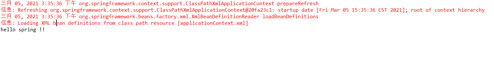

# 实验01：搭建开发环境
## 实验目的
* Spring初步认识

##实验内容
* 搭建开发环境（JDK+Eclipse+Tomcat+MySQL）；
* 下载Spring开发包及其所依赖的第三方开发包；
* 实践教材P9-11 Spring入门程序。

## 源代码
** 1.TestDao **

```java
package dao;

public interface TestDao {
    public void sayHello();
}

```
** 2.TestDaoImple **

```java
package dao.impl;

import dao.TestDao;

public class TestDaoImpl implements TestDao {
    @Override
    public void sayHello() {
        System.out.println("hello spring !!");
    }
}

```

** 3.Test **

```java
package test;

import org.springframework.context.ApplicationContext;
import org.springframework.context.support.ClassPathXmlApplicationContext;
import dao.TestDao;

public class Test {
	public static void main(String[] args) {
		// 初始化Spring容器ApplicationContext，加载配置文件
		ApplicationContext app = new ClassPathXmlApplicationContext("applicationContext.xml");
		
		// 通过容器获取test实例
		TestDao testDao = (TestDao) app.getBean("test");	// test为配置文件中的id
		testDao.sayHello();
	}

}
```

** 4.applicationContext.xml **

```xml
<?xml version="1.0" encoding="UTF-8"?>
<beans xmlns="http://www.springframework.org/schema/beans"
	xmlns:xsi="http://www.w3.org/2001/XMLSchema-instance"
	xsi:schemaLocation="http://www.springframework.org/schema/beans
		http://www.springframework.org/schema/beans/spring-beans.xsd">
	<!-- 将指定TestDaoImpl配置给spring，让spring创建其实例 -->
	<bean id="test" class="dao.impl.TestDaoImpl"/>
</beans>
```


## 运行截图


