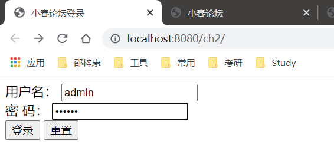
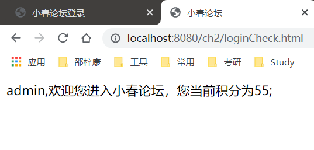

# 实验02 Spring概述
## 1.实验目的：

1) 理解Spring分层架构；
2) 理解Spring模块；
3) 理解spring配置方式。

## 2.实验内容：
实现并验证所给出示例程序功能（登录验证）。

## 3.源代码

**User.java**
```java
package com.smart.domain;

import java.io.Serializable;
import java.util.Date;

public class User implements Serializable{
    private int userId;

    private String userName;

    private String password;

    private int credits;

    private String lastIp;

    private Date lastVisit;

    public String getLastIp() {
        return lastIp;
    }

    public void setLastIp(String lastIp) {
        this.lastIp = lastIp;
    }

    public Date getLastVisit() {
        return lastVisit;
    }

    public void setLastVisit(Date lastVisit) {
        this.lastVisit = lastVisit;
    }

    public int getUserId() {
        return userId;
    }

    public void setUserId(int userId) {
        this.userId = userId;
    }

    public String getUserName() {
        return userName;
    }

    public void setUserName(String userName) {
        this.userName = userName;
    }

    public String getPassword() {
        return password;
    }

    public void setPassword(String password) {
        this.password = password;
    }

    public int getCredits() {
        return credits;
    }

    public void setCredits(int credits) {
        this.credits = credits;
    }
}

```

**LoginLog.java**
```java
package com.smart.domain;
import java.io.Serializable;
import java.util.Date;

public class LoginLog implements Serializable{
    private int loginLogId;

    private int userId;

    private String ip;

    private Date loginDate;

    public String getIp() {
        return ip;
    }

    public void setIp(String ip) {
        this.ip = ip;
    }

    public Date getLoginDate() {
        return loginDate;
    }

    public void setLoginDate(Date loginDate) {
        this.loginDate = loginDate;
    }

    public int getLoginLogId() {
        return loginLogId;
    }

    public void setLoginLogId(int loginLogId) {
        this.loginLogId = loginLogId;
    }

    public int getUserId() {
        return userId;
    }

    public void setUserId(int userId) {
        this.userId = userId;
    }

}

```


**LoginController.java**
```java
package com.smart.web;

import java.util.Date;

import javax.servlet.http.HttpServletRequest;


import org.springframework.beans.factory.annotation.Autowired;
import org.springframework.web.bind.annotation.RequestMapping;
import org.springframework.web.bind.annotation.RestController;
import org.springframework.web.servlet.ModelAndView;

import com.smart.domain.User;
import com.smart.service.UserService;

@RestController
public class LoginController{
    private UserService userService;

    @RequestMapping(value = "/index.html")
    public String loginPage(){
        return "login";
    }

    @RequestMapping(value = "/loginCheck.html")
    public ModelAndView loginCheck(HttpServletRequest request,LoginCommand loginCommand){
        boolean isValidUser =  userService.hasMatchUser(loginCommand.getUserName(),loginCommand.getPassword());
        if (!isValidUser) {
            return new ModelAndView("login", "error", "用户名或密码错误。");
        } else {
            User user = userService.findUserByUserName(loginCommand.getUserName());
            user.setLastIp(request.getLocalAddr());
            user.setLastVisit(new Date());
            userService.loginSuccess(user);
            request.getSession().setAttribute("user", user);
            return new ModelAndView("main");
        }
    }

    @Autowired
    public void setUserService(UserService userService) {
        this.userService = userService;
    }
}

```

**LoginCommand.java**
```java
package com.smart.web;

public class LoginCommand {
    private String userName;

    private String password;

    public String getPassword() {
        return password;
    }

    public void setPassword(String password) {
        this.password = password;
    }

    public String getUserName() {
        return userName;
    }

    public void setUserName(String userName) {
        this.userName = userName;
    }
}


```

**UserService.java**
```java
package com.smart.service;

import org.springframework.beans.factory.annotation.Autowired;
import org.springframework.stereotype.Service;

import com.smart.dao.LoginLogDao;
import com.smart.dao.UserDao;
import com.smart.domain.LoginLog;
import com.smart.domain.User;

import org.springframework.transaction.annotation.Transactional;

@Service
public class UserService {
    private UserDao userDao;
    private LoginLogDao loginLogDao;

    // 登陆检测
    public boolean hasMatchUser(String userName, String password) {
        int matchCount =userDao.getMatchCount(userName, password);
        return matchCount > 0;
    }

    // 通过用户名查找是否存在该用户
    public User findUserByUserName(String userName) {
        return userDao.findUserByUserName(userName);
    }

    @Transactional
    public void loginSuccess(User user) {
        user.setCredits( 5 + user.getCredits());
        LoginLog loginLog = new LoginLog();
        loginLog.setUserId(user.getUserId());
        loginLog.setIp(user.getLastIp());
        loginLog.setLoginDate(user.getLastVisit());
        userDao.updateLoginInfo(user);
        loginLogDao.insertLoginLog(loginLog);
    }

    @Autowired
    public void setUserDao(UserDao userDao) {
        this.userDao = userDao;
    }

    @Autowired
    public void setLoginLogDao(LoginLogDao loginLogDao) {
        this.loginLogDao = loginLogDao;
    }
}

```

**LoginLogDao.java**
```java
package com.smart.dao;

import com.smart.domain.LoginLog;
import org.springframework.beans.factory.annotation.Autowired;
import org.springframework.jdbc.core.JdbcTemplate;
import org.springframework.stereotype.Repository;


@Repository
public class LoginLogDao {
    private JdbcTemplate jdbcTemplate;

    //保存登陆日志SQL
    private final static String INSERT_LOGIN_LOG_SQL= "INSERT INTO t_login_log(user_id,ip,login_datetime) VALUES(?,?,?)";

    public void insertLoginLog(LoginLog loginLog) {
        Object[] args = { loginLog.getUserId(), loginLog.getIp(),
                loginLog.getLoginDate() };
        jdbcTemplate.update(INSERT_LOGIN_LOG_SQL, args);
    }

    @Autowired
    public void setJdbcTemplate(JdbcTemplate jdbcTemplate) {
        this.jdbcTemplate = jdbcTemplate;
    }
}

```

**UserDao.java**
```java
package com.smart.dao;

import com.smart.domain.User;
import org.springframework.beans.factory.annotation.Autowired;
import org.springframework.jdbc.core.JdbcTemplate;
import org.springframework.jdbc.core.RowCallbackHandler;
import org.springframework.stereotype.Repository;

import java.sql.ResultSet;
import java.sql.SQLException;


@Repository
public class UserDao {
    private JdbcTemplate jdbcTemplate;


    private  final static String MATCH_COUNT_SQL = " SELECT count(*) FROM t_user  " +
            " WHERE user_name =? and password=? ";
    private  final static String UPDATE_LOGIN_INFO_SQL = " UPDATE t_user SET " +
            " last_visit=?,last_ip=?,credits=?  WHERE user_id =?";

    public int getMatchCount(String userName, String password) {

        return jdbcTemplate.queryForObject(MATCH_COUNT_SQL, new Object[]{userName, password}, Integer.class);
    }

    public User findUserByUserName(final String userName) {
        String sqlStr = " SELECT user_id,user_name,credits "
                + " FROM t_user WHERE user_name =? ";
        final User user = new User();
        jdbcTemplate.query(sqlStr, new Object[] { userName },
                new RowCallbackHandler() {
                    public void processRow(ResultSet rs) throws SQLException {
                        user.setUserId(rs.getInt("user_id"));
                        user.setUserName(userName);
                        user.setCredits(rs.getInt("credits"));
                    }
                });
        return user;
    }

    public void updateLoginInfo(User user) {
        jdbcTemplate.update(UPDATE_LOGIN_INFO_SQL, new Object[] { user.getLastVisit(),
                user.getLastIp(),user.getCredits(),user.getUserId()});
    }

    @Autowired
    public void setJdbcTemplate(JdbcTemplate jdbcTemplate) {
        this.jdbcTemplate = jdbcTemplate;
    }
}

```


**web.xml**
```xml
<?xml version="1.0" encoding="UTF-8"?>
<web-app version="2.5"
         xmlns="http://java.sun.com/xml/ns/javaee"
         xmlns:xsi="http://www.w3.org/2001/XMLSchema-instance"
         xsi:schemaLocation="http://java.sun.com/xml/ns/javaee
	http://java.sun.com/xml/ns/javaee/web-app_2_5.xsd">
    <context-param>
        <param-name>contextConfigLocation</param-name>
        <param-value>classpath:smart-context.xml</param-value>
    </context-param>

    <listener>
        <listener-class>
            org.springframework.web.context.ContextLoaderListener
        </listener-class>
    </listener>

    <servlet>
        <servlet-name>smart</servlet-name>
        <servlet-class>
            org.springframework.web.servlet.DispatcherServlet
        </servlet-class>
        <load-on-startup>3</load-on-startup>
    </servlet>

    <servlet-mapping>
        <servlet-name>smart</servlet-name>
        <url-pattern>*.html</url-pattern>
    </servlet-mapping>
</web-app>

```

**smart-servlet.xml**
``` xml
<?xml version="1.0" encoding="UTF-8" ?>
<beans xmlns="http://www.springframework.org/schema/beans"
       xmlns:xsi="http://www.w3.org/2001/XMLSchema-instance"
       xmlns:p="http://www.springframework.org/schema/p"
       xmlns:context="http://www.springframework.org/schema/context"
       xsi:schemaLocation="http://www.springframework.org/schema/beans
       http://www.springframework.org/schema/beans/spring-beans.xsd
       http://www.springframework.org/schema/context
       http://www.springframework.org/schema/context/spring-context.xsd">
    <!-- 扫描web包，应用Spring的注解 -->
    <context:component-scan base-package="com.smart.web"/>

    <!-- 配置视图解析器，将ModelAndView及字符串解析为具体的页面 -->
    <bean
            class="org.springframework.web.servlet.view.InternalResourceViewResolver"
            p:viewClass="org.springframework.web.servlet.view.JstlView"
            p:prefix="/WEB-INF/jsp/"
            p:suffix=".jsp" />

</beans>
```

**smart-context.xml**
``` xml
<?xml version="1.0" encoding="UTF-8"?>
<beans xmlns="http://www.springframework.org/schema/beans"
       xmlns:xsi="http://www.w3.org/2001/XMLSchema-instance"
       xmlns:context="http://www.springframework.org/schema/context"
       xmlns:p="http://www.springframework.org/schema/p"
       xmlns:aop="http://www.springframework.org/schema/aop"
       xmlns:tx="http://www.springframework.org/schema/tx"
       xsi:schemaLocation="http://www.springframework.org/schema/beans
        http://www.springframework.org/schema/beans/spring-beans.xsd
        http://www.springframework.org/schema/context
        http://www.springframework.org/schema/context/spring-context.xsd
        http://www.springframework.org/schema/tx
        http://www.springframework.org/schema/tx/spring-tx.xsd
        http://www.springframework.org/schema/aop
        http://www.springframework.org/schema/aop/spring-aop.xsd">

    <!-- 扫描类包，将标注Spring注解的类自动转化Bean，同时完成Bean的注入 -->
    <context:component-scan base-package="com.smart.dao"/>
    <context:component-scan base-package="com.smart.service"/>

    <!-- 配置数据源 -->
    <!--部署在服务器上的数据库-->
    <bean id="dataSource" class="org.apache.commons.dbcp2.BasicDataSource"
          destroy-method="close"
          p:driverClassName="com.mysql.jdbc.Driver"
          p:url="jdbc:mysql://47.106.246.216/sampledb?characterEncoding=utf8&amp;useUnicode=true&amp;useSSL=false&amp;serverTimezone=Asia/Shanghai"
          p:username="root"
          p:password="123456" />

    <!-- 配置Jdbc模板  -->
    <bean id="jdbcTemplate" class="org.springframework.jdbc.core.JdbcTemplate"
          p:dataSource-ref="dataSource" />

    <!-- 配置事务管理器 -->
    <bean id="transactionManager"
          class="org.springframework.jdbc.datasource.DataSourceTransactionManager"
          p:dataSource-ref="dataSource" />

    <!-- 通过AOP配置提供事务增强，让service包下所有Bean的所有方法拥有事务 -->
    <aop:config proxy-target-class="true">
        <aop:pointcut id="serviceMethod"
                      expression="(execution(* com.smart.service..*(..))) and (@annotation(org.springframework.transaction.annotation.Transactional))" />
        <aop:advisor pointcut-ref="serviceMethod" advice-ref="txAdvice" />
    </aop:config>
    <tx:advice id="txAdvice" transaction-manager="transactionManager">
        <tx:attributes>
            <tx:method name="*" />
        </tx:attributes>
    </tx:advice>
</beans>

```

**pom.xml**
```xml
<?xml version="1.0" encoding="UTF-8"?>
<project xmlns="http://maven.apache.org/POM/4.0.0" xmlns:xsi="http://www.w3.org/2001/XMLSchema-instance"
  xsi:schemaLocation="http://maven.apache.org/POM/4.0.0 http://maven.apache.org/xsd/maven-4.0.0.xsd">
  <modelVersion>4.0.0</modelVersion>

  <groupId>org.example</groupId>
  <artifactId>ch2</artifactId>
  <version>1.0-SNAPSHOT</version>
  <packaging>war</packaging>
  
  <properties>
    <project.build.sourceEncoding>UTF-8</project.build.sourceEncoding>
    <spring.version>4.2.2.RELEASE</spring.version>
    <mysql.version>5.7.32</mysql.version>
    <servlet.version>4.0</servlet.version>
    <maven.compiler.source>1.7</maven.compiler.source>
    <maven.compiler.target>1.7</maven.compiler.target>
  </properties>

  <dependencies>
    <!--单元测试-->
    <dependency>
      <groupId>junit</groupId>
      <artifactId>junit</artifactId>
      <version>4.11</version>
      <scope>test</scope>
    </dependency>
    <!--spring框架,bean,core,context,context-support,jdbc,expression,webmvc-->
    <dependency>
      <groupId>org.springframework</groupId>
      <artifactId>spring-core</artifactId>
      <version>${spring.version}</version>
    </dependency>

    <dependency>
      <groupId>org.springframework</groupId>
      <artifactId>spring-beans</artifactId>
      <version>${spring.version}</version>
    </dependency>
    
    <dependency>
      <groupId>org.springframework</groupId>
      <artifactId>spring-context</artifactId>
      <version>${spring.version}</version>
    </dependency>
    <dependency>
      <groupId>org.springframework</groupId>
      <artifactId>spring-context-support</artifactId>
      <version>${spring.version}</version>
    </dependency>
    <dependency>
      <groupId>org.springframework</groupId>
      <artifactId>spring-jdbc</artifactId>
      <version>${spring.version}</version>
    </dependency>
    <dependency>
      <groupId>org.springframework</groupId>
      <artifactId>spring-test</artifactId>
      <version>${spring.version}</version>
      <scope>test</scope>
    </dependency>
    <dependency>
      <groupId>org.springframework</groupId>
      <artifactId>spring-webmvc</artifactId>
      <version>${spring.version}</version>
    </dependency>
    <dependency>
      <groupId>org.springframework</groupId>
      <artifactId>spring-expression</artifactId>
      <version>${spring.version}</version>
    </dependency>
    <dependency>
      <groupId>org.aspectj</groupId>
      <artifactId>aspectjweaver</artifactId>
      <version>1.9.5</version>
    </dependency>

    <dependency>
      <groupId>commons-logging</groupId>
      <artifactId>commons-logging</artifactId>
      <version>1.2</version>
    </dependency>

    <dependency>
      <groupId>javax.servlet</groupId>
      <artifactId>javax.servlet-api</artifactId>
      <version>3.1.0</version>
    </dependency>

    <!-- https://mvnrepository.com/artifact/org.apache.commons/commons-dbcp2 -->
    <dependency>
      <groupId>org.apache.commons</groupId>
      <artifactId>commons-dbcp2</artifactId>
      <version>2.0.1</version>
    </dependency>

    <dependency>
      <groupId>javax.servlet</groupId>
      <artifactId>jstl</artifactId>
      <version>1.1.2</version>
    </dependency>

    <dependency>
      <groupId>javax.servlet</groupId>
      <artifactId>javax.servlet-api</artifactId>
      <version>3.1.0</version>
    </dependency>

    <!-- https://mvnrepository.com/artifact/javax.servlet.jsp/javax.servlet.jsp-api -->
    <dependency>
      <groupId>javax.servlet.jsp</groupId>
      <artifactId>javax.servlet.jsp-api</artifactId>
      <version>2.3.1</version>
      <scope>provided</scope>
    </dependency>

  </dependencies>

  <build>
    <finalName>ch3</finalName>
    <pluginManagement><!-- lock down plugins versions to avoid using Maven defaults (may be moved to parent pom) -->
      <plugins>
        <plugin>
          <artifactId>maven-clean-plugin</artifactId>
          <version>3.1.0</version>
        </plugin>
        <!-- see http://maven.apache.org/ref/current/maven-core/default-bindings.html#Plugin_bindings_for_war_packaging -->
        <plugin>
          <artifactId>maven-resources-plugin</artifactId>
          <version>3.0.2</version>
        </plugin>
        <plugin>
          <artifactId>maven-compiler-plugin</artifactId>
          <version>3.8.0</version>
        </plugin>
        <plugin>
          <artifactId>maven-surefire-plugin</artifactId>
          <version>2.22.1</version>
        </plugin>
        <plugin>
          <artifactId>maven-war-plugin</artifactId>
          <version>3.2.2</version>
        </plugin>
        <plugin>
          <artifactId>maven-install-plugin</artifactId>
          <version>2.5.2</version>
        </plugin>
        <plugin>
          <artifactId>maven-deploy-plugin</artifactId>
          <version>2.8.1</version>
        </plugin>
      </plugins>
    </pluginManagement>
  </build>
</project>

```


## 4.实验截图

1) 小春论坛登录



2) 小春论坛




