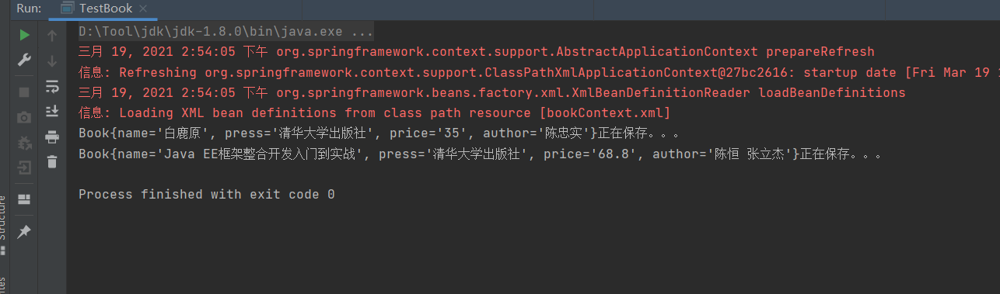

## 实验03 Spring Ioc
* 理解Spring Ioc和DI两种概念
* 掌握依赖注入的方法

## 源代码

**pojo.Book.java**
```java
/*
 * Date: 2021/3/19
 * Author: <https://www.github.com/shaozk>
 */

package book.pojo;

/**
 * @author shaozk
 * @Description: TODO
 */
public class Book {
    String name;
    String press;
    String price;
    String author;

    public Book(String name, String press, String price, String author) {
        this.name = name;
        this.press = press;
        this.price = price;
        this.author = author;
    }


    public Book() {

    }

    public String getName() {
        return name;
    }

    public void setName(String name) {
        this.name = name;
    }

    public String getPress() {
        return press;
    }

    public void setPress(String press) {
        this.press = press;
    }

    public String getPrice() {
        return price;
    }

    @Override
    public String toString() {
        return "Book{" +
                "name='" + name + '\'' +
                ", press='" + press + '\'' +
                ", price='" + price + '\'' +
                ", author='" + author + '\'' +
                '}';
    }

    public void setPrice(String price) {
        this.price = price;
    }

    public String getAuthor() {
        return author;
    }

    public void setAuthor(String author) {
        this.author = author;
    }
}


```

**dao.BookDao.java**
```java
/*
 * Date: 2021/3/19
 * Author: <https://www.github.com/shaozk>
 */

package book.dao;

import book.pojo.Book;

/**
 * @author shaozk
 * @Description: BookDao
 */
public interface BookDao {

    public void save(Book book);

}


```

**dao.BookDaoImpl.java**
```java
/*
 * Date: 2021/3/19
 * Author: <https://www.github.com/shaozk>
 */

package book.dao;

import book.pojo.Book;

/**
 * @author shaozk
 * @Description: TODO
 */
public class BookDaoImpl implements BookDao{
    @Override
    public void save(Book book) {
        System.out.println(book + "正在保存。。。");
    }
}


```

**service.BookService.java**
```java
/*
 * Date: 2021/3/19
 * Author: <https://www.github.com/shaozk>
 */

package book.service;

import book.pojo.Book;

/**
 * @author shaozk
 * @Description: TODO
 */
public interface BookService {
    public void add(Book book);
}


```

**service.BookServiceImpl.java**
```java
/*
 * Date: 2021/3/19
 * Author: <https://www.github.com/shaozk>
 */

package book.service;

import book.dao.BookDao;
import book.pojo.Book;

/**
 * @author shaozk
 * @Description: TODO
 */
public class BookServiceImpl implements BookService{

    private BookDao bookDao;

    public BookDao getBookDao() {
        return bookDao;
    }

    public void setBookDao(BookDao bookDao) {
        this.bookDao = bookDao;
    }

    @Override
    public void add(Book book) {
        bookDao.save(book);
    }
}


```

**TestBook.java**
```java
/*
 * Date: 2021/3/19
 * Author: <https://www.github.com/shaozk>
 */

package book;

import book.pojo.Book;
import book.service.BookService;
import book.service.BookServiceImpl;
import org.springframework.context.ApplicationContext;
import org.springframework.context.support.ClassPathXmlApplicationContext;

/**
 * @author shaozk
 * @Description: 测试book保存
 */
public class TestBook {

    private static BookService bookService;

    public BookService getBookService() {
        return bookService;
    }

    public void setBookService(BookServiceImpl bookService) {
        TestBook.bookService = bookService;
    }


    public static void main(String[] args) {
        ApplicationContext applicationContext = new ClassPathXmlApplicationContext("bookContext.xml");

        // 使用构造方法装配测试
        Book book1 = (Book) applicationContext.getBean("bookConstructor");
        bookService.add(book1);

        // 使用setter方法装配测试
        Book book2 = (Book) applicationContext.getBean("bookSetter");
        bookService.add(book2);
    }


}


```

**bookContext.xml**
``` xml
<?xml version="1.0" encoding="UTF-8"?>
<beans xmlns="http://www.springframework.org/schema/beans"
       xmlns:xsi="http://www.w3.org/2001/XMLSchema-instance"
       xsi:schemaLocation="http://www.springframework.org/schema/beans http://www.springframework.org/schema/beans/spring-beans.xsd">

    <!--构造方法注入Book-->
    <bean id="bookConstructor" class="book.pojo.Book">
        <constructor-arg index="0" value="白鹿原"/>
        <constructor-arg index="1" value="清华大学出版社"/>
        <constructor-arg index="2" value="35"/>
        <constructor-arg index="3" value="陈忠实"/>
    </bean>

    <!--Setter方式注入Book-->
    <bean id="bookSetter" class="book.pojo.Book">
        <property name="name" value="Java EE框架整合开发入门到实战"/>
        <property name="author" value="陈恒 张立杰"/>
        <property name="press" value="清华大学出版社"/>
        <property name="price" value="68.8"/>
    </bean>

    <!-- 配置DAO层（实例化BookDao）-->
    <bean id="bookDAO" class="book.dao.BookDaoImpl"/>

    <!-- 配置Service层（Setter方式）-->
    <bean id="bookService" class="book.service.BookServiceImpl">
        <property name="bookDao" ref="bookDAO"/>
    </bean>

    <!--将TestBook所依赖的BookService对象注入到TestDao类中（Setter方式）-->
    <bean id="testBook" class="book.TestBook">
        <property name="bookService" ref="bookService"/>
    </bean>

    
</beans>

```

**pom.xml**
```xml
<?xml version="1.0" encoding="UTF-8"?>

<project xmlns="http://maven.apache.org/POM/4.0.0" xmlns:xsi="http://www.w3.org/2001/XMLSchema-instance"
  xsi:schemaLocation="http://maven.apache.org/POM/4.0.0 http://maven.apache.org/xsd/maven-4.0.0.xsd">
  <modelVersion>4.0.0</modelVersion>

  <groupId>org.example</groupId>
  <artifactId>ch3</artifactId>
  <version>1.0-SNAPSHOT</version>
  <packaging>war</packaging>

  <name>ch3 Maven Webapp</name>
  <!-- FIXME change it to the project's website -->
  <url>http://www.example.com</url>

  <properties>
    <project.build.sourceEncoding>UTF-8</project.build.sourceEncoding>
    <maven.compiler.source>1.7</maven.compiler.source>
    <maven.compiler.target>1.7</maven.compiler.target>
  </properties>

  <dependencies>
    <dependency>
      <groupId>junit</groupId>
      <artifactId>junit</artifactId>
      <version>4.11</version>
      <scope>test</scope>
    </dependency>

    <dependency>
      <groupId>org.springframework</groupId>
      <artifactId>spring-core</artifactId>
      <version>5.3.5</version>
    </dependency>

    <dependency>
      <groupId>org.springframework</groupId>
      <artifactId>spring-beans</artifactId>
      <version>5.0.20.RELEASE</version>
    </dependency>

    <dependency>
      <groupId>org.springframework</groupId>
      <artifactId>spring-context</artifactId>
      <version>5.0.2.RELEASE</version>
    </dependency>

    <dependency>
      <groupId>org.springframework</groupId>
      <artifactId>spring-context-support</artifactId>
      <version>5.0.2.RELEASE</version>
    </dependency>

    <dependency>
      <groupId>org.springframework</groupId>
      <artifactId>spring-expression</artifactId>
      <version>5.0.2.RELEASE</version>
    </dependency>

    <!-- https://mvnrepository.com/artifact/commons-logging/commons-logging -->
    <dependency>
      <groupId>commons-logging</groupId>
      <artifactId>commons-logging</artifactId>
      <version>1.2</version>
    </dependency>


  </dependencies>

  <build>
    <finalName>ch3</finalName>
    <pluginManagement><!-- lock down plugins versions to avoid using Maven defaults (may be moved to parent pom) -->
      <plugins>
        <plugin>
          <artifactId>maven-clean-plugin</artifactId>
          <version>3.1.0</version>
        </plugin>
        <!-- see http://maven.apache.org/ref/current/maven-core/default-bindings.html#Plugin_bindings_for_war_packaging -->
        <plugin>
          <artifactId>maven-resources-plugin</artifactId>
          <version>3.0.2</version>
        </plugin>
        <plugin>
          <artifactId>maven-compiler-plugin</artifactId>
          <version>3.8.0</version>
        </plugin>
        <plugin>
          <artifactId>maven-surefire-plugin</artifactId>
          <version>2.22.1</version>
        </plugin>
        <plugin>
          <artifactId>maven-war-plugin</artifactId>
          <version>3.2.2</version>
        </plugin>
        <plugin>
          <artifactId>maven-install-plugin</artifactId>
          <version>2.5.2</version>
        </plugin>
        <plugin>
          <artifactId>maven-deploy-plugin</artifactId>
          <version>2.8.2</version>
        </plugin>
      </plugins>
    </pluginManagement>
  </build>
</project>


```

## 实验结果截图
