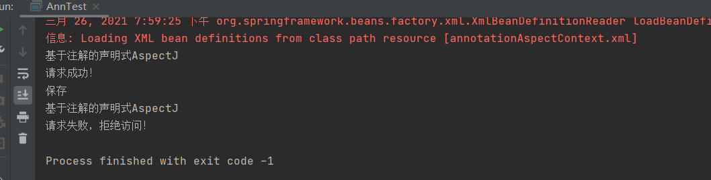

# 实验04 Spring AOP

## 代码
**pom.xml**
```xml
<?xml version="1.0" encoding="UTF-8"?>
<project xmlns="http://maven.apache.org/POM/4.0.0"
         xmlns:xsi="http://www.w3.org/2001/XMLSchema-instance"
         xsi:schemaLocation="http://maven.apache.org/POM/4.0.0 http://maven.apache.org/xsd/maven-4.0.0.xsd">
    <modelVersion>4.0.0</modelVersion>

    <groupId>org.example</groupId>
    <artifactId>ch4</artifactId>
    <version>1.0-SNAPSHOT</version>

    <properties>
        <maven.compiler.source>8</maven.compiler.source>
        <maven.compiler.target>8</maven.compiler.target>
    </properties>


    <dependencies>
        <dependency>
            <groupId>junit</groupId>
            <artifactId>junit</artifactId>
            <version>4.11</version>
            <scope>test</scope>
        </dependency>

        <dependency>
            <groupId>org.springframework</groupId>
            <artifactId>spring-core</artifactId>
            <version>5.0.2.RELEASE</version>
        </dependency>

        <dependency>
            <groupId>org.springframework</groupId>
            <artifactId>spring-beans</artifactId>
            <version>5.0.2.RELEASE</version>
        </dependency>

        <dependency>
            <groupId>org.springframework</groupId>
            <artifactId>spring-context</artifactId>
            <version>5.0.2.RELEASE</version>
        </dependency>

        <dependency>
            <groupId>org.springframework</groupId>
            <artifactId>spring-context-support</artifactId>
            <version>5.0.2.RELEASE</version>
        </dependency>

        <dependency>
            <groupId>org.springframework</groupId>
            <artifactId>spring-expression</artifactId>
            <version>5.0.2.RELEASE</version>
        </dependency>

        <!-- https://mvnrepository.com/artifact/commons-logging/commons-logging -->
        <dependency>
            <groupId>commons-logging</groupId>
            <artifactId>commons-logging</artifactId>
            <version>1.2</version>
        </dependency>

        <!-- https://mvnrepository.com/artifact/org.aspectj/aspectjweaver -->
        <dependency>
            <groupId>org.aspectj</groupId>
            <artifactId>aspectjweaver</artifactId>
            <version>1.8.13</version>
        </dependency>

        <!-- https://mvnrepository.com/artifact/org.springframework/spring-aop -->
<!--        注意保持版本一致-->
        <dependency>
            <groupId>org.springframework</groupId>
            <artifactId>spring-aop</artifactId>
            <version>5.0.2.RELEASE</version>
        </dependency>
        <!-- https://mvnrepository.com/artifact/aopalliance/aopalliance -->
<!--        <dependency>-->
<!--            <groupId>aopalliance</groupId>-->
<!--            <artifactId>aopalliance</artifactId>-->
<!--            <version>1.0</version>-->
<!--        </dependency>-->

        <dependency>
            <groupId>org.springframework</groupId>
            <artifactId>spring-aspects</artifactId>
            <version>5.0.2.RELEASE</version>
        </dependency>
        <dependency>
            <groupId>org.springframework</groupId>
            <artifactId>spring-test</artifactId>
            <version>4.2.2.RELEASE</version>
            <scope>compile</scope>
        </dependency>
        <dependency>
            <groupId>junit</groupId>
            <artifactId>junit</artifactId>
            <version>4.12</version>
            <scope>compile</scope>
        </dependency>


    </dependencies>

</project>

```

**com.com.dao.XMLTestDao.java**

```java
/*
 * Date: 2021/3/26
 * Author: <https://www.github.com/shaozk>
 */

/*
 * Date: 2021/3/26
 * Author: <https://www.github.com/shaozk>
 */

package com.com.dao;

/**
 * @author shaozk
 * @Description: TODO
 */
public interface XMLTestDao {
    public void save(String action);
}


```
**com.com.dao.XMLTestDaoImpl.java**

```java
/*
 * Date: 2021/3/26
 * Author: <https://www.github.com/shaozk>
 */

/*
 * Date: 2021/3/26
 * Author: <https://www.github.com/shaozk>
 */

package com.com.dao;

/**
 * @author shaozk
 * @Description: TODO
 */

public class XMLTestDaoImpl implements XMLTestDao {

    @Override
    public void save(String action) {
        System.out.println("保存");
    }


}


```

**aspect.xml.XmlAspect.java**
```java
/*
 * Date: 2021/3/26
 * Author: <https://www.github.com/shaozk>
 */

package aspect.xml;

import org.aspectj.lang.JoinPoint;

import static java.lang.System.exit;

/**
 * @author shaozk
 * @Description: 切面类
 */
public class XmlAspect {
  // 前置通知
  public void before(JoinPoint joinPoint) {
    System.out.println("基于XML的声明式AspectJ");

    //获取当前请求方法的参数值
    Object[] args = joinPoint.getArgs();

    if(args[0].toString().equals("agree")) {
      System.out.println("请求成功！");
    }else {
      System.out.println("请求失败，拒绝访问！");
      exit(-1);
    }
  }

}


```

**aspect.xml.XmlTest.java**

```java
/*
 * Date: 2021/3/26
 * Author: <https://www.github.com/shaozk>
 */

package aspect.xml;

import com.com.dao.XMLTestDao;
import org.springframework.context.ApplicationContext;
import org.springframework.context.support.ClassPathXmlApplicationContext;

/**
 * @author shaozk
 * @Description: TODO
 */
public class XmlTest {
    public static void main(String[] args) {
        ApplicationContext applicationContext = new ClassPathXmlApplicationContext("xmlAspectContext.xml");
        XMLTestDao advice = (XMLTestDao) applicationContext.getBean("testDao");
        // 执行方法
        advice.save("agree");
        advice.save("false");
    }
}


```

**xmlAspectContext.xml**
``` xml
<?xml version="1.0" encoding="UTF-8"?>
<beans xmlns="http://www.springframework.org/schema/beans"
       xmlns:xsi="http://www.w3.org/2001/XMLSchema-instance"
       xmlns:aop="http://www.springframework.org/schema/aop"
       xsi:schemaLocation="http://www.springframework.org/schema/beans
       http://www.springframework.org/schema/beans/spring-beans.xsd
       http://www.springframework.org/schema/aop
       https://www.springframework.org/schema/aop/spring-aop.xsd">
    <!--spring-beans-4.3这里的4.3是指明版本号 -->
    <!-- 1.目标类 -->
    <bean id="testDao" class="com.com.dao.XMLTestDaoImpl"/>
    <!-- 2.切面 -->
    <bean id="myAspect" class="aspect.xml.XmlAspect"/>
    <!-- 3.Aop编程 -->
    <aop:config>
        <!-- 配置切面 -->
        <aop:aspect ref="myAspect">
            <!-- 3.1配置切入点，通知最后增强那些方法 ,对所有的类，里面所有的方法进行增强 -->
            <aop:pointcut
                    expression="execution(* com.com.dao.XMLTestDaoImpl.*(..))" id="myPointCut" />
            <!-- 管理通知Advice和切入点 -->
            <!-- 前置通知 -->
            <aop:before method="before" pointcut-ref="myPointCut" />

        </aop:aspect>
    </aop:config>
</beans>
```

**com.com.dao.AnnTestDao.java**

```java
/*
 * Date: 2021/3/26
 * Author: <https://www.github.com/shaozk>
 */

package com.com.dao;

/**
 * @author shaozk
 * @Description: 注解dao
 */
public interface ANNTestDao {
    public void save(String action);
}


```
**com.com.dao.AnnTestDaoImpl.java**

```java
/*
 * Date: 2021/3/26
 * Author: <https://www.github.com/shaozk>
 */

package com.com.dao;

import org.springframework.stereotype.Repository;

/**
 * @author shaozk
 * @Description: ann dao的实现类
 */
@Repository("testDaoImpl")
public class AnnTestDaoImpl implements ANNTestDao {
    @Override
    public void save(String action) {
        System.out.println("保存");
    }
}


```

**aspect.annotation.AnnAspect.java**
```java
/*
 * Date: 2021/3/26
 * Author: <https://www.github.com/shaozk>
 */

package aspect.xml;

import org.aspectj.lang.JoinPoint;

import static java.lang.System.exit;

/**
 * @author shaozk
 * @Description: 切面类
 */
public class XmlAspect {
    // 前置通知
    public void before(JoinPoint joinPoint) {
        System.out.println("基于XML的声明式AspectJ");

        //获取当前请求方法的参数值
        Object[] args = joinPoint.getArgs();

        if(args[0].toString().equals("agree")) {
            System.out.println("请求成功！");
        }else {
            System.out.println("请求失败，拒绝访问！");
            exit(-1);
        }
    }

}

```

**aspect.annotation.AnnTest.java**

```java
/*
 * Date: 2021/3/26
 * Author: <https://www.github.com/shaozk>
 */

package aspect.annotation;


import com.com.dao.ANNTestDao;
import org.springframework.context.ApplicationContext;
import org.springframework.context.support.ClassPathXmlApplicationContext;

/**
 * @author shaozk
 * @Description: TODO
 */
public class AnnTest {
    public static void main(String[] args) {
        ApplicationContext applicationContext = new ClassPathXmlApplicationContext("annotationAspectContext.xml");
        ANNTestDao com.com.dao = (ANNTestDao) applicationContext.getBean("testDaoImpl");
        com.com.dao.save("agree");
        com.com.dao.save("false");
    }
}


```

**annotationAspectContext.xml**
``` xml
<?xml version="1.0" encoding="UTF-8"?>
<beans xmlns="http://www.springframework.org/schema/beans"
       xmlns:xsi="http://www.w3.org/2001/XMLSchema-instance"
       xmlns:aop="http://www.springframework.org/schema/aop"
       xmlns:context="http://www.springframework.org/schema/context"
       xsi:schemaLocation="http://www.springframework.org/schema/beans
        http://www.springframework.org/schema/beans/spring-beans.xsd
        http://www.springframework.org/schema/aop
        http://www.springframework.org/schema/aop/spring-aop.xsd
        http://www.springframework.org/schema/context
        http://www.springframework.org/schema/context/spring-context.xsd">

    <!--指定需要扫描的包，使注解生效  -->
    <context:component-scan base-package="aspect.annotation"/>
    <context:component-scan base-package="com.com.dao"/>

    <!-- 启动基于注解的AspectJ支持 -->
    <aop:aspectj-autoproxy/>

</beans>

```


## 实验截图
* 基于XML的声明式AspectJ
  
  
* 基于注解的声明式AspectJ
  
  