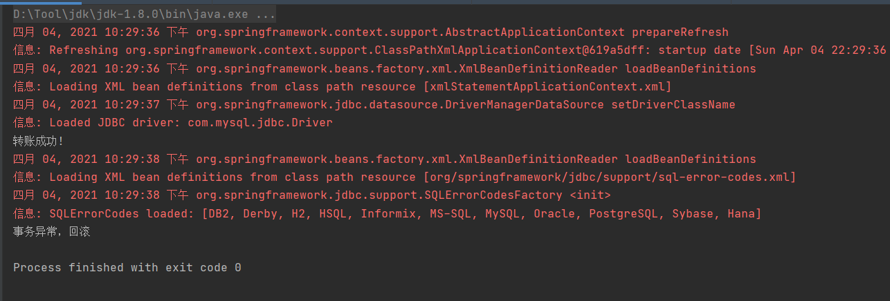
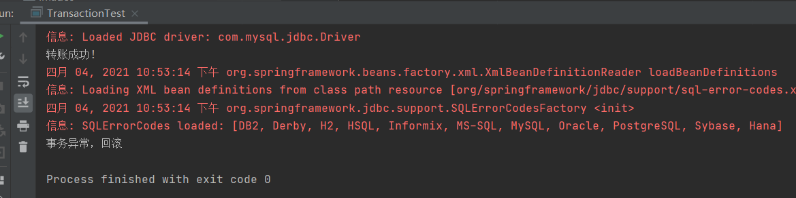
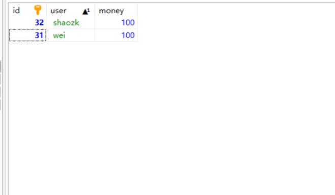

# Spring事务管理
## 源代码
**pom.xml**
```xml
<?xml version="1.0" encoding="UTF-8"?>
<project xmlns="http://maven.apache.org/POM/4.0.0"
         xmlns:xsi="http://www.w3.org/2001/XMLSchema-instance"
         xsi:schemaLocation="http://maven.apache.org/POM/4.0.0 http://maven.apache.org/xsd/maven-4.0.0.xsd">
    <modelVersion>4.0.0</modelVersion>

    <groupId>org.example</groupId>
    <artifactId>ch5</artifactId>
    <version>1.0-SNAPSHOT</version>

    <properties>
        <maven.compiler.source>8</maven.compiler.source>
        <maven.compiler.target>8</maven.compiler.target>
        <mysql.version>5.7.32</mysql.version>
    </properties>

    <dependencies>


        <dependency>
            <groupId>junit</groupId>
            <artifactId>junit</artifactId>
            <version>4.11</version>
            <scope>test</scope>
        </dependency>

        <dependency>
            <groupId>org.springframework</groupId>
            <artifactId>spring-core</artifactId>
            <version>5.0.2.RELEASE</version>
        </dependency>

        <dependency>
            <groupId>org.springframework</groupId>
            <artifactId>spring-beans</artifactId>
            <version>5.0.2.RELEASE</version>
        </dependency>

        <dependency>
            <groupId>org.springframework</groupId>
            <artifactId>spring-context</artifactId>
            <version>5.0.2.RELEASE</version>
        </dependency>

        <dependency>
            <groupId>org.springframework</groupId>
            <artifactId>spring-context-support</artifactId>
            <version>5.0.2.RELEASE</version>
        </dependency>

        <dependency>
            <groupId>org.springframework</groupId>
            <artifactId>spring-expression</artifactId>
            <version>5.0.2.RELEASE</version>
        </dependency>

        <!-- https://mvnrepository.com/artifact/commons-logging/commons-logging -->
        <dependency>
            <groupId>commons-logging</groupId>
            <artifactId>commons-logging</artifactId>
            <version>1.2</version>
        </dependency>
        <dependency>
            <groupId>org.springframework</groupId>
            <artifactId>spring-test</artifactId>
            <version>5.0.2.RELEASE</version>
            <scope>compile</scope>
        </dependency>
        <dependency>
            <groupId>junit</groupId>
            <artifactId>junit</artifactId>
            <version>4.12</version>
            <scope>compile</scope>
        </dependency>
        <dependency>
            <groupId>org.springframework</groupId>
            <artifactId>spring-jdbc</artifactId>
            <version>5.0.2.RELEASE</version>
        </dependency>
        <dependency>
            <groupId>org.springframework</groupId>
            <artifactId>spring-tx</artifactId>
            <version>5.0.2.RELEASE</version>
        </dependency>
        <dependency>
            <groupId>org.springframework</groupId>
            <artifactId>spring-aop</artifactId>
            <version>5.0.2.RELEASE</version>
        </dependency>
        <dependency>
            <groupId>mysql</groupId>
            <artifactId>mysql-connector-java</artifactId>
            <version>5.1.46</version>
        </dependency>
        <dependency>
            <groupId>org.aspectj</groupId>
            <artifactId>aspectjweaver</artifactId>
            <version>1.8.13</version>
        </dependency>
        <dependency>
            <groupId>org.springframework</groupId>
            <artifactId>spring-aspects</artifactId>
            <version>5.0.2.RELEASE</version>
        </dependency>

    </dependencies>


</project>
```

**xmlStatementApplicationContext.xml**
``` xml
<?xml version="1.0" encoding="UTF-8"?>
<beans xmlns="http://www.springframework.org/schema/beans"
       xmlns:xsi="http://www.w3.org/2001/XMLSchema-instance"
       xmlns:context="http://www.springframework.org/schema/context" xmlns:tx="http://www.springframework.org/schema/tx"
       xmlns:aop="http://www.springframework.org/schema/aop"
       xsi:schemaLocation="http://www.springframework.org/schema/beans
       http://www.springframework.org/schema/beans/spring-beans.xsd
       http://www.springframework.org/schema/context
        http://www.springframework.org/schema/context/spring-context.xsd
        http://www.springframework.org/schema/tx
         http://www.springframework.org/schema/tx/spring-tx.xsd
         http://www.springframework.org/schema/aop
         http://www.springframework.org/schema/aop/spring-aop.xsd">
    <context:component-scan base-package="statement"/>
    <!--    配置数据源-->
    <bean id="dataSource" class="org.springframework.jdbc.datasource.DriverManagerDataSource">
        <!--        mysql数据库驱动-->
        <property name="driverClassName" value="com.mysql.jdbc.Driver"/>
        <property name="url" value="jdbc:mysql://47.106.246.216/sampledb?characterEncoding=utf8&amp;useUnicode=true&amp;useSSL=false&amp;serverTimezone=Asia/Shanghai"/>
        <property name="username" value="root"/>
        <property name="password" value="123456"/>
    </bean>
    <!-- 配置Jdbc模板  -->
    <bean id="jdbcTemplate" class="org.springframework.jdbc.core.JdbcTemplate">
        <property name="dataSource" ref="dataSource"/>
    </bean>

    <!--    为数据源添加事务管理器-->
    <bean id="txManager" class="org.springframework.jdbc.datasource.DataSourceTransactionManager">
        <property name="dataSource" ref="dataSource"/>
    </bean>

<!--    编写同时声明事务-->
    <tx:advice id="myAdvice" transaction-manager="txManager">
        <tx:attributes>
            <!--事务的传播行为  -->
            <tx:method name="*"/>
        </tx:attributes>
    </tx:advice>

    <aop:config>
    <!--    定义切入点-->
        <aop:pointcut expression="execution(* statement.xml.service.*.*(..))" id="txPointCut"/>
    <!--    切面：将切入点于通知关联-->
        <aop:advisor advice-ref="myAdvice" pointcut-ref="txPointCut"/>
    </aop:config>

</beans>
```

**statement.xml.com.dao.AccountDao.java**
```java
/*
 * Date: 2021/4/2
 * Author: <https://www.github.com/shaozk>
 */

package statement.xml.com.dao;

/**
 * @author shaozk
 * @Description: 账户转账接口
 */
public interface AccountDao {
    // 添加用户
    public void addUser(String user, int money);
    // 汇款
    public void out(String outUser, int money);
    // 收款
    public void in(String inUser, int money);
}

```

**statement.xml.com.dao.AccountDaoImpl.java**
```java
/*
 * Date: 2021/4/2
 * Author: <https://www.github.com/shaozk>
 */

package statement.xml.com.dao;

import org.springframework.beans.factory.annotation.Autowired;
import org.springframework.jdbc.core.JdbcTemplate;
import org.springframework.stereotype.Repository;

/**
 * @author shaozk
 * @Description: 账户转账实现类
 */
@Repository("accountDao")
public class AccountDaoImpl implements AccountDao{

    @Autowired
    private JdbcTemplate jdbcTemplate;

    @Override
    public void addUser(String user, int money) {
        // 添加账户
        String sql = "insert into bank_account values(null, ?,?)";
        this.jdbcTemplate.update(sql, user, money);
    }

    @Override
    public void out(String outUser, int money) {
        // 汇款的实现方法
        String sql = "update bank_account set money = money - ? where user =?";
        this.jdbcTemplate.update(sql, money, outUser);
    }

    @Override
    public void in(String inUser, int money) {
        // 收款的实现方法
        String sql = "update bank_account set money = money + ? where user =?";
        this.jdbcTemplate.update(sql, money, inUser);
    }
}

```

**statement.xml.service.AccountService.java**
```java
/*
 * Date: 2021/4/2
 * Author: <https://www.github.com/shaozk>
 */

package statement.xml.service;

/**
 * @author shaozk
 * @Description:
 */
public interface AccountService {
    // 添加用户
    public void addUser();
    // 转账
    public void transfer();
}

```

**statement.xml.service.AccountServiceImpl.java**
```java
/*
 * Date: 2021/4/2
 * Author: <https://www.github.com/shaozk>
 */

package statement.xml.service;

import org.springframework.beans.factory.annotation.Autowired;
import org.springframework.stereotype.Service;
import statement.xml.com.dao.AccountDao;

/**
 * @author shaozk
 * @Description: TODO
 */
@Service("accountService")
public class AccountServiceImpl implements AccountService{

    @Autowired
    private AccountDao accountDao;

    @Override
    public void addUser() {
        accountDao.addUser("wei", 100);
        accountDao.addUser("shaozk", 100);
    }

    @Override
    public void transfer() {
        // 转账
        this.accountDao.out("wei", 10);
        this.accountDao.in("shaozk", 10);
        System.out.println("转账成功!");
        this.accountDao.out("wei", 100);
        this.accountDao.in("shaozk", 100);
        System.out.println("转账成功!");

    }
}

```

**statement.xml.controller.AccountController.java**
```java
/*
 * Date: 2021/4/2
 * Author: <https://www.github.com/shaozk>
 */

package statement.xml.controller;

import org.springframework.beans.factory.annotation.Autowired;
import org.springframework.stereotype.Controller;
import statement.xml.service.AccountService;

/**
 * @author shaozk
 * @Description:
 */
@Controller("accountController")
public class AccountController {
    @Autowired
    private AccountService accountService;

    public void addUser() {
        accountService.addUser();
        System.out.println("添加用户成功");
    }

    public void test() {
        try {
            accountService.transfer();
        } catch (Exception e) {
            System.out.println("事务异常，回滚");
        }
    }
}

```

**XMLTest.java**
```java
/*
 * Date: 2021/3/26
 * Author: <https://www.github.com/shaozk>
 */

import org.springframework.context.ApplicationContext;
import org.springframework.context.support.ClassPathXmlApplicationContext;
import statement.xml.controller.AccountController;


/**
 * @author shaozk
 * @Description: TODO
 */
public class XMLText {
    public static void main(String[] args) {
        ApplicationContext ac = new ClassPathXmlApplicationContext("xmlStatementApplicationContext.xml");
        AccountController ct = (AccountController) ac.getBean("accountController");
//        ct.addUser();
        ct.test();

    }
}

```

**annotationstatementapplicationContext.xml**
``` xml
<?xml version="1.0" encoding="UTF-8"?>
<beans xmlns="http://www.springframework.org/schema/beans"
       xmlns:xsi="http://www.w3.org/2001/XMLSchema-instance"
       xmlns:context="http://www.springframework.org/schema/context" xmlns:tx="http://www.springframework.org/schema/tx"
       xmlns:aop="http://www.springframework.org/schema/aop"
       xsi:schemaLocation="http://www.springframework.org/schema/beans
       http://www.springframework.org/schema/beans/spring-beans.xsd
       http://www.springframework.org/schema/context
        http://www.springframework.org/schema/context/spring-context.xsd
        http://www.springframework.org/schema/tx
         http://www.springframework.org/schema/tx/spring-tx.xsd
         http://www.springframework.org/schema/aop
         http://www.springframework.org/schema/aop/spring-aop.xsd">
    <context:component-scan base-package="statement.annotation"/>
    <!--    配置数据源-->
    <bean id="dataSource" class="org.springframework.jdbc.datasource.DriverManagerDataSource">
        <!--        mysql数据库驱动-->
        <property name="driverClassName" value="com.mysql.jdbc.Driver"/>
        <property name="url" value="jdbc:mysql://47.106.246.216/sampledb?characterEncoding=utf8&amp;useUnicode=true&amp;useSSL=false&amp;serverTimezone=Asia/Shanghai"/>
        <property name="username" value="root"/>
        <property name="password" value="123456"/>
    </bean>
    <!-- 配置Jdbc模板  -->
    <bean id="jdbcTemplate" class="org.springframework.jdbc.core.JdbcTemplate">
        <property name="dataSource" ref="dataSource" />
    </bean>

    <!--    为数据源添加事务管理器-->
    <bean id="txManager" class="org.springframework.jdbc.datasource.DataSourceTransactionManager">
        <property name="dataSource" ref="dataSource"/>
    </bean>

    <!--    编写同时声明事务-->
    <tx:advice id="myAdvice" transaction-manager="txManager">
        <tx:attributes>
            <!--            *表示任意方法-->
            <tx:method name="*"/>
        </tx:attributes>
    </tx:advice>

    <tx:annotation-driven transaction-manager="txManager"/>
</beans>
```

**statement.annotation.com.dao.TAccountDao.java**
```java
/*
 * Date: 2021/4/4
 * Author: <https://www.github.com/shaozk>
 */

package statement.annotation.com.dao;

/**
 * @author shaozk
 * @Description: TODO
 */
public interface TAccountDao {
    // 汇款
    public void out(String outUser, int money);
    // 收款
    public void in(String inUser, int money);
}

```

**statement.annotation.com.dao.TAccountDaoImpl.java**
```java
/*
 * Date: 2021/4/4
 * Author: <https://www.github.com/shaozk>
 */

package statement.annotation.com.dao;

import org.springframework.beans.factory.annotation.Autowired;
import org.springframework.jdbc.core.JdbcTemplate;
import org.springframework.stereotype.Repository;

/**
 * @author shaozk
 * @Description: TODO
 */
@Repository("tAccountDao")
public class TAccountDaoImpl implements TAccountDao {

    @Autowired
    private JdbcTemplate jdbcTemplate;

    @Override
    public void out(String outUser, int money) {
        // 汇款的实现方法
        String sql = "update bank_account set money = money - ? where user =?";
        this.jdbcTemplate.update(sql, money, outUser);
    }

    @Override
    public void in(String inUser, int money) {
        // 收款的实现方法
        String sql = "update bank_account set money = money + ? where user =?";
        this.jdbcTemplate.update(sql, money, inUser);
    }
}

```

**statement.annotation.service.TAccountService.java**
```java
/*
 * Date: 2021/4/4
 * Author: <https://www.github.com/shaozk>
 */

package statement.annotation.service;

/**
 * @author shaozk
 * @Description: TODO
 */
public interface TAccountService {
    // 转账
    public void transfer();
}


```

**statement.annotation.service.TAccountServiceImpl.java**
```java
/*
 * Date: 2021/4/4
 * Author: <https://www.github.com/shaozk>
 */

package statement.annotation.service;

import org.springframework.beans.factory.annotation.Autowired;
import org.springframework.stereotype.Service;
import org.springframework.transaction.annotation.Transactional;
import statement.annotation.com.dao.TAccountDao;

/**
 * @author shaozk
 * @Description: TODO
 */
@Service("tAccountService")
@Transactional
public class TAccountServiceImpl implements TAccountService{

    @Autowired
    private TAccountDao taccountDao;

    @Override
    public void transfer() {
        this.taccountDao.out("wei", 10);
        this.taccountDao.in("shaozk", 10);
        System.out.println("转账成功!");
        this.taccountDao.out("wei", 100);
        this.taccountDao.in("shaozk", 100);
        System.out.println("转账成功!");
    }
}


```

**statement.annotation.controller.TAccountController.java**
```java
/*
 * Date: 2021/4/4
 * Author: <https://www.github.com/shaozk>
 */

package statement.annotation.controller;

import org.springframework.beans.factory.annotation.Autowired;
import org.springframework.stereotype.Controller;
import org.springframework.transaction.annotation.Transactional;
import statement.annotation.service.TAccountService;

/**
 * @author shaozk
 * @Description: TODO
 */
@Controller("tAccountController")
public class TAccountController {
    @Autowired
    private TAccountService tAccountService;

    public void test() {
        try {
            tAccountService.transfer();
        } catch (Exception e) {
            System.out.println("事务异常，回滚");
        }
    }
}

```

**TransactionTest.java**
```java
/*
 * Date: 2021/4/4
 * Author: <https://www.github.com/shaozk>
 */

import org.springframework.context.ApplicationContext;
import org.springframework.context.support.ClassPathXmlApplicationContext;
import statement.annotation.controller.TAccountController;

/**
 * @author shaozk
 * @Description: TODO
 */
public class TransactionTest {
    public static void main(String[] args) {
        ApplicationContext ac = new ClassPathXmlApplicationContext("annotationstatementapplicationContext.xml");
        TAccountController tac = (TAccountController) ac.getBean("tAccountController");
        tac.test();
    }
}

```


## 结果截图
* 基于XML方式的声明式事务管理
  

* 基于@Transactional注解的声明式事务管理
  
  
* 数据库截图
  