# 实验06 Spring JDBC
## 实验内容
利用Spring JDBC实现用户表（User）的增删改查

1. 在MySQL中创建sampledb数据库，在数据库中创建user数据表，包括user_id（int）、user_name（varchar）、user_sex（tinyint）、user_birthday（date）、user_photo（blob）、user_resume（text）等字段；
2. 编写对应的用户实体类（User）；
3. 编写持久层UserDao类，针对user表数据提供增删改查操作方法，SQL语句自行设计，要求涵盖全部字段。
4. 进行测试。

## 源代码
**pom.xml**
```xml
<?xml version="1.0" encoding="UTF-8"?>
<project xmlns="http://maven.apache.org/POM/4.0.0"
         xmlns:xsi="http://www.w3.org/2001/XMLSchema-instance"
         xsi:schemaLocation="http://maven.apache.org/POM/4.0.0 http://maven.apache.org/xsd/maven-4.0.0.xsd">
    <modelVersion>4.0.0</modelVersion>

    <groupId>org.example</groupId>
    <artifactId>ch6</artifactId>
    <version>1.0-SNAPSHOT</version>

    <properties>
        <maven.compiler.source>8</maven.compiler.source>
        <maven.compiler.target>8</maven.compiler.target>
    </properties>

    <build>
        <!--   **.xml写在src找不到问题解决方案     -->
        <resources>
            <resource>
                <!-- directory：指定资源文件的位置 -->
                <directory>src/main/java</directory>
                <includes>
                    <!-- “**” 表示任意级目录    “*”表示任意任意文件 -->
                    <!-- mvn resources:resources　：对资源做出处理，先于compile阶段  -->
                    <include>**/*.properties</include>
                    <include>**/*.xml</include>
                </includes>
                <!--  filtering：开启过滤，用指定的参数替换directory下的文件中的参数(eg. ${name}) -->
                <filtering>false</filtering>
            </resource>
            <resource>
                <directory>src/main/resources</directory>
            </resource>
        </resources>

    </build>


    <dependencies>
        <dependency>
            <groupId>junit</groupId>
            <artifactId>junit</artifactId>
            <version>4.11</version>
            <scope>test</scope>
        </dependency>

        <dependency>
            <groupId>org.springframework</groupId>
            <artifactId>spring-core</artifactId>
            <version>5.0.2.RELEASE</version>
        </dependency>

        <dependency>
            <groupId>org.springframework</groupId>
            <artifactId>spring-beans</artifactId>
            <version>5.0.2.RELEASE</version>
        </dependency>

        <dependency>
            <groupId>org.springframework</groupId>
            <artifactId>spring-context</artifactId>
            <version>5.0.2.RELEASE</version>
        </dependency>

        <dependency>
            <groupId>org.springframework</groupId>
            <artifactId>spring-context-support</artifactId>
            <version>5.0.2.RELEASE</version>
        </dependency>

        <dependency>
            <groupId>org.springframework</groupId>
            <artifactId>spring-expression</artifactId>
            <version>5.0.2.RELEASE</version>
        </dependency>

        <!-- https://mvnrepository.com/artifact/commons-logging/commons-logging -->
        <dependency>
            <groupId>commons-logging</groupId>
            <artifactId>commons-logging</artifactId>
            <version>1.2</version>
        </dependency>
        <dependency>
            <groupId>org.springframework</groupId>
            <artifactId>spring-test</artifactId>
            <version>5.0.2.RELEASE</version>
            <scope>compile</scope>
        </dependency>
        <dependency>
            <groupId>org.springframework</groupId>
            <artifactId>spring-jdbc</artifactId>
            <version>5.0.2.RELEASE</version>
        </dependency>
        <dependency>
            <groupId>org.springframework</groupId>
            <artifactId>spring-tx</artifactId>
            <version>5.0.2.RELEASE</version>
        </dependency>
        <dependency>
            <groupId>org.springframework</groupId>
            <artifactId>spring-aop</artifactId>
            <version>5.0.2.RELEASE</version>
        </dependency>
        <dependency>
            <groupId>mysql</groupId>
            <artifactId>mysql-connector-java</artifactId>
            <version>5.1.46</version>
        </dependency>
        <dependency>
            <groupId>org.aspectj</groupId>
            <artifactId>aspectjweaver</artifactId>
            <version>1.8.13</version>
        </dependency>
        <dependency>
            <groupId>org.springframework</groupId>
            <artifactId>spring-aspects</artifactId>
            <version>5.0.2.RELEASE</version>
        </dependency>
        <dependency>
            <groupId>org.mybatis</groupId>
            <artifactId>mybatis</artifactId>
            <version>3.4.5</version>
        </dependency>
        <dependency>
            <groupId>org.apache.ant</groupId>
            <artifactId>ant</artifactId>
            <version>1.9.9</version>
        </dependency>
        <dependency>
            <groupId>org.apache.ant</groupId>
            <artifactId>ant-launcher</artifactId>
            <version>1.9.9</version>
        </dependency>
        <dependency>
            <groupId>org.ow2.asm</groupId>
            <artifactId>asm</artifactId>
            <version>5.0.4</version>
        </dependency>
        <dependency>
            <groupId>org.slf4j</groupId>
            <artifactId>slf4j-api</artifactId>
            <version>1.7.25</version>
        </dependency>
        <dependency>
            <groupId>org.slf4j</groupId>
            <artifactId>slf4j-log4j12</artifactId>
            <version>1.7.25</version>
        </dependency>
    </dependencies>


</project>
```

**applicationContext.xml**
``` xml
<?xml version="1.0" encoding="UTF-8"?>
<beans xmlns="http://www.springframework.org/schema/beans"
       xmlns:xsi="http://www.w3.org/2001/XMLSchema-instance"
       xmlns:context="http://www.springframework.org/schema/context"
       xsi:schemaLocation="http://www.springframework.org/schema/beans http://www.springframework.org/schema/beans/spring-beans.xsd http://www.springframework.org/schema/context http://www.springframework.org/schema/context/spring-context.xsd">

    <context:component-scan base-package="com.com.dao"/>
    <!--    配置数据源-->
    <bean id="dataSource" class="org.springframework.jdbc.datasource.DriverManagerDataSource">
        <!--        mysql数据库驱动-->
        <property name="driverClassName" value="com.mysql.jdbc.Driver"/>
        <property name="url" value="jdbc:mysql://47.106.246.216/sampledb?characterEncoding=utf8&amp;useUnicode=true&amp;useSSL=false&amp;serverTimezone=Asia/Shanghai"/>
        <property name="username" value="root"/>
        <property name="password" value="123456"/>
    </bean>

    <!--  创建jdbcTemplate对象 -->
    <bean id="jdbcTemplate" class="org.springframework.jdbc.core.JdbcTemplate">
        <property name="dataSource" ref="dataSource">
        </property>
    </bean>

</beans>
```

**log4j.properties**
```properties
log4j.rootLogger=debug, stdout, R

log4j.appender.stdout=org.apache.log4j.ConsoleAppender
log4j.appender.stdout.layout=org.apache.log4j.PatternLayout

# Pattern to output the caller's file name and line number.
log4j.appender.stdout.layout.ConversionPattern=%5p [%t] (%F:%L) - %m%n

log4j.appender.R=org.apache.log4j.RollingFileAppender
log4j.appender.R.File=example.log

log4j.appender.R.MaxFileSize=100KB
# Keep one backup file
log4j.appender.R.MaxBackupIndex=5

log4j.appender.R.layout=org.apache.log4j.PatternLayout
log4j.appender.R.layout.ConversionPattern=%p %t %c - %m%n

```

**com.pojo.User**
```java
/*
 * Date: 2021/4/9
 * Author: <https://www.github.com/shaozk>
 */

package com.pojo;

import java.sql.Blob;
import java.util.Arrays;
import java.util.Date;

/**
 * @author shaozk
 * @Description: 用户类
 */
public class User {
    private int userId;
    private String userName;
    private int userSex;
    private Date userBirthday;
    private Blob userPhoto;
    private String userResume;

    public User() {

    }

    public int getUserId() {
        return userId;
    }

    public void setUserId(int userId) {
        this.userId = userId;
    }

    public String getUserName() {
        return userName;
    }

    public void setUserName(String userName) {
        this.userName = userName;
    }

    public int getUserSex() {
        return userSex;
    }

    public void setUserSex(int userSex) {
        this.userSex = userSex;
    }

    public Date getUserBirthday() {
        return userBirthday;
    }

    public void setUserBirthday(Date userBirthday) {
        this.userBirthday = userBirthday;
    }

    public Blob getUserPhoto() {
        return userPhoto;
    }

    public void setUserPhoto(Blob userPhoto) {
        this.userPhoto = userPhoto;
    }

    public String getUserResume() {
        return userResume;
    }

    public void setUserResume(String userResume) {
        this.userResume = userResume;
    }

    @Override
    public String toString() {
        return "User{" +
                "userId=" + userId +
                ", userName='" + userName + '\'' +
                ", userSex=" + userSex +
                ", userBirthday=" + userBirthday +
                ", userPhoto=" + userPhoto +
                ", userResume='" + userResume + '\'' +
                '}';
    }
}

```

**com.com.dao.UserDao**
```java
/*
 * Date: 2021/4/9
 * Author: <https://www.github.com/shaozk>
 */

package com.com.dao;

import com.pojo.User;
import org.springframework.beans.factory.annotation.Autowired;
import org.springframework.jdbc.core.JdbcTemplate;
import org.springframework.jdbc.core.RowCallbackHandler;
import org.springframework.stereotype.Repository;

import java.sql.ResultSet;
import java.sql.SQLException;
import java.util.ArrayList;
import java.util.List;


/**
 * 一些数据库方法
 * @author shaozk
 */
@Repository("userDao")
public class UserDao {

    @Autowired
    private JdbcTemplate jdbcTemplate;

    /**
     * 插入数据
     * @param user
     */
    public int insert(User user) {
        String sql = "insert into user (user_id, user_name, user_sex, user_birthday, user_photo, user_resume) values (?,?,?,?,?,? )";
        Object[] obj = new Object[]{
                user.getUserId(),
                user.getUserName(),
                user.getUserSex(),
                user.getUserBirthday(),
                user.getUserPhoto(),
                user.getUserResume()
        };
        //DML操作都使用update方法。
        return jdbcTemplate.update(sql, obj);
    }

    /**
     * 删除数据
     * @param id
     */
    public int delete(int id) {
        String sql = "delete from user where user_id = ?";
        Object[] obj = new Object[]{id};
        return jdbcTemplate.update(sql, obj);
    }

    /**
     * 更新数据
     * @param user
     */
    public int update(User user) {
        String sql = "update user set user_id = ?, user_name = ?, user_sex = ?, user_birthday = ?, user_photo = ?, user_resume = ?";
        Object[] obj = new Object[]{
                user.getUserId(),
                user.getUserName(),
                user.getUserSex(),
                user.getUserBirthday(),
                user.getUserPhoto(),
                user.getUserResume()
        };
        return jdbcTemplate.update(sql, obj);
    }

    /**
     * 查询
     * @param id
     */
    public User query(int id) {
        String sql = "select * from user where user_id = ?";
        final User user = new User();
        Object[] obj = new Object[]{id};

        jdbcTemplate.query(sql, obj, new RowCallbackHandler() {
            @Override
            public void processRow(ResultSet rs) throws SQLException {
                user.setUserId(id);
                user.setUserName(rs.getString("user_name"));
                user.setUserSex(Integer.parseInt(rs.getString("user_sex")));
                user.setUserBirthday(rs.getDate("user_birthday"));
                user.setUserPhoto(rs.getBlob("user_photo"));
                user.setUserResume(rs.getString("user_resume"));
            }
        });

        return user;
    }

    /**
     * 查询所有用户
     */
    public List<User> queryAll() {
        String sql = "select * from user";
        final List<User> list = new ArrayList<User>();

        jdbcTemplate.query(sql, new RowCallbackHandler() {
            @Override
            public void processRow(ResultSet rs) throws SQLException {
                User user = new User();
                user.setUserId(rs.getInt("user_id"));
                user.setUserName(rs.getString("user_name"));
                user.setUserSex(Integer.parseInt(rs.getString("user_sex")));
                user.setUserBirthday(rs.getDate("user_birthday"));
                user.setUserPhoto(rs.getBlob("user_photo"));
                user.setUserResume(rs.getString("user_resume"));
                list.add(user);
            }
        });

        return list;
    }

}


```
**SpringJdbcTest.java**
```java
/*
 * Date: 2021/4/9
 * Author: <https://www.github.com/shaozk>
 */

import com.com.dao.UserDao;
import com.pojo.User;
import org.junit.Test;
import org.springframework.context.ApplicationContext;
import org.springframework.context.support.ClassPathXmlApplicationContext;

import java.io.File;
import java.io.FileInputStream;
import java.io.FileNotFoundException;
import java.sql.Blob;
import java.util.Date;
import java.util.List;

/**
 * UserDao测试
 * @author shaozk
 */
public class SpringJdbcTest {
    ApplicationContext applicationContext = new ClassPathXmlApplicationContext("applicationContext.xml");
    UserDao userDao = (UserDao) applicationContext.getBean("userDao");


    @Test
    public void insert() throws FileNotFoundException {
        User user = new User();
        user.setUserId(1);
        user.setUserName("shaozk");
        user.setUserSex(0);
        user.setUserBirthday(new Date());
        user.setUserPhoto(null);

        user.setUserResume("hello,world");

        // 添加用户
        if(1 == userDao.insert(user)) {
            System.out.println("添加用户成功 ==> " + user.toString() );
        } else {
            System.out.println("添加用户失败，请稍后再试。。");
        }
    }

    @Test
    public void update() {
        // 修改用户信息
        User user = new User();
        user.setUserId(1);
        user.setUserName("kangshen");
        user.setUserSex(1);
        user.setUserBirthday(new Date());
        user.setUserPhoto(null);
        user.setUserResume("make progress every day");
        assert userDao.update(user) == 1;

        if(1 == userDao.update(user)) {
            System.out.println("修改用户信息成功 ==> " + user.toString() );
        } else {
            System.out.println("修改用户信息失败，请稍后再试。。");
        }

    }

    @Test
    public void delete() {
        if(1 == userDao.delete(1)) {
            System.out.println("删除用户成功");
        } else {
            System.out.println("删除用户失败");
        }
    }

    @Test
    public void query() {
        User user = userDao.query(1);
        if (user != null) {
            System.out.println("查询用户成功 == 》" + user);
        } else {
            System.out.println("找不到该用户");
        }
    }

    @Test
    public void queryAll() {
        List<User> list = userDao.queryAll();
        if(list != null) {
            System.out.println("查询成功");
            for(User u : list) {
                System.out.println(u);
            }
        } else {
            System.out.println("查询失败，请稍后再试");
        }
    }

}

```


## 实验截图
* 添加用户
  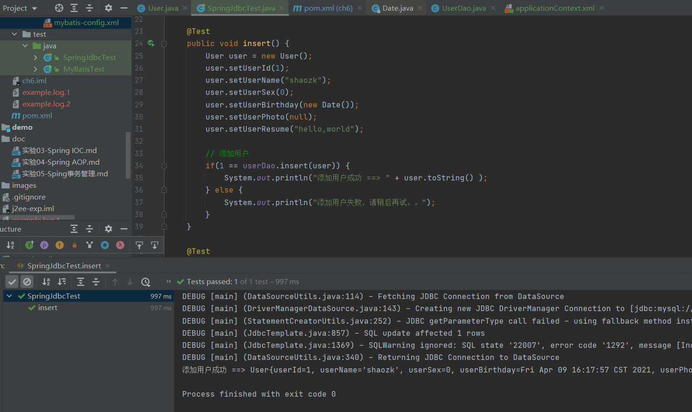
  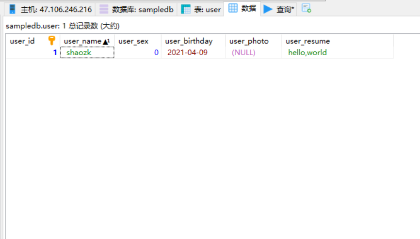

* 修改用户信息
  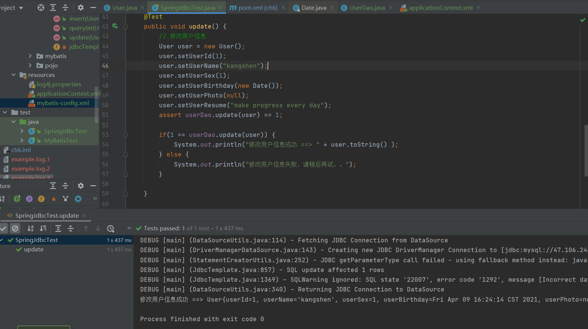
  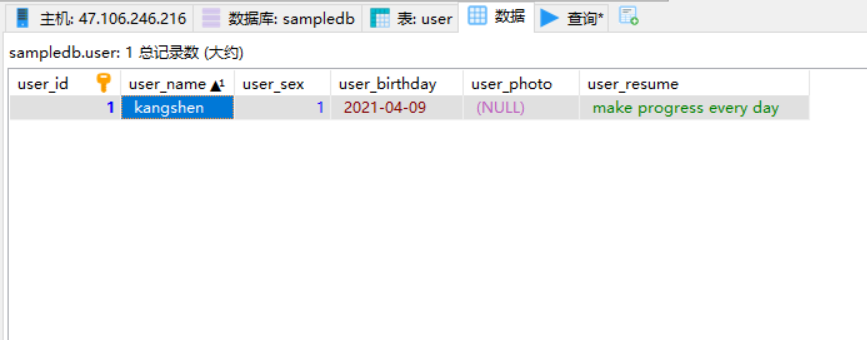
  
* 删除用户
  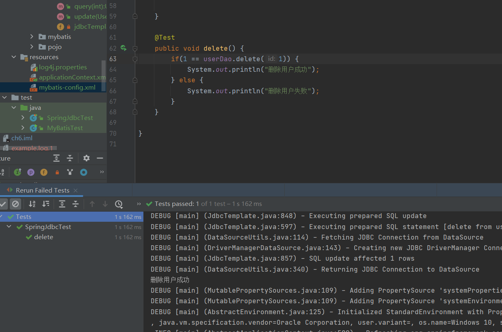
  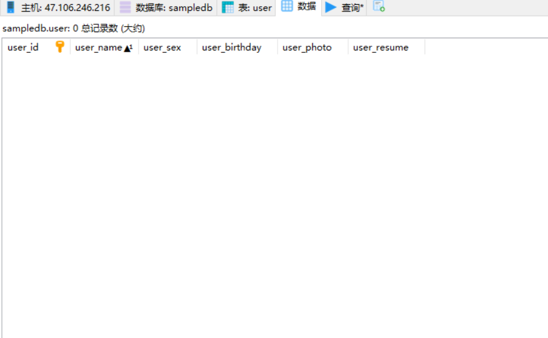
  
* 查询用户信息
  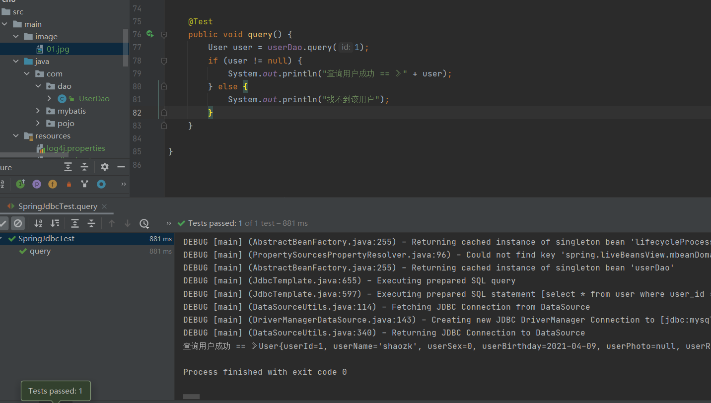
  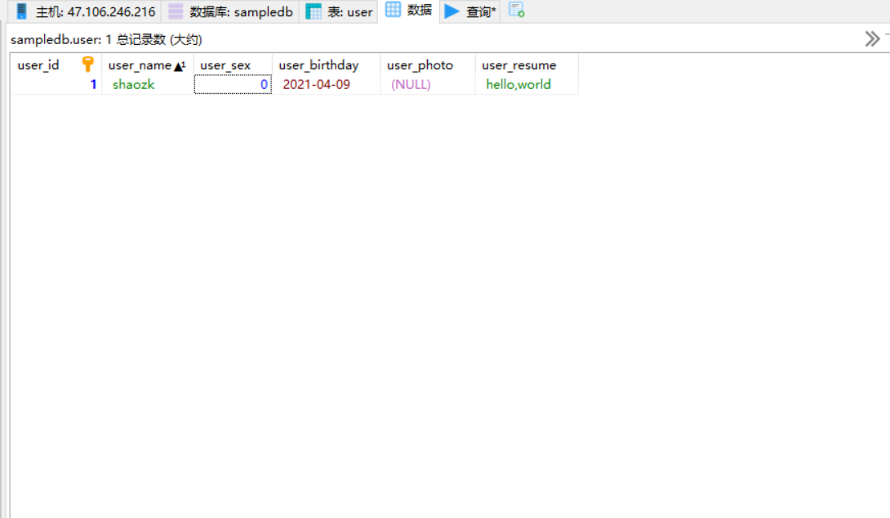

* 查询所有用户信息
  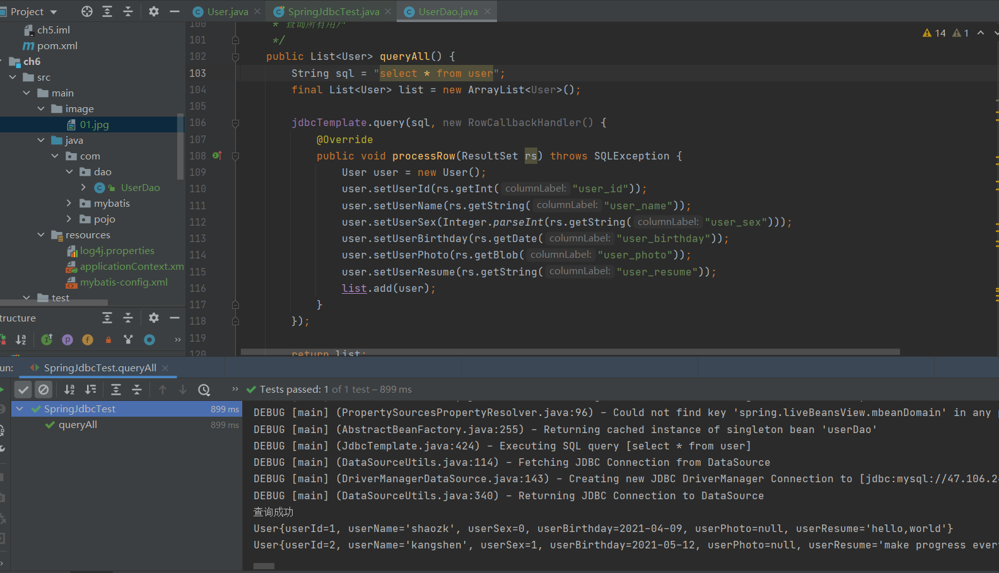
  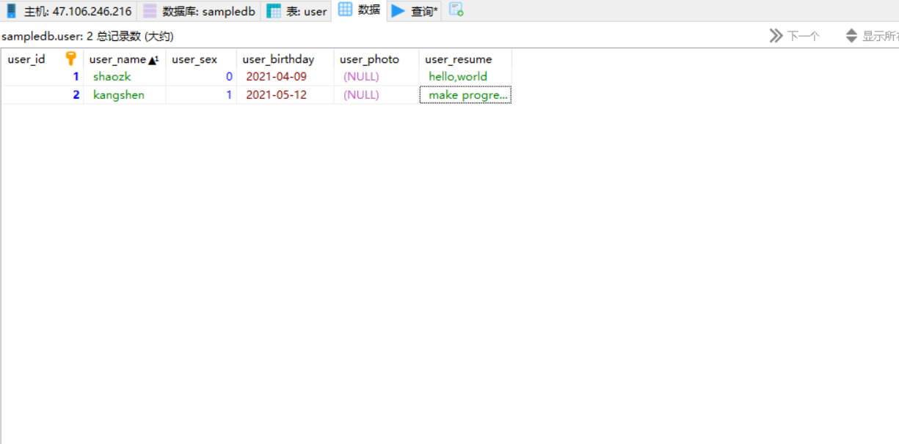
  
* 数据库表结构
  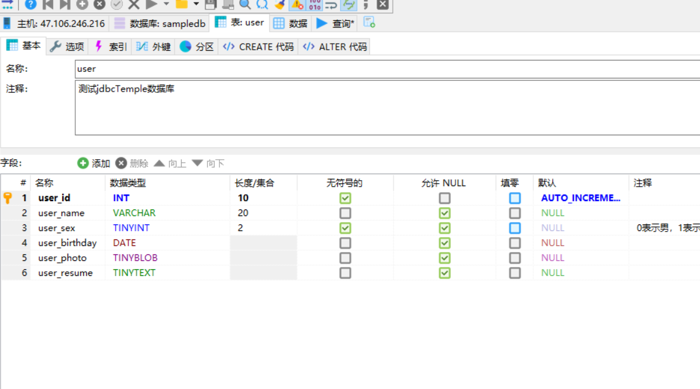


