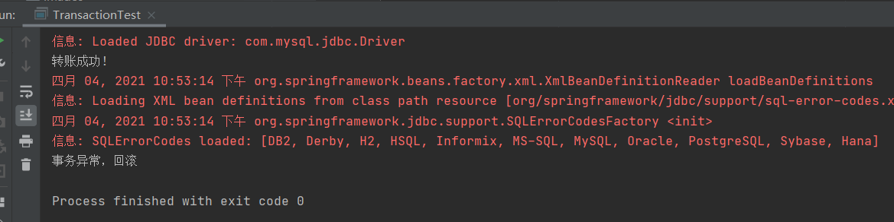

# 实验07-Spring 补充
实践教材第3、4、5章全部示例程序

## 第三章 Spring Bean
(所有示例在一个模块ch3中)

项目结构


pom文件
``` xml
<dependency>
    <groupId>junit</groupId>
    <artifactId>junit</artifactId>
    <version>4.11</version>
    <scope>test</scope>
</dependency>

<dependency>
    <groupId>org.springframework</groupId>
    <artifactId>spring-core</artifactId>
    <version>5.3.5</version>
</dependency>

<dependency>
    <groupId>org.springframework</groupId>
    <artifactId>spring-beans</artifactId>
    <version>5.0.20.RELEASE</version>
</dependency>

<dependency>
    <groupId>org.springframework</groupId>
    <artifactId>spring-context</artifactId>
    <version>5.0.2.RELEASE</version>
</dependency>

<dependency>
    <groupId>org.springframework</groupId>
    <artifactId>spring-context-support</artifactId>
    <version>5.0.2.RELEASE</version>
</dependency>

<dependency>
    <groupId>org.springframework</groupId>
    <artifactId>spring-expression</artifactId>
    <version>5.0.2.RELEASE</version>
</dependency>

<!-- https://mvnrepository.com/artifact/commons-logging/commons-logging -->
<dependency>
    <groupId>commons-logging</groupId>
    <artifactId>commons-logging</artifactId>
    <version>1.2</version>
</dependency>
```

**例1 Bean的实例化（构造方法、静态工厂、实例工厂一起）**

实体类BeanClass
```java
/*
 * Date: 2021/3/18
 * Author: <https://www.github.com/shaozk>
 */

package instance;

/**
 * @author shaozk
 * @Description: 构造方法实例化
 */
public class BeanClass {
    public String message;
    public BeanClass() {
        message = "构造方法实例化Bean";
    }
    public BeanClass(String s) {
        message = s;
    }
}


```

静态工厂类BeanStaticFactory
```java
/*
 * Date: 2021/3/18
 * Author: <https://www.github.com/shaozk>
 */

package instance;

/**
 * @author shaozk
 * @Description: 静态工厂实例化
 */
public class BeanStaticFactory {
    private static BeanClass beanInstance = new BeanClass("调用静态工厂方法实例化Bean");
    public static BeanClass createInstance() {
        return beanInstance;
    }
}

```

实例工厂类BeanInstanceFactory
```java
/*
 * Date: 2021/3/18
 * Author: <https://www.github.com/shaozk>
 */

package instance;

/**
 * @author shaozk
 * @Description: 实例工厂实例化
 */
public class BeanInstanceFactory {
    public BeanClass createBeanClassInstance() {
        return new BeanClass("调用实例工厂方法实例化Bean");
    }

}

```


测试类TestInstance
```java
/*
 * Date: 2021/3/18
 * Author: <https://www.github.com/shaozk>
 */

package test;

import instance.BeanClass;
import org.springframework.context.ApplicationContext;
import org.springframework.context.support.ClassPathXmlApplicationContext;

/**
 * @author shaozk
 * @Description: 测试类
 */
public class TestInstance {
    public static void main(String[] args) {
        // 初始化Spring容器ApplicationContext，加载配置文件
        ApplicationContext applicationContext = new ClassPathXmlApplicationContext("applicationContext.xml");

        // 测试构造方法实例化
        BeanClass b1 = (BeanClass) applicationContext.getBean("constructorInstance");
        System.out.println(b1 + b1.message);

        // 测试静态工厂方法实例化
        BeanClass b2 = (BeanClass) applicationContext.getBean("staticFactoryInstance");
        System.out.println(b2 + b2.message);

        // 测试实例化工厂方法实例化
        BeanClass b3 = (BeanClass) applicationContext.getBean("instanceFactory");
        System.out.println(b3 + b3.message);
        
    }

}

```


Spring配置文件applicationContext.xml
``` xml
<?xml version="1.0" encoding="UTF-8"?>
<beans xmlns="http://www.springframework.org/schema/beans"
       xmlns:xsi="http://www.w3.org/2001/XMLSchema-instance"
       xsi:schemaLocation="http://www.springframework.org/schema/beans http://www.springframework.org/schema/beans/spring-beans.xsd">
    <!--构造方法实例化Bean-->
    <bean id="constructorInstance" class="instance.BeanClass" scope="prototype"/>

    <!--静态工厂方法实例化Bean，CreateInstance为静态工厂类BeanStaticFactory中的静态方法-->
    <bean id="staticFactoryInstance" class="instance.BeanStaticFactory" factory-method="createInstance"/>

    <!--配置工厂-->
    <bean id="myFactory" class="instance.BeanInstanceFactory" />
    <!--使用factory-bean属性指定配置工厂，使用factory-method属性指定使用工厂中的哪个方法实例化Bean-->
    <bean id="instanceFactory" factory-bean="myFactory" factory-method="createBeanClassInstance"/>

    <!--配置Bean，使用init-method属性指定初始化方法，使用destroy-method属性指定销毁方法-->
    <bean id="beanLife" class="life.BeanLife" init-method="initMyself" destroy-method="destroyMyself"/>
</beans>
```

实验截图


**例2 Bean的作用域**
singleton作用域（默认）
```xml
<!--构造方法实例化Bean-->
    <bean id="constructorInstance" class="instance.BeanClass"/>
```

prototype作用域的配置
```xml
<!--构造方法实例化Bean-->
    <bean id="constructorInstance" class="instance.BeanClass" scope="prototype"/>
```

测试类TestScope
```java
/*
 * Date: 2021/3/18
 * Author: <https://www.github.com/shaozk>
 */

package test;

import instance.BeanClass;
import org.springframework.context.ApplicationContext;
import org.springframework.context.support.ClassPathXmlApplicationContext;

/**
 * @author shaozk
 * @Description: singleton作用域
 */
public class TestScope {

    public static void main(String[] args) {
        // 初始化Spring容器ApplicationContext，加载配置文件
        ApplicationContext applicationContext = new ClassPathXmlApplicationContext("applicationContext.xml");

        // 测试构造方法实例化Bean
        BeanClass b1 = (BeanClass) applicationContext.getBean("constructorInstance");
        System.out.println(b1);

        BeanClass b2 = (BeanClass) applicationContext.getBean("constructorInstance");
        System.out.println(b2);

    }


}

```

实验截图


**例3 Bean的生命周期**
Bean的实现类BeanLife
```java
/*
 * Date: 2021/3/18
 * Author: <https://www.github.com/shaozk>
 */

package life;

/**
 * @author shaozk
 * @Description: Bean的声明周期
 */
public class BeanLife {
    public void initMyself() {
        System.out.println(this.getClass().getName() + "自定义初始化方法");
    }

    public void destroyMyself() {
        System.out.println(this.getClass().getName() + "自定义销毁方法");
    }
}

```

配置Bean
```xml
 <!--配置Bean，使用init-method属性指定初始化方法，使用destroy-method属性指定销毁方法-->
    <bean id="beanLife" class="life.BeanLife" init-method="initMyself" destroy-method="destroyMyself"/>
```

测试类TestLife
```java
/*
 * Date: 2021/3/18
 * Author: <https://www.github.com/shaozk>
 */

package test;

import life.BeanLife;
import org.springframework.context.ApplicationContext;
import org.springframework.context.support.ClassPathXmlApplicationContext;

/**
 * @author shaozk
 * @Description: 测试声明周期
 */
public class TestLife {
    public static void main(String[] args) {
        // 初始化Spring容器，加载配置文件
        // 为了方便演示销毁的方法，使用ClassPathXmlApplicationContext
        ClassPathXmlApplicationContext applicationContext = new ClassPathXmlApplicationContext("applicationContext.xml");
        System.out.println("获得对象前");
        BeanLife bLife = (BeanLife) applicationContext.getBean("beanLife");
        System.out.println("获得对象后：" + bLife);
        applicationContext.close();
    }
}

```


**例4 Bean的装配方式**

1）基于XML配置的装配
实体类ComplexUser
```java
/*
 * Date: 2021/3/18
 * Author: <https://www.github.com/shaozk>
 */

package assemble;

import java.util.List;
import java.util.Map;
import java.util.Set;

/**
 * @author shaozk
 * @Description: 基于XML配置的Bean的装配方式
 */
public class ComplexUser {
    private String uname;
    private List<String> hobbyList;
    private Map<String, String> residenceMap;
    private Set<String> aliasSet;
    private String[] array;

    /**
     * 使用构造方法注入，需要提供带参的构造方法
     * @param uname
     * @param hobbyList
     * @param residenceMap
     * @param aliasSet
     * @param array
     */
    public ComplexUser(String uname, List<String> hobbyList, Map<String, String> residenceMap, Set<String> aliasSet, String[] array) {
        super();
        this.uname = uname;
        this.hobbyList = hobbyList;
        this.residenceMap = residenceMap;
        this.aliasSet = aliasSet;
        this.array = array;
    }

    /**
     * 使用属性的setter方法注入，提供默认无参的构造方法，并为注入的属性提供setter方法
     */

    public ComplexUser() {
        super();
    }

    public String getUname() {
        return uname;
    }

    public void setUname(String uname) {
        this.uname = uname;
    }

    public List<String> getHobbyList() {
        return hobbyList;
    }

    public void setHobbyList(List<String> hobbyList) {
        this.hobbyList = hobbyList;
    }

    public Map<String, String> getResidenceMap() {
        return residenceMap;
    }

    public void setResidenceMap(Map<String, String> residenceMap) {
        this.residenceMap = residenceMap;
    }

    public Set<String> getAliasSet() {
        return aliasSet;
    }

    public void setAliasSet(Set<String> aliasSet) {
        this.aliasSet = aliasSet;
    }

    public String[] getArray() {
        return array;
    }

    public void setArray(String[] array) {
        this.array = array;
    }

    @Override
    public String toString() {
        return "uname=" + uname + ";hobbyList=" + hobbyList + ";residenceMap=" + residenceMap + ";aliasSet=" + aliasSet + ";array=" + array + ";";
    }
}

```

配置Bean
``` xml
<!--使用构造方法注入方式配置ComplexUser实例user1-->
    <bean id="user1" class="assemble.ComplexUser">
        <constructor-arg index="0" value="shaozk1"/>
        <constructor-arg index="1">
            <list>
                <value>唱歌</value>
                <value>爬山</value>
                <value>跳舞</value>
            </list>
        </constructor-arg>
        <constructor-arg index="2">
            <map>
                <entry key="dalian" value="大连"/>
                <entry key="beijing" value="北京"/>
                <entry key="shanghai" value="上海"/>
            </map>
        </constructor-arg>
        <constructor-arg index="3">
            <set>
                <value>shaozk101</value>
                <value>shaozk102</value>
                <value>shaozk103</value>
            </set>
        </constructor-arg>
        <constructor-arg index="4">
            <array>
                <value>aaaaa</value>
                <value>bbbbb</value>
            </array>
        </constructor-arg>
    </bean>

    <!--使用属性的setter方法注入方式配置ComplexUser实例user2-->
    <bean id="user2" class="assemble.ComplexUser">
        <property name="uname" value="shaozk2"/>
        <property name="hobbyList">
            <list>
                <value>看书</value>
                <value>敲代码</value>
            </list>
        </property>
        <property name="residenceMap">
            <map>
                <entry key="shenzhen" value="深圳"/>
                <entry key="guangzhou" value="广州"/>
                <entry key="changsha" value="长沙"/>
            </map>
        </property>
        <property name="aliasSet">
            <set>
                <value>shaozk104</value>
                <value>shaozk105</value>
                <value>shaozk106</value>
            </set>
        </property>
        <property name="array">
            <array>
                <value>ccccc</value>
                <value>ddddd</value>
            </array>
        </property>
    </bean>
```

测试类TestAssemble
```java
/*
 * Date: 2021/3/18
 * Author: <https://www.github.com/shaozk>
 */

package test;

import assemble.ComplexUser;
import org.springframework.context.ApplicationContext;
import org.springframework.context.support.ClassPathXmlApplicationContext;

/**
 * @author shaozk
 * @Description: 测试基于XML配置的装配方式
 */
public class TestAssemble {
    public static void main(String[] args) {
        ApplicationContext applicationContext = new ClassPathXmlApplicationContext("applicationContext.xml");

        // 使用构造方法装配测试
        ComplexUser u1 = (ComplexUser) applicationContext.getBean("user1");
        System.out.println(u1);

        // 使用setter方法装配测试
        ComplexUser u2 = (ComplexUser) applicationContext.getBean("user2");
        System.out.println(u2);
    }
}

```

实验截图


2）基于注解的装配
实体类AnnotationUser
```java
/*
 * Date: 2021/3/18
 * Author: <https://www.github.com/shaozk>
 */

package annotation;

import org.springframework.beans.factory.annotation.Value;
import org.springframework.stereotype.Component;

/**
 * @author shaozk
 * @Description: 基于注解的装配
 */
@Component()    // 相当与@Compoent("AnnotationUser")或@Component(value="AnnotationUser")
public class AnnotationUser {
    @Value("shaozk")    // 只注入简单的值，对于复杂值得注入目前使用该方法解决不了
    private String uname;

    public String getUname() {
        return uname;
    }

    public void setUname(String uname) {
        this.uname = uname;
    }
}

```

Spring配置文件annotationContext.xml
``` xml
<?xml version="1.0" encoding="UTF-8"?>
<beans xmlns="http://www.springframework.org/schema/beans"
       xmlns:xsi="http://www.w3.org/2001/XMLSchema-instance"
       xmlns:context="http://www.springframework.org/schema/context"
       xsi:schemaLocation="http://www.springframework.org/schema/beans
       http://www.springframework.org/schema/beans/spring-beans.xsd
       http://www.springframework.org/schema/context
       http://www.springframework.org/schema/context/spring-context.xsd">
    <!--使用context命名空间，通过Spring扫描指定包annotation及其子包所有Bean的实现类，进行注解解析-->
    <context:component-scan base-package="annotation"/>
</beans>
```

Dao层

TestDao
```java
/*
 * Date: 2021/3/18
 * Author: <https://www.github.com/shaozk>
 */

package annotation.com.dao;

/**
 * @author shaozk
 * @Description: TODO
 */
public interface TestDao {
    public void save();
}

```

TestDaoImpl
```java
/*
 * Date: 2021/3/18
 * Author: <https://www.github.com/shaozk>
 */

package annotation.com.dao;

import org.springframework.stereotype.Repository;

/**
 * @author shaozk
 * @Description: TODO
 */
@Repository("testDaoImpl")
public class TestDaoImpl implements TestDao{
    @Override
    public void save() {
        System.out.println("TestDao save()");
    }
}

```

Service层

TestService
```java
/*
 * Date: 2021/3/18
 * Author: <https://www.github.com/shaozk>
 */

package annotation.service;

/**
 * @author shaozk
 * @Description: TODO
 */
public interface TestService {
    public void save();
}

```

TestServiceImpl
```java
/*
 * Date: 2021/3/18
 * Author: <https://www.github.com/shaozk>
 */

package annotation.service;

import annotation.com.dao.TestDao;
import org.springframework.stereotype.Service;

import javax.annotation.Resource;

/**
 * @author shaozk
 * @Description: TODO
 */
@Service("testServiceImpl")
public class TestServiceImpl implements TestService{
    @Resource(name = "testDaoImpl") // 相当与@Autowried
    private TestDao testDao;

    @Override
    public void save() {
        testDao.save();
        System.out.println("TestService save()");
    }
}

```

controller层
```java
/*
 * Date: 2021/3/18
 * Author: <https://www.github.com/shaozk>
 */

package annotation.controller;

import annotation.service.TestService;
import org.springframework.beans.factory.annotation.Autowired;
import org.springframework.stereotype.Controller;

/**
 * @author shaozk
 * @Description: TODO
 */
@Controller
public class TestController {

    @Autowired
    private TestService testService;

    public void save() {
        testService.save();
        System.out.println("TestController save()");
    }
}

```


测试类TestMoreAnnotation
```java
/*
 * Date: 2021/3/18
 * Author: <https://www.github.com/shaozk>
 */

package test;

import annotation.controller.TestController;
import org.springframework.context.ApplicationContext;
import org.springframework.context.support.ClassPathXmlApplicationContext;

/**
 * @author shaozk
 * @Description: TODO
 */
public class TestMoreAnnotation {
    public static void main(String[] args) {
        ApplicationContext applicationContext = new ClassPathXmlApplicationContext("annotationContext.xml");
        TestController testController = (TestController) applicationContext.getBean("testController");
        testController.save();
    }
}

```

实验截图


## 第四章 Spring AOP
(所有示例在一个模块ch4中)

项目结构


pom文件
``` xml
<dependency>
            <groupId>junit</groupId>
            <artifactId>junit</artifactId>
            <version>4.11</version>
            <scope>test</scope>
        </dependency>

        <dependency>
            <groupId>org.springframework</groupId>
            <artifactId>spring-core</artifactId>
            <version>5.0.2.RELEASE</version>
        </dependency>

        <dependency>
            <groupId>org.springframework</groupId>
            <artifactId>spring-beans</artifactId>
            <version>5.0.2.RELEASE</version>
        </dependency>

        <dependency>
            <groupId>org.springframework</groupId>
            <artifactId>spring-context</artifactId>
            <version>5.0.2.RELEASE</version>
        </dependency>

        <dependency>
            <groupId>org.springframework</groupId>
            <artifactId>spring-context-support</artifactId>
            <version>5.0.2.RELEASE</version>
        </dependency>

        <dependency>
            <groupId>org.springframework</groupId>
            <artifactId>spring-expression</artifactId>
            <version>5.0.2.RELEASE</version>
        </dependency>

        <!-- https://mvnrepository.com/artifact/commons-logging/commons-logging -->
        <dependency>
            <groupId>commons-logging</groupId>
            <artifactId>commons-logging</artifactId>
            <version>1.2</version>
        </dependency>

        <!-- https://mvnrepository.com/artifact/org.aspectj/aspectjweaver -->
        <dependency>
            <groupId>org.aspectj</groupId>
            <artifactId>aspectjweaver</artifactId>
            <version>1.8.13</version>
        </dependency>

        <!-- https://mvnrepository.com/artifact/org.springframework/spring-aop -->
<!--        注意保持版本一致-->
        <dependency>
            <groupId>org.springframework</groupId>
            <artifactId>spring-aop</artifactId>
            <version>5.0.2.RELEASE</version>
        </dependency>
        <!-- https://mvnrepository.com/artifact/aopalliance/aopalliance -->
<!--        <dependency>-->
<!--            <groupId>aopalliance</groupId>-->
<!--            <artifactId>aopalliance</artifactId>-->
<!--            <version>1.0</version>-->
<!--        </dependency>-->

        <dependency>
            <groupId>org.springframework</groupId>
            <artifactId>spring-aspects</artifactId>
            <version>5.0.2.RELEASE</version>
        </dependency>
        <dependency>
            <groupId>org.springframework</groupId>
            <artifactId>spring-test</artifactId>
            <version>4.2.2.RELEASE</version>
            <scope>compile</scope>
        </dependency>
        <dependency>
            <groupId>junit</groupId>
            <artifactId>junit</artifactId>
            <version>4.12</version>
            <scope>compile</scope>
        </dependency>
        <dependency>
            <groupId>org.jetbrains</groupId>
            <artifactId>annotations</artifactId>
            <version>RELEASE</version>
            <scope>compile</scope>
        </dependency>

```

**例1 JDK动态代理**

Dao层

TestDao
```java
/*
 * Date: 2021/3/26
 * Author: <https://www.github.com/shaozk>
 */

package dynamic.jdk;

/**
 * @author shaozk
 * @Description: TODO
 */
public interface TestDao {
    public void save();
    public void modify();
    public void delete();
}

```

TestDaoImpl
```java
/*
 * Date: 2021/3/26
 * Author: <https://www.github.com/shaozk>
 */

package dynamic.jdk;

import org.springframework.stereotype.Repository;

/**
 * @author shaozk
 * @Description: TODO
 */
@Repository()
public class TestDaoImpl implements TestDao{
    public TestDaoImpl() {
    }

    @Override
    public void save() {
        System.out.println("保存");
    }

    @Override
    public void modify() {
        System.out.println("修改");
    }

    @Override
    public void delete() {
        System.out.println("删除");
    }
}

```

切面类MyAspect
```java
/*
 * Date: 2021/3/26
 * Author: <https://www.github.com/shaozk>
 */

package aspect;

/**
 * @author shaozk
 * @Description: 切面类，可以定义多个通知，即增强处理的方法
 */
public class MyAspect {
    public void check() {
        System.out.println("模拟权限控制");
    }
    public void except() {
        System.out.println("模拟异常处理");
    }
    public void log() {
        System.out.println("模拟日志记录");
    }
    public void monitor() {
        System.out.println("性能测试");
    }

}

```

动态代理类JDKDynamicProxy
```java
/*
 * Date: 2021/3/26
 * Author: <https://www.github.com/shaozk>
 */

package dynamic.jdk;

import aspect.MyAspect;

import java.lang.reflect.InvocationHandler;
import java.lang.reflect.Method;
import java.lang.reflect.Proxy;

/**
 * @author shaozk
 * @Description: TODO
 */
public class JDKDynamicProxy implements InvocationHandler {
    // 声明目标类接口对象
    private TestDao testDao;

    // 创建代理的方法，建立代理对象和真实对象的代理关系，并返回代理对象
    public Object createProxy(TestDao testDao) {
        this.testDao = testDao;
        // 1.类加载器
        ClassLoader cld = JDKDynamicProxy.class.getClassLoader();

        // 2.被代理对象事项的所有接口
        Class[] clazz = testDao.getClass().getInterfaces();

        // 3.使用代理类进行增强，返回代理后的对象
        return Proxy.newProxyInstance(cld, clazz, this);
    }


    /**
     * 代理的逻辑方法，所有动态代理的方法调用都交给该方法处理
     * proxy是代理对象
     * method是将要被执行的方法
     * args是执行难方法时需要的参数
     * return指返回代理结果
     * @param proxy
     * @param method
     * @param args
     * @return
     * @throws Throwable
     */
    @Override
    public Object invoke(Object proxy, Method method, Object[] args) throws Throwable {
        // 创建一个切面
        MyAspect myAspect = new MyAspect();
        // 前增强
        myAspect.check();
        myAspect.except();

        // 在目标类桑调用方法并传入参数，相当于调用testDao中的方法
        Object obj = method.invoke(testDao, args);

        // 后增强
        myAspect.log();
        myAspect.monitor();
        return obj;
    }
}

```

测试类JDKDynamicProxy
```java
/*
 * Date: 2021/3/26
 * Author: <https://www.github.com/shaozk>
 */

package dynamic.jdk;

/**
 * @author shaozk
 * @Description: TODO
 */
public class JDKDynamicTest {
    public static void main(String[] args) {
        // 创建代理对象
        JDKDynamicProxy jdkDynamicProxy = new JDKDynamicProxy();
        // 创建目标对象
        TestDao testDao = new TestDaoImpl();

        TestDao testDaoAdvice = (TestDao) jdkDynamicProxy.createProxy(testDao);

        // 执行方法
        testDaoAdvice.save();
        System.out.println("==========");
        testDaoAdvice.modify();
        System.out.println("==========");
        testDaoAdvice.delete();
    }
}

```

实验截图


**例2 CGLIB动态代理**

dao层
```java
/*
 * Date: 2021/3/26
 * Author: <https://www.github.com/shaozk>
 */

package dynamic.cglib;

/**
 * @author shaozk
 * @Description: TODO
 */
public class TestDao {
    public void save() {
        System.out.println("保存");
    }

    public void modify() {
        System.out.println("修改");
    }

    public void delete() {
        System.out.println("删除");
    }
}

```

代理类CglibDynamicProxy
```java
/*
 * Date: 2021/3/26
 * Author: <https://www.github.com/shaozk>
 */

package dynamic.cglib;

import aspect.MyAspect;

import org.springframework.cglib.proxy.Callback;
import org.springframework.cglib.proxy.Enhancer;
import org.springframework.cglib.proxy.MethodInterceptor;
import org.springframework.cglib.proxy.MethodProxy;

import java.lang.reflect.Method;

/**
 * @author shaozk
 * @Description: TODO
 */
public class CglibDynamicProxy implements MethodInterceptor {

    /**
     * 创建代理的方法，生成CGLIB代理对象，
     * target是目标对象，需要增强的对象
     * 返回目标对象的CGLIB代理对象
     * @param target
     * @return
     */
    public Object createProxy(Object target) {
        // 创建一个动态类对象，即增强类对象
        Enhancer enhancer = new Enhancer();

        // 确定需要增强的类，设置其父类
        enhancer.setSuperclass(target.getClass());

        // 确定代理逻辑对象为当前对象，要求当前对象实现MethodInterceptor的方法
        enhancer.setCallback((Callback) this);

        // 返回创建的代理对象
        return enhancer.create();

    }

    /**
     * intercept方法会在程序执行目标方法时被调用
     * proxy是CGLIB根据指定父类生成的代理对象
     * method是拦截方法
     * args是拦截方法的参数数组
     * methodProxy是方法的dialing对象，用于执行父类的方法
     * 返回代理结果
     * @param
     * @return
     * @throws Throwable
     */
    @Override
    public Object intercept(Object o, Method method, Object[] objects, MethodProxy methodProxy) throws Throwable {
        // 创建一个切面
        MyAspect myAspect = new MyAspect();
        // 前增强
        myAspect.check();
        myAspect.except();

        // 目标方法执行，返回代理结果
        Object obj = methodProxy.invokeSuper(o, objects);

        // 后增强
        myAspect.log();
        myAspect.monitor();
        return obj;
    }


}

```

测试类CglibDynamicTest
```java
/*
 * Date: 2021/3/26
 * Author: <https://www.github.com/shaozk>
 */

package dynamic.cglib;

/**
 * @author shaozk
 * @Description: TODO
 */
public class CglibDynamicTest {
    public static void main(String[] args) {
        // 创建代理对象
        CglibDynamicProxy cdp = new CglibDynamicProxy();
        TestDao com.dao = new TestDao();
        TestDao testDaoAdvice = (TestDao) cdp.createProxy(com.dao);
        // 执行方法
        testDaoAdvice.save();
        System.out.println("==========");
        testDaoAdvice.modify();
        System.out.println("==========");
        testDaoAdvice.delete();

    }
}

```

实验截图


**例3 基于代理类的AOP实现**

切面类
```java
/*
 * Date: 2021/3/26
 * Author: <https://www.github.com/shaozk>
 */

package spring.proxyfactorybean;

import org.aopalliance.intercept.MethodInterceptor;
import org.aopalliance.intercept.MethodInvocation;
import org.aspectj.lang.JoinPoint;

/**
 * @author shaozk
 * @Description: TODO
 */
public class MyAspect implements MethodInterceptor {
    @Override
    public Object invoke(MethodInvocation methodInvocation) throws Throwable {
        check();
        except();
        Object object = methodInvocation.proceed();
        log();
        monitor();
        return object;
    }

    public void check() {
        System.out.println("模拟权限控制");
    }

    public void except() {
        System.out.println("模拟异常处理");
    }

    public void monitor() {
        System.out.println("性能检测");
    }

    public void log() {
        System.out.println("模拟日志打印");
    }

}

```

配置文件
``` xml
<?xml version="1.0" encoding="UTF-8"?>
<beans xmlns="http://www.springframework.org/schema/beans"
       xmlns:xsi="http://www.w3.org/2001/XMLSchema-instance"
       xsi:schemaLocation="http://www.springframework.org/schema/beans http://www.springframework.org/schema/beans/spring-beans.xsd">
<!--    定义目标对象-->
    <bean id="testDao" class="dynamic.jdk.TestDaoImpl"/>
<!--    创建一个切面-->
    <bean id="myAspect" class="spring.proxyfactorybean.MyAspect"/>
<!--    使用Spring代理工厂定义一个名为testDaoProxy的代理对象-->
    <bean id="testDaoProxy" class="org.springframework.aop.framework.ProxyFactoryBean">
<!--        指定代理实现的接口-->
        <property name="proxyInterfaces" value="dynamic.jdk.TestDao"/>
<!--        指定目标对象-->
        <property name="target" ref="testDao"/>
<!--        指定切面，植入环绕通知-->
        <property name="interceptorNames" value="myAspect"/>
<!--        指定代理方式，true指定CGLIB动态代理，默认为JDK动态代理-->
        <property name="proxyTargetClass" value="true"/>
    </bean>
</beans>

```

测试类ProXyFactoryBeanTest
```java

/*
 * Date: 2021/3/26
 * Author: <https://www.github.com/shaozk>
 */

package spring.proxyfactorybean;

import dynamic.jdk.TestDao;
import org.springframework.context.ApplicationContext;
import org.springframework.context.support.ClassPathXmlApplicationContext;

/**
 * @author shaozk
 * @Description: TODO
 */
public class ProFactoryBeanTest {
    public static void main(String[] args) {
        ApplicationContext applicationContext = new ClassPathXmlApplicationContext("daoAdviceContext.xml");
        TestDao testDaoAdvice = (TestDao) applicationContext.getBean("testDaoProxy");
        // 执行方法
        testDaoAdvice.save();
        System.out.println("==========");
        testDaoAdvice.modify();
        System.out.println("==========");
        testDaoAdvice.delete();
    }
}

```


**例4 基于XML配置开发AspectJ**

切面类
```java
/*
 * Date: 2021/3/26
 * Author: <https://www.github.com/shaozk>
 */

package aspect.xml;

import org.aspectj.lang.JoinPoint;

import static java.lang.System.exit;

/**
 * @author shaozk
 * @Description: 切面类
 */
public class XmlAspect {
    // 前置通知
    public void before(JoinPoint joinPoint) {
        System.out.println("基于XML的声明式AspectJ");

        //获取当前请求方法的参数值
        Object[] args = joinPoint.getArgs();

        if(args[0].toString().equals("agree")) {
            System.out.println("请求成功！");
        }else {
            System.out.println("请求失败，拒绝访问！");
            exit(-1);
        }
    }

}

```

配置文件
``` xml
<?xml version="1.0" encoding="UTF-8"?>
<beans xmlns="http://www.springframework.org/schema/beans"
       xmlns:xsi="http://www.w3.org/2001/XMLSchema-instance"
       xmlns:aop="http://www.springframework.org/schema/aop"
       xsi:schemaLocation="http://www.springframework.org/schema/beans
       http://www.springframework.org/schema/beans/spring-beans.xsd
       http://www.springframework.org/schema/aop
       https://www.springframework.org/schema/aop/spring-aop.xsd">
    <!--spring-beans-4.3这里的4.3是指明版本号 -->
    <!-- 1.目标类 -->
    <bean id="testDao" class="com.com.dao.XMLTestDaoImpl"/>
    <!-- 2.切面 -->
    <bean id="myAspect" class="aspect.xml.XmlAspect"/>
    <!-- 3.Aop编程 -->
    <aop:config>
        <!-- 配置切面 -->
        <aop:aspect ref="myAspect">
            <!-- 3.1配置切入点，通知最后增强那些方法 ,对所有的类，里面所有的方法进行增强 -->
            <aop:pointcut
                    expression="execution(* com.com.dao.XMLTestDaoImpl.*(..))" id="myPointCut" />
            <!-- 管理通知Advice和切入点 -->
            <!-- 前置通知 -->
            <aop:before method="before" pointcut-ref="myPointCut" />

        </aop:aspect>
    </aop:config>
</beans>
```

测试类
```java
/*
 * Date: 2021/3/26
 * Author: <https://www.github.com/shaozk>
 */

package aspect.xml;

import com.com.dao.XMLTestDao;
import org.springframework.context.ApplicationContext;
import org.springframework.context.support.ClassPathXmlApplicationContext;

/**
 * @author shaozk
 * @Description: TODO
 */
public class XmlTest {
    public static void main(String[] args) {
        ApplicationContext applicationContext = new ClassPathXmlApplicationContext("xmlAspectContext.xml");
        XMLTestDao advice = (XMLTestDao) applicationContext.getBean("testDao");
        // 执行方法
        advice.save("agree");
        advice.save("false");
    }
}

```

实验截图


**基于注解开发AspectJ**

切面类
```java
package aspect.annotation;


import org.aspectj.lang.JoinPoint;
import org.aspectj.lang.annotation.*;
import org.springframework.stereotype.Component;

import static java.lang.System.exit;

@Aspect
@Component
class MyAspect {
    //定义切入点表达式
    @Pointcut("execution(* com.com.dao.AnnTestDaoImpl.*(..))")
    private void myPointCut() {
        //使用一个返回值为void,方法体为空的方法来命名切入点
    }

    @Before("myPointCut()")
    // 前置通知
    public void myBefore(JoinPoint joinPoint) {
        System.out.println("基于注解的声明式AspectJ");

        //获取当前请求方法的参数值
        Object[] args = joinPoint.getArgs();

        if(args[0].toString().equals("agree")) {
            System.out.println("请求成功！");
        }else {
            System.out.println("请求失败，拒绝访问！");
            exit(-1);
        }
    }

}

```

测试类
```java
/*
 * Date: 2021/3/26
 * Author: <https://www.github.com/shaozk>
 */

package aspect.annotation;


import com.com.dao.ANNTestDao;
import org.springframework.context.ApplicationContext;
import org.springframework.context.support.ClassPathXmlApplicationContext;

/**
 * @author shaozk
 * @Description: TODO
 */
public class AnnTest {
    public static void main(String[] args) {
        ApplicationContext applicationContext = new ClassPathXmlApplicationContext("annotationAspectContext.xml");
        ANNTestDao com.dao = (ANNTestDao) applicationContext.getBean("testDaoImpl");
        com.dao.save("agree");
        com.dao.save("false");
    }
}

```

实验截图


## 第五章 Spring Bean
(所有示例在一个模块ch5中)

目录结构


pom文件
``` xml
<dependency>
            <groupId>junit</groupId>
            <artifactId>junit</artifactId>
            <version>4.11</version>
            <scope>test</scope>
        </dependency>

        <dependency>
            <groupId>org.springframework</groupId>
            <artifactId>spring-core</artifactId>
            <version>5.0.2.RELEASE</version>
        </dependency>

        <dependency>
            <groupId>org.springframework</groupId>
            <artifactId>spring-beans</artifactId>
            <version>5.0.2.RELEASE</version>
        </dependency>

        <dependency>
            <groupId>org.springframework</groupId>
            <artifactId>spring-context</artifactId>
            <version>5.0.2.RELEASE</version>
        </dependency>

        <dependency>
            <groupId>org.springframework</groupId>
            <artifactId>spring-context-support</artifactId>
            <version>5.0.2.RELEASE</version>
        </dependency>

        <dependency>
            <groupId>org.springframework</groupId>
            <artifactId>spring-expression</artifactId>
            <version>5.0.2.RELEASE</version>
        </dependency>

        <!-- https://mvnrepository.com/artifact/commons-logging/commons-logging -->
        <dependency>
            <groupId>commons-logging</groupId>
            <artifactId>commons-logging</artifactId>
            <version>1.2</version>
        </dependency>
        <dependency>
            <groupId>org.springframework</groupId>
            <artifactId>spring-test</artifactId>
            <version>5.0.2.RELEASE</version>
            <scope>compile</scope>
        </dependency>
        <dependency>
            <groupId>junit</groupId>
            <artifactId>junit</artifactId>
            <version>4.12</version>
            <scope>compile</scope>
        </dependency>
        <dependency>
            <groupId>org.springframework</groupId>
            <artifactId>spring-jdbc</artifactId>
            <version>5.0.2.RELEASE</version>
        </dependency>
        <dependency>
            <groupId>org.springframework</groupId>
            <artifactId>spring-tx</artifactId>
            <version>5.0.2.RELEASE</version>
        </dependency>
        <dependency>
            <groupId>org.springframework</groupId>
            <artifactId>spring-aop</artifactId>
            <version>5.0.2.RELEASE</version>
        </dependency>
        <dependency>
            <groupId>mysql</groupId>
            <artifactId>mysql-connector-java</artifactId>
            <version>5.1.46</version>
        </dependency>
        <dependency>
            <groupId>org.aspectj</groupId>
            <artifactId>aspectjweaver</artifactId>
            <version>1.8.13</version>
        </dependency>
        <dependency>
            <groupId>org.springframework</groupId>
            <artifactId>spring-aspects</artifactId>
            <version>5.0.2.RELEASE</version>
        </dependency>

```

配置文件applicationContext.xml
``` xml
<?xml version="1.0" encoding="UTF-8"?>
<beans xmlns="http://www.springframework.org/schema/beans"
       xmlns:xsi="http://www.w3.org/2001/XMLSchema-instance"
       xmlns:context="http://www.springframework.org/schema/context"
       xsi:schemaLocation="http://www.springframework.org/schema/beans http://www.springframework.org/schema/beans/spring-beans.xsd http://www.springframework.org/schema/util http://www.springframework.org/schema/util/spring-util.xsd http://www.springframework.org/schema/context http://www.springframework.org/schema/context/spring-context.xsd">
<!--    指定需要扫描的包-->
    <context:component-scan base-package="com.com.dao"/>

<!--    配置数据源-->
    <bean id="dataSource" class="org.springframework.jdbc.datasource.DriverManagerDataSource">
<!--        mysql数据库驱动-->
        <property name="driverClassName" value="com.mysql.jdbc.Driver"/>
        <property name="url" value="jdbc:mysql://47.106.246.216/sampledb?characterEncoding=utf8&amp;useUnicode=true&amp;useSSL=false&amp;serverTimezone=Asia/Shanghai"/>
        <property name="username" value="root"/>
        <property name="password" value="123456"/>
    </bean>
    <!-- 配置Jdbc模板  -->
    <bean id="jdbcTemplate" class="org.springframework.jdbc.core.JdbcTemplate">
        <property name="dataSource" ref="dataSource" />
    </bean>

<!--    为数据源添加事务管理器-->
    <bean id="txManager" class="org.springframework.jdbc.datasource.DataSourceTransactionManager">
        <property name="dataSource" ref="dataSource"/>

    </bean>
    <!--    为是为u管理器txManager创建transactionTemplate-->
    <bean id="transactionTemplate" class="org.springframework.transaction.support.TransactionTemplate">
        <property name="transactionManager" ref="txManager"/>
    </bean>
</beans>
```

dao层

```java
/*
 * Date: 2021/3/26
 * Author: <https://www.github.com/shaozk>
 */

package com.com.dao;

import pojo.MyUser;

import java.util.List;

/**
 * @author shaozk
 * @Description: TODO
 */
public interface TestDao {
    public int update(String sql, Object[] param);
    public List<MyUser> query(String sql, Object [] param);
}

```

```java
/*
 * Date: 2021/3/26
 * Author: <https://www.github.com/shaozk>
 */

package com.com.dao;

import org.springframework.beans.factory.annotation.Autowired;
import org.springframework.jdbc.core.BeanPropertyRowMapper;
import org.springframework.jdbc.core.JdbcTemplate;
import org.springframework.jdbc.core.RowMapper;
import org.springframework.stereotype.Repository;
import pojo.MyUser;

import java.util.List;

/**
 * @author shaozk
 * @Description: TODO
 */
@Repository("testDao")
public class TestDaoImpl implements TestDao{
    @Autowired
    // 使用配置文件中的jdbc模板
    private JdbcTemplate jdbcTemplate;

    @Override
    public int update(String sql, Object[] param) {
        return jdbcTemplate.update(sql, param);
    }

    @Override
    public List<MyUser> query(String sql, Object[] param) {
        RowMapper<MyUser> rowMapper = new BeanPropertyRowMapper<MyUser>(MyUser.class);
        return jdbcTemplate.query(sql, rowMapper, param);
    }
}

```

数据库


实体类MyUser
```java
/*
 * Date: 2021/3/26
 * Author: <https://www.github.com/shaozk>
 */

package pojo;

/**
 * @author shaozk
 * @Description: TODO
 */
public class MyUser {
    public Integer getUid() {
        return uid;
    }

    public void setUid(Integer uid) {
        this.uid = uid;
    }

    public String getUname() {
        return uname;
    }

    public void setUname(String uname) {
        this.uname = uname;
    }

    public String getUsex() {
        return usex;
    }

    public void setUsex(String usex) {
        this.usex = usex;
    }

    @Override
    public String toString() {
        return "MyUser{" +
                "uid=" + uid +
                ", uname='" + uname + '\'' +
                ", usex='" + usex + '\'' +
                '}';
    }

    private Integer uid;
    private String uname;
    private String usex;

}

```

测试类
```java
/*
 * Date: 2021/3/26
 * Author: <https://www.github.com/shaozk>
 */

import com.com.dao.TestDao;
import org.springframework.context.ApplicationContext;
import org.springframework.context.support.ClassPathXmlApplicationContext;
import pojo.MyUser;

import java.util.List;

/**
 * @author shaozk
 * @Description: TODO
 */
public class TestSpringJdbc {
    public static void main(String[] args) {
        ApplicationContext applicationContext = new ClassPathXmlApplicationContext("applicationContext.xml");
        TestDao testDao = (TestDao) applicationContext.getBean("testDao");
        String insertSql = "insert into User values (?,?,?)";
        Object param1[] = {1,"shaozk1", "男"};
        Object param2[] = {2,"shaozk2", "男"};
        Object param3[] = {3,"shaozk3", "男"};
        Object param4[] = {4,"shaozk4", "男"};
        testDao.update(insertSql, param1);
        testDao.update(insertSql, param2);
        testDao.update(insertSql, param3);
        testDao.update(insertSql, param4);
        // 查询用户
        String selectSql = "select * from User";
        List<MyUser> list = testDao.query(selectSql, null);
        for(MyUser u : list) {
            System.out.println(u);
        }
    }
}

```
结果截图


**例2 基于底层API的编程式事务管理**

配置事务管理器
```xml
<!--    为数据源添加事务管理器-->
    <bean id="txManager" class="org.springframework.jdbc.datasource.DataSourceTransactionManager">
        <property name="dataSource" ref="dataSource"/>

    </bean>
```

数据访问类CodeTransaction
```java
/*
 * Date: 2021/3/26
 * Author: <https://www.github.com/shaozk>
 */

package com.com.dao;

import org.springframework.beans.factory.annotation.Autowired;
import org.springframework.jdbc.core.JdbcTemplate;
import org.springframework.jdbc.datasource.DataSourceTransactionManager;
import org.springframework.stereotype.Repository;
import org.springframework.transaction.TransactionDefinition;
import org.springframework.transaction.TransactionStatus;
import org.springframework.transaction.support.DefaultTransactionDefinition;

/**
 * @author shaozk
 * @Description: TODO
 */
@Repository("codeTransaction")
public class CodeTransaction {
    @Autowired
    private JdbcTemplate jdbcTemplate;
    @Autowired
    private DataSourceTransactionManager txManager;
    public String test() {
        TransactionDefinition tf = new DefaultTransactionDefinition();
        TransactionStatus ts = txManager.getTransaction(tf);
        String message = "执行成功，没有事务回滚";
        try {
            // 删除表中数据
            String sql = "delete from student";
            String addSql = "insert into student values(?,?,?)";
            Object param[] = {1, "shaozk", "男"};
            jdbcTemplate.update(sql);
            jdbcTemplate.update(addSql, param);
            // 使得主键重复
            jdbcTemplate.update(addSql, param);
            // 提交事务
            txManager.commit(ts);
        } catch (Exception e) {
            txManager.rollback(ts);
            message = "主键重复，事务回滚";
            e.printStackTrace();
        }
        return message;
    }
}

```

测试类
```java
/*
 * Date: 2021/3/26
 * Author: <https://www.github.com/shaozk>
 */

import org.springframework.context.ApplicationContext;
import org.springframework.context.support.ClassPathXmlApplicationContext;
import com.com.dao.CodeTransaction;

/**
 * @author shaozk
 * @Description: TODO
 */
public class TestCodeTransaction {
    public static void main(String[] args) {
        ApplicationContext ac = new ClassPathXmlApplicationContext("applicationContext.xml");
        CodeTransaction ct = (CodeTransaction) ac.getBean("codeTransaction");
        String result = ct.test();
        System.out.println(result);
    }
}

```

实验截图


**例3 基于TransactionTemplate的编程式事务管理**

添加事务模板
```xml
<!--    为是为管理器txManager创建transactionTemplate-->
    <bean id="transactionTemplate" class="org.springframework.transaction.support.TransactionTemplate">
        <property name="transactionManager" ref="txManager"/>
    </bean>
```

创建数据访问类
```java
/*
 * Date: 2021/3/26
 * Author: <https://www.github.com/shaozk>
 */

package com.com.dao;

import org.springframework.beans.factory.annotation.Autowired;
import org.springframework.jdbc.core.JdbcTemplate;
import org.springframework.stereotype.Repository;
import org.springframework.transaction.TransactionStatus;
import org.springframework.transaction.support.TransactionCallback;
import org.springframework.transaction.support.TransactionTemplate;

/**
 * @author shaozk
 * @Description: TODO
 */
@Repository("transactionTemplateDao")
public class TransactionTemplateDao {
    @Autowired
    private JdbcTemplate jdbcTemplate;
    @Autowired
    private TransactionTemplate transactionTemplate;
    String message = "";
    public String test() {
        transactionTemplate.execute(new TransactionCallback<Object>() {
            @Override
            public Object doInTransaction(TransactionStatus transactionStatus) {
                String sql = "delete from User";
                String insertSql = "insert into User values(?,?,?)";
                Object param[] = {1, "shaozk", "男"};
                try {
                    jdbcTemplate.update(sql);
                    jdbcTemplate.update(insertSql, param);
                    jdbcTemplate.update(insertSql, param);
                    message = "执行成功，没有事务回滚";
                } catch (Exception e) {
                    message = "主键重复，事务回滚";
                    e.printStackTrace();
                }
                return message;
            }
        });
        return message;
    }
}

```

测试类
```java
/*
 * Date: 2021/3/26
 * Author: <https://www.github.com/shaozk>
 */


import com.com.dao.TransactionTemplateDao;
import org.springframework.context.ApplicationContext;
import org.springframework.context.support.ClassPathXmlApplicationContext;

/**
 * @author shaozk
 * @Description: TODO
 */
public class TransactionTemplateTest {
    public static void main(String[] args) {
        ApplicationContext ac = new ClassPathXmlApplicationContext("applicationContext.xml");
        TransactionTemplateDao ttd = (TransactionTemplateDao) ac.getBean("transactionTemplateDao");
        String result = ttd.test();
        System.out.println(result);
    }
}

```

实验截图


**例4 基于XML方式的声明式事务管理**


**例5 基于@Transactional注解的声明式事务管理**

配置文件
``` xml
<?xml version="1.0" encoding="UTF-8"?>
<beans xmlns="http://www.springframework.org/schema/beans"
       xmlns:xsi="http://www.w3.org/2001/XMLSchema-instance"
       xmlns:context="http://www.springframework.org/schema/context" xmlns:tx="http://www.springframework.org/schema/tx"
       xmlns:aop="http://www.springframework.org/schema/aop"
       xsi:schemaLocation="http://www.springframework.org/schema/beans
       http://www.springframework.org/schema/beans/spring-beans.xsd
       http://www.springframework.org/schema/context
        http://www.springframework.org/schema/context/spring-context.xsd
        http://www.springframework.org/schema/tx
         http://www.springframework.org/schema/tx/spring-tx.xsd
         http://www.springframework.org/schema/aop
         http://www.springframework.org/schema/aop/spring-aop.xsd">
    <context:component-scan base-package="statement"/>
    <!--    配置数据源-->
    <bean id="dataSource" class="org.springframework.jdbc.datasource.DriverManagerDataSource">
        <!--        mysql数据库驱动-->
        <property name="driverClassName" value="com.mysql.jdbc.Driver"/>
        <property name="url" value="jdbc:mysql://47.106.246.216/sampledb?characterEncoding=utf8&amp;useUnicode=true&amp;useSSL=false&amp;serverTimezone=Asia/Shanghai"/>
        <property name="username" value="root"/>
        <property name="password" value="123456"/>
    </bean>
    <!-- 配置Jdbc模板  -->
    <bean id="jdbcTemplate" class="org.springframework.jdbc.core.JdbcTemplate">
        <property name="dataSource" ref="dataSource" />
    </bean>

    <!--    为数据源添加事务管理器-->
    <bean id="txManager" class="org.springframework.jdbc.datasource.DataSourceTransactionManager">
        <property name="dataSource" ref="dataSource"/>
    </bean>

    <!--    编写同时声明事务-->
    <tx:advice id="myAdvice" transaction-manager="txManager">
        <tx:attributes>
            <!--            *表示任意方法-->
            <tx:method name="*"/>
        </tx:attributes>
    </tx:advice>

    <tx:annotation-driven transaction-manager="txManager"/>
</beans>
```

dao层
```java
/*
 * Date: 2021/3/26
 * Author: <https://www.github.com/shaozk>
 */

package statement.com.dao;

/**
 * @author shaozk
 * @Description: TODO
 */
public interface TestDao {
    public int save(String sql, Object param[]);
    public int delete(String sql, Object param[]);
}

```

```java
/*
 * Date: 2021/3/26
 * Author: <https://www.github.com/shaozk>
 */

package statement.com.dao;

import org.springframework.beans.factory.annotation.Autowired;
import org.springframework.jdbc.core.JdbcTemplate;
import org.springframework.stereotype.Repository;

/**
 * @author shaozk
 * @Description: TODO
 */
@Repository("testDao")
public class TestDaoImpl implements TestDao{

    @Autowired
    private JdbcTemplate jdbcTemplate;

    @Override
    public int save(String sql, Object[] param) {
        return jdbcTemplate.update(sql, param);
    }

    @Override
    public int delete(String sql, Object[] param) {
        return jdbcTemplate.update(sql, param);
    }
}

```

service层
```java
/*
 * Date: 2021/3/26
 * Author: <https://www.github.com/shaozk>
 */

package statement.service;

/**
 * @author shaozk
 * @Description: TODO
 */
public interface TestService {
    public void test();
}

```

```java
/*
 * Date: 2021/3/26
 * Author: <https://www.github.com/shaozk>
 */

package statement.service;

import org.springframework.beans.factory.annotation.Autowired;
import org.springframework.stereotype.Service;
import org.springframework.transaction.annotation.Transactional;
import statement.com.dao.TestDao;

/**
 * @author shaozk
 * @Description: TODO
 */
@Service("testService")
@Transactional
public class TestServiceImpl implements TestService{

    @Autowired
    private TestDao testDao;

    @Override
    public void test() {
        try {
            String deleteSql = "delete from student";
            String saveSql = "insert into User values(?,?,?)";
            Object param[] = {1, "shaozk", "男"};
            testDao.delete(deleteSql, null);
            testDao.save(saveSql, param);
            testDao.save(saveSql, param);
        } catch (Exception e) {
            System.out.println("主键重复，事务回滚");
        }

    }
}

```

controller层
```java
/*
 * Date: 2021/3/26
 * Author: <https://www.github.com/shaozk>
 */

package statement.xml.controller;

import org.springframework.beans.factory.annotation.Autowired;
import org.springframework.stereotype.Controller;
import org.springframework.stereotype.Service;
import statement.service.TestService;

/**
 * @author shaozk
 * @Description: TODO
 */
@Service("statementController1")
public class StatementController {

    @Autowired
    private TestService testService;

    public void test() {
        testService.test();

    }
}


```

测试类
```java
/*
 * Date: 2021/3/26
 * Author: <https://www.github.com/shaozk>
 */

import org.springframework.context.ApplicationContext;
import org.springframework.context.support.ClassPathXmlApplicationContext;
import statement.xml.controller.StatementController;


/**
 * @author shaozk
 * @Description: TODO
 */
public class TransactionalTest {
    public static void main(String[] args) {
        ApplicationContext ac = new ClassPathXmlApplicationContext("annotationstatementapplicationContext.xml");
        StatementController ct = (StatementController) ac.getBean("statementController1");
        ct.test();
    }
}

```

实验截图
