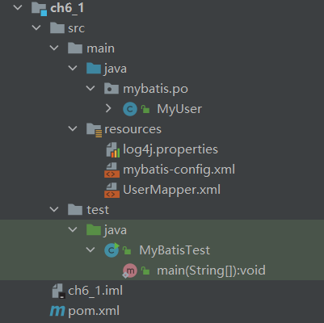
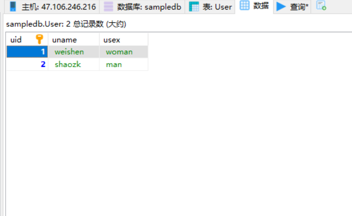
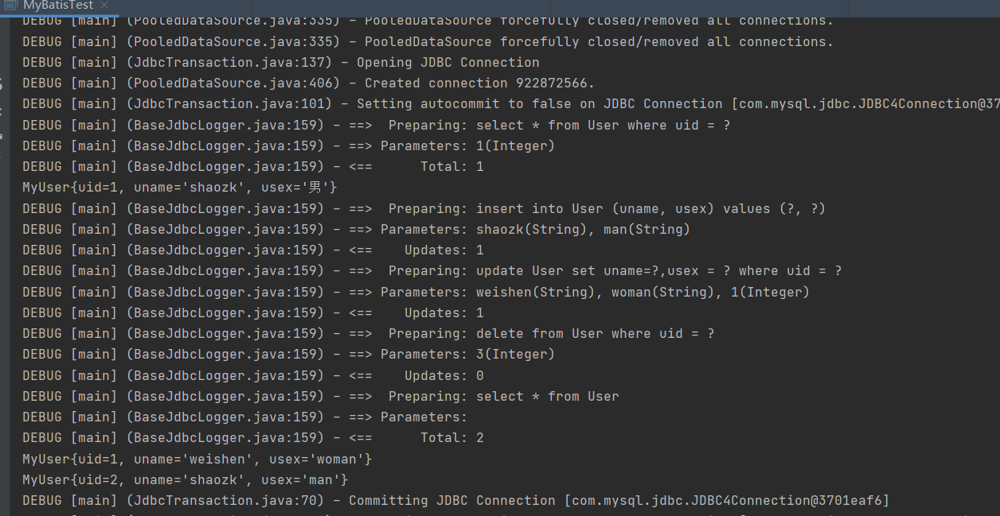
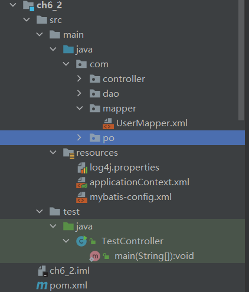
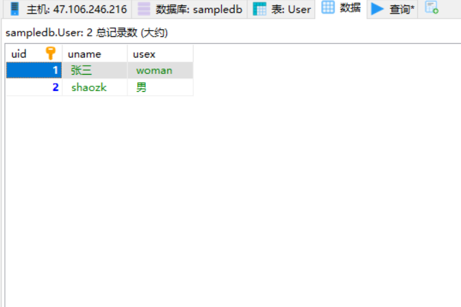
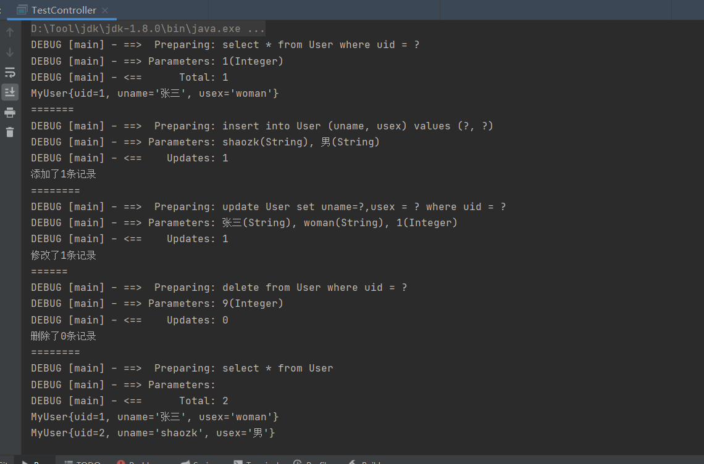
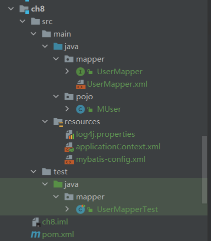
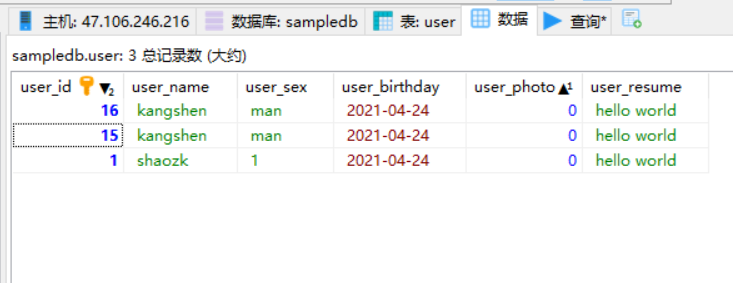
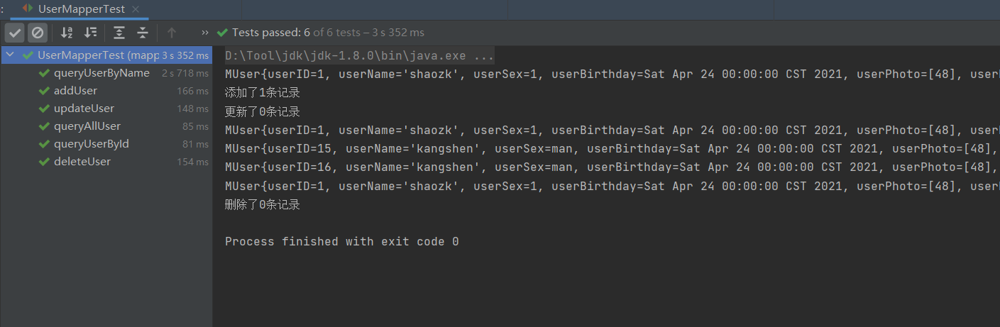

# 实验08-Mybatis编程实践
## 教材全部实例
### 1.Mybatis入门程序
目录结构


pom文件

```xml
<?xml version="1.0" encoding="UTF-8"?>
<project xmlns="http://maven.apache.org/POM/4.0.0"
         xmlns:xsi="http://www.w3.org/2001/XMLSchema-instance"
         xsi:schemaLocation="http://maven.apache.org/POM/4.0.0 http://maven.apache.org/xsd/maven-4.0.0.xsd">
    <modelVersion>4.0.0</modelVersion>

    <groupId>org.example</groupId>
    <artifactId>ch6_1</artifactId>
    <version>1.0-SNAPSHOT</version>

    <properties>
        <maven.compiler.source>8</maven.compiler.source>
        <maven.compiler.target>8</maven.compiler.target>
    </properties>

    <build>
        <!--   **.xml写在src找不到问题解决方案     -->
        <resources>
            <resource>
                <!-- directory：指定资源文件的位置 -->
                <directory>src/main/java</directory>
                <includes>
                    <!-- “**” 表示任意级目录    “*”表示任意任意文件 -->
                    <!-- mvn resources:resources　：对资源做出处理，先于compile阶段  -->
                    <include>**/*.properties</include>
                    <include>**/*.xml</include>
                </includes>
                <!--  filtering：开启过滤，用指定的参数替换directory下的文件中的参数(eg. ${name}) -->
                <filtering>false</filtering>
            </resource>
            <resource>
                <directory>src/main/resources</directory>
            </resource>
        </resources>

    </build>

    <dependencies>
        <dependency>
            <groupId>junit</groupId>
            <artifactId>junit</artifactId>
            <version>4.11</version>
            <scope>test</scope>
        </dependency>

        <dependency>
            <groupId>org.springframework</groupId>
            <artifactId>spring-core</artifactId>
            <version>5.0.2.RELEASE</version>
        </dependency>

        <dependency>
            <groupId>org.springframework</groupId>
            <artifactId>spring-beans</artifactId>
            <version>5.0.2.RELEASE</version>
        </dependency>

        <dependency>
            <groupId>org.springframework</groupId>
            <artifactId>spring-context</artifactId>
            <version>5.0.2.RELEASE</version>
        </dependency>

        <dependency>
            <groupId>org.springframework</groupId>
            <artifactId>spring-context-support</artifactId>
            <version>5.0.2.RELEASE</version>
        </dependency>

        <dependency>
            <groupId>org.springframework</groupId>
            <artifactId>spring-expression</artifactId>
            <version>5.0.2.RELEASE</version>
        </dependency>

        <!-- https://mvnrepository.com/artifact/commons-logging/commons-logging -->
        <dependency>
            <groupId>commons-logging</groupId>
            <artifactId>commons-logging</artifactId>
            <version>1.2</version>
        </dependency>
        <dependency>
            <groupId>org.springframework</groupId>
            <artifactId>spring-test</artifactId>
            <version>5.0.2.RELEASE</version>
            <scope>compile</scope>
        </dependency>
        <dependency>
            <groupId>org.springframework</groupId>
            <artifactId>spring-jdbc</artifactId>
            <version>5.0.2.RELEASE</version>
        </dependency>
        <dependency>
            <groupId>org.springframework</groupId>
            <artifactId>spring-tx</artifactId>
            <version>5.0.2.RELEASE</version>
        </dependency>
        <dependency>
            <groupId>org.springframework</groupId>
            <artifactId>spring-aop</artifactId>
            <version>5.0.2.RELEASE</version>
        </dependency>
        <dependency>
            <groupId>mysql</groupId>
            <artifactId>mysql-connector-java</artifactId>
            <version>5.1.46</version>
        </dependency>
        <dependency>
            <groupId>org.aspectj</groupId>
            <artifactId>aspectjweaver</artifactId>
            <version>1.8.13</version>
        </dependency>
        <dependency>
            <groupId>org.springframework</groupId>
            <artifactId>spring-aspects</artifactId>
            <version>5.0.2.RELEASE</version>
        </dependency>
        <dependency>
            <groupId>org.mybatis</groupId>
            <artifactId>mybatis</artifactId>
            <version>3.4.5</version>
        </dependency>
        <dependency>
            <groupId>org.apache.ant</groupId>
            <artifactId>ant</artifactId>
            <version>1.9.9</version>
        </dependency>
        <dependency>
            <groupId>org.apache.ant</groupId>
            <artifactId>ant-launcher</artifactId>
            <version>1.9.9</version>
        </dependency>
        <dependency>
            <groupId>org.ow2.asm</groupId>
            <artifactId>asm</artifactId>
            <version>5.0.4</version>
        </dependency>
        <dependency>
            <groupId>org.slf4j</groupId>
            <artifactId>slf4j-api</artifactId>
            <version>1.7.25</version>
        </dependency>
        <dependency>
            <groupId>org.slf4j</groupId>
            <artifactId>slf4j-log4j12</artifactId>
            <version>1.7.25</version>
        </dependency>

    </dependencies>

</project>
```

实体类MyUser
```java
/*
 * Date: 2021/4/8
 * Author: <https://www.github.com/shaozk>
 */

package mybatis.po;

/**
 * @author shaozk
 * @Description: spingtest数据库中user表的持久化类
 */
public class MyUser {
    private Integer uid;    // 主键
    private String uname;
    private String usex;

    public Integer getUid() {
        return uid;
    }

    public void setUid(Integer uid) {
        this.uid = uid;
    }

    public String getUname() {
        return uname;
    }

    public void setUname(String uname) {
        this.uname = uname;
    }

    public String getUsex() {
        return usex;
    }

    public void setUsex(String usex) {
        this.usex = usex;
    }

    @Override
    public String toString() {
        return "MyUser{" +
                "uid=" + uid +
                ", uname='" + uname + '\'' +
                ", usex='" + usex + '\'' +
                '}';
    }
}

```

配置文件
log4j.properties
```properties
log4j.rootLogger=debug, stdout, R

log4j.appender.stdout=org.apache.log4j.ConsoleAppender
log4j.appender.stdout.layout=org.apache.log4j.PatternLayout

# Pattern to output the caller's file name and line number.
log4j.appender.stdout.layout.ConversionPattern=%5p [%t] (%F:%L) - %m%n

log4j.appender.R=org.apache.log4j.RollingFileAppender
log4j.appender.R.File=example.log

log4j.appender.R.MaxFileSize=100KB
# Keep one backup file
log4j.appender.R.MaxBackupIndex=5

log4j.appender.R.layout=org.apache.log4j.PatternLayout
log4j.appender.R.layout.ConversionPattern=%p %t %c - %m%n

```

mybatis配置文件
```xml
<?xml version="1.0" encoding="UTF-8" ?>
<!DOCTYPE configuration
        PUBLIC "-//mybatis.org//DTD Config 3.0//EN"
        "http://mybatis.org/dtd/mybatis-3-config.dtd">

<configuration>
<!--    配置环境-->
    <environments default="development">
        <environment id="development">
<!--            使用jdbc事务管理-->
            <transactionManager type="JDBC"/>
            <dataSource type="POOLED">
<!--                Mysql数据库驱动程序-->
                <property name="driver" value="com.mysql.jdbc.Driver"/>
<!--                连接数据库的URL-->
                <property name="url" value="jdbc:mysql://47.106.246.216/sampledb?characterEncoding=utf-8&amp;useSSL=false"/>
                <property name="username" value="root"/>
                <property name="password" value="123456"/>

            </dataSource>
        </environment>
    </environments>
    <mappers>
<!--        映射文件位置-->
        <mapper resource="UserMapper.xml"/>
    </mappers>


</configuration>

```

mapper文件
```xml
<?xml version="1.0" encoding="UTF-8" ?>
<!DOCTYPE mapper
        PUBLIC "-//mybatis.org//DTD Config 3.0//EN"
        "http://mybatis.org/dtd/mybatis-3-mapper.dtd">

<mapper namespace="UserMapper">
<!--        根据uid查询一个用户的信息-->
    <select id="selectUserById" parameterType="Integer"
            resultType="mybatis.po.MyUser">
        select * from User where uid = #{uid}
    </select>
<!--    查询所有用户信息-->
    <select id="selectAllUser" resultType="mybatis.po.MyUser">
        select * from User
    </select>
<!--    添加一个用户#{uname}为 com.mybatis.com.po.MyUser的属性值-->
    <insert id="addUser" parameterType="mybatis.po.MyUser">
        insert into User (uname, usex) values (#{uname}, #{usex})
    </insert>
<!--    修改一个用户-->
    <update id="updateUser" parameterType="mybatis.po.MyUser">
        update User set uname=#{uname},usex = #{usex} where uid = #{uid}
    </update>
<!--    删除一个用户-->
    <delete id="deleteUser" parameterType="Integer">
        delete from User where uid = #{uid}
    </delete>


</mapper>

```

测试类
```java
/*
 * Date: 2021/4/8
 * Author: <https://www.github.com/shaozk>
 */


import mybatis.po.MyUser;
import org.apache.ibatis.io.Resources;
import org.apache.ibatis.session.SqlSession;
import org.apache.ibatis.session.SqlSessionFactory;
import org.apache.ibatis.session.SqlSessionFactoryBuilder;

import java.io.InputStream;
import java.util.ArrayList;
import java.util.List;

/**
 * @author shaozk
 * @Description: 测试mybatis
 */
public class MyBatisTest {
    public static void main(String[] args) {

        try{
            // 读取配置文件
            InputStream config = Resources.getResourceAsStream("mybatis-config.xml");
            // 根据配置文件构建SqlSessionFactory
            SqlSessionFactory ssf = new SqlSessionFactoryBuilder().build(config);
            // 通过SqlSessionFactory构建SqlSession
            SqlSession ss = ssf.openSession();

            // SqlSession执行映射文件中定义的SQL，并返回映射结果
            // 查询一个用户
            MyUser user = ss.selectOne("UserMapper.selectUserById", 1);
            System.out.println(user);

            // 添加一个用户
            MyUser addUser = new MyUser();
            addUser.setUname("shaozk");
            addUser.setUsex("man");
            ss.insert("UserMapper.addUser", addUser);

            // 修改一个用户
            MyUser updateUser = new MyUser();
            updateUser.setUid(1);
            updateUser.setUname("weishen");
            updateUser.setUsex("woman");
            ss.update("UserMapper.updateUser", updateUser);

            // 删除一个用户
            ss.delete("UserMapper.deleteUser", 3);

            // 查询所有用户
            List<MyUser> listUser = ss.selectList("UserMapper.selectAllUser");
            for(MyUser u : listUser) {
                System.out.println(u);
            }

            // 提交事务
            ss.commit();
            // 关闭session
            ss.close();

        }catch (Exception e) {
            e.printStackTrace();
        }
    }
}

```


数据库


结果截图


### 2. Mybatis与Spring整合

目录结构


pom文件
```xml
<?xml version="1.0" encoding="UTF-8"?>
<project xmlns="http://maven.apache.org/POM/4.0.0"
         xmlns:xsi="http://www.w3.org/2001/XMLSchema-instance"
         xsi:schemaLocation="http://maven.apache.org/POM/4.0.0 http://maven.apache.org/xsd/maven-4.0.0.xsd">
    <modelVersion>4.0.0</modelVersion>

    <groupId>org.example</groupId>
    <artifactId>ch6_2</artifactId>
    <version>1.0-SNAPSHOT</version>

    <properties>
        <maven.compiler.source>8</maven.compiler.source>
        <maven.compiler.target>8</maven.compiler.target>
    </properties>

    <build>
        <!--   **.xml写在src找不到问题解决方案     -->
        <resources>
            <resource>
                <!-- directory：指定资源文件的位置 -->
                <directory>src/main/java</directory>
                <includes>
                    <!-- “**” 表示任意级目录    “*”表示任意任意文件 -->
                    <!-- mvn resources:resources　：对资源做出处理，先于compile阶段  -->
                    <include>**/*.properties</include>
                    <include>**/*.xml</include>
                </includes>
                <!--  filtering：开启过滤，用指定的参数替换directory下的文件中的参数(eg. ${name}) -->
                <filtering>false</filtering>
            </resource>
            <resource>
                <directory>src/main/resources</directory>
            </resource>
        </resources>

    </build>

    <dependencies>
        <dependency>
            <groupId>junit</groupId>
            <artifactId>junit</artifactId>
            <version>4.11</version>
            <scope>test</scope>
        </dependency>

        <dependency>
            <groupId>org.springframework</groupId>
            <artifactId>spring-core</artifactId>
            <version>5.0.2.RELEASE</version>
        </dependency>

        <dependency>
            <groupId>org.springframework</groupId>
            <artifactId>spring-beans</artifactId>
            <version>5.0.2.RELEASE</version>
        </dependency>

        <dependency>
            <groupId>org.springframework</groupId>
            <artifactId>spring-context</artifactId>
            <version>5.0.2.RELEASE</version>
        </dependency>

        <dependency>
            <groupId>org.springframework</groupId>
            <artifactId>spring-context-support</artifactId>
            <version>5.0.2.RELEASE</version>
        </dependency>

        <dependency>
            <groupId>org.springframework</groupId>
            <artifactId>spring-expression</artifactId>
            <version>5.0.2.RELEASE</version>
        </dependency>

        <!-- https://mvnrepository.com/artifact/commons-logging/commons-logging -->
        <dependency>
            <groupId>commons-logging</groupId>
            <artifactId>commons-logging</artifactId>
            <version>1.2</version>
        </dependency>
        <dependency>
            <groupId>org.springframework</groupId>
            <artifactId>spring-test</artifactId>
            <version>5.0.2.RELEASE</version>
            <scope>compile</scope>
        </dependency>
        <dependency>
            <groupId>org.springframework</groupId>
            <artifactId>spring-jdbc</artifactId>
            <version>5.0.2.RELEASE</version>
        </dependency>
        <dependency>
            <groupId>org.springframework</groupId>
            <artifactId>spring-tx</artifactId>
            <version>5.0.2.RELEASE</version>
        </dependency>
        <dependency>
            <groupId>org.springframework</groupId>
            <artifactId>spring-aop</artifactId>
            <version>5.0.2.RELEASE</version>
        </dependency>
        <dependency>
            <groupId>mysql</groupId>
            <artifactId>mysql-connector-java</artifactId>
            <version>5.1.46</version>
        </dependency>
        <dependency>
            <groupId>org.aspectj</groupId>
            <artifactId>aspectjweaver</artifactId>
            <version>1.8.13</version>
        </dependency>

        <dependency>
            <groupId>org.springframework</groupId>
            <artifactId>spring-aspects</artifactId>
            <version>5.0.2.RELEASE</version>
        </dependency>
        <dependency>
            <groupId>org.mybatis</groupId>
            <artifactId>mybatis</artifactId>
            <version>3.4.5</version>
        </dependency>
        <dependency>
            <groupId>org.apache.ant</groupId>
            <artifactId>ant</artifactId>
            <version>1.9.9</version>
        </dependency>
        <dependency>
            <groupId>org.apache.ant</groupId>
            <artifactId>ant-launcher</artifactId>
            <version>1.9.9</version>
        </dependency>
        <dependency>
            <groupId>org.ow2.asm</groupId>
            <artifactId>asm</artifactId>
            <version>5.0.4</version>
        </dependency>
        <dependency>
            <groupId>org.slf4j</groupId>
            <artifactId>slf4j-api</artifactId>
            <version>1.7.25</version>
        </dependency>
        <dependency>
            <groupId>org.slf4j</groupId>
            <artifactId>slf4j-log4j12</artifactId>
            <version>1.7.25</version>
        </dependency>
        <!-- https://mvnrepository.com/artifact/org.mybatis/mybatis-spring -->
        <dependency>
            <groupId>org.mybatis</groupId>
            <artifactId>mybatis-spring</artifactId>
            <version>2.0.5</version>
        </dependency>

        <dependency>
            <groupId>org.apache.commons</groupId>
            <artifactId>commons-dbcp2</artifactId>
            <version>2.8.0</version>
        </dependency>

            <dependency>
                <groupId>aopalliance</groupId>
                <artifactId>aopalliance</artifactId>
                <version>1.0</version>
            </dependency>


    </dependencies>

</project>
```
配置文件
log4j.properties
```properties
log4j.rootLogger=ERROR,  stdout
log4j.logger.com.dao=DEBUG
log4j.appender.stdout=org.apache.log4j.ConsoleAppender
log4j.appender.stdout.layout=org.apache.log4j.PatternLayout
log4j.appender.stdout.layout.ConversionPattern=%5p [%t] - %m %n


```

applicationContext.xml
```xml
<?xml version="1.0" encoding="UTF-8"?>
<beans xmlns="http://www.springframework.org/schema/beans"
       xmlns:xsi="http://www.w3.org/2001/XMLSchema-instance"
       xmlns:context="http://www.springframework.org/schema/context"
       xmlns:tx="http://www.springframework.org/schema/tx"
       xmlns:mvc="http://www.springframework.org/schema/mvc"
       xsi:schemaLocation="http://www.springframework.org/schema/beans
        http://www.springframework.org/schema/beans/spring-beans.xsd
        http://www.springframework.org/schema/context
        http://www.springframework.org/schema/context/spring-context.xsd
        http://www.springframework.org/schema/tx
        http://www.springframework.org/schema/tx/spring-tx.xsd
        http://www.springframework.org/schema/mvc
        http://www.springframework.org/schema/mvc/spring-mvc.xsd">
<!--    扫描，使注解生效-->
    <context:component-scan base-package="com.dao"/>
    <context:component-scan base-package="com.controller"/>
<!--    配置数据源-->
    <bean id="dataSourceSpring" class="org.apache.commons.dbcp2.BasicDataSource">
        <!--                Mysql数据库驱动程序-->
        <property name="driverClassName" value="com.mysql.jdbc.Driver"/>
        <!--                连接数据库的URL-->
        <property name="url" value="jdbc:mysql://47.106.246.216/sampledb?characterEncoding=utf-8&amp;useSSL=false"/>
        <property name="username" value="root"/>
        <property name="password" value="123456"/>
<!--        最大连接数-->
        <property name="maxTotal" value="30"/>
<!--        最大空闲连接数-->
        <property name="maxIdle" value="10"/>
<!--        初始化连接数-->
        <property name="initialSize" value="5"/>
    </bean>

<!--    添加事务支持-->
    <bean id="txManager"
          class="org.springframework.jdbc.datasource.DataSourceTransactionManager">
        <property name="dataSource" ref="dataSourceSpring"/>
    </bean>
<!--    开启事务注解-->
    <tx:annotation-driven transaction-manager="txManager"/>


<!--    配置Mybatis工厂，同时指定数据源，并与Mybatis完美整合-->
    <bean id="sqlSessionFactory" class="org.mybatis.spring.SqlSessionFactoryBean">
        <property name="dataSource" ref="dataSourceSpring"/>
<!--        configLocation的属性值为MyBatis的核心配置文件-->
        <property name="configLocation" value="classpath:mybatis-config.xml"/>
        <!--注册Mapper.xm映射器-->
        <property name="mapperLocations" value="classpath:com/mapper/*.xml"/>
    </bean>

<!--    Mapper代理开发，使用Spring自动扫描MyBatis的接口并装配-->
<!--    Spring自动将指定包中所有被@Mapper注解标注的接口自动装配为Mybatis的映射接口-->
    <bean class="org.mybatis.spring.mapper.MapperScannerConfigurer">
<!--    mybatis-spring组件的扫描器，-->
        <property name="basePackage" value="com.dao"/>
        <property name="sqlSessionFactoryBeanName" value="sqlSessionFactory"/>
        <!--注册Mapper.xm映射器-->
    </bean>


</beans>
```

mybatis-config.xml
```xml
<?xml version="1.0" encoding="UTF-8" ?>
<!DOCTYPE configuration
        PUBLIC "-//mybatis.org//DTD Config 3.0//EN"
        "http://mybatis.org/dtd/mybatis-3-config.dtd">

<configuration>
<!--    在spring配置文件中注册了Mapper.xml，直接删除-->
<!--    <mappers>-->
<!--        <package name="com.mapper"/>-->
<!--    </mappers>-->

</configuration>

```

UserMapper.xml
```xml
<?xml version="1.0" encoding="UTF-8" ?>
<!DOCTYPE mapper
        PUBLIC "-//mybatis.org//DTD Config 3.0//EN"
        "http://mybatis.org/dtd/mybatis-3-mapper.dtd">

<mapper namespace="com.dao.UserMapper">
    <!--        根据uid查询一个用户的信息-->
    <select id="selectUserById" parameterType="Integer"
            resultType="com.po.MyUser">
        select * from User where uid = #{uid}
    </select>
    <!--    查询所有用户信息-->
    <select id="selectAllUser" resultType="com.po.MyUser">
        select * from User
    </select>
    <!--    添加一个用户#{uname}为 com.mybatis.com.po.MyUser的属性值-->
    <insert id="addUser" parameterType="com.po.MyUser">
        insert into User (uname, usex) values (#{uname}, #{usex})
    </insert>
    <!--    修改一个用户-->
    <update id="updateUser" parameterType="com.po.MyUser">
        update User set uname=#{uname},usex = #{usex} where uid = #{uid}
    </update>
    <!--    删除一个用户-->
    <delete id="deleteUser" parameterType="Integer">
        delete from User where uid = #{uid}
    </delete>


</mapper>

```

实体类 
MyUser
```java
/*
 * Date: 2021/4/8
 * Author: <https://www.github.com/shaozk>
 */

package com.po;

/**
 * @author shaozk
 * @Description: spingtest数据库中user表的持久化类
 */
public class MyUser {
    private Integer uid;    // 主键
    private String uname;
    private String usex;

    public Integer getUid() {
        return uid;
    }

    public void setUid(Integer uid) {
        this.uid = uid;
    }

    public String getUname() {
        return uname;
    }

    public void setUname(String uname) {
        this.uname = uname;
    }

    public String getUsex() {
        return usex;
    }

    public void setUsex(String usex) {
        this.usex = usex;
    }

    @Override
    public String toString() {
        return "MyUser{" +
                "uid=" + uid +
                ", uname='" + uname + '\'' +
                ", usex='" + usex + '\'' +
                '}';
    }
}

```

dao层
UserMapper
```java
/*
 * Date: 2021/4/18
 * Author: <https://www.github.com/shaozk>
 */

package com.dao;

import org.apache.ibatis.annotations.Mapper;
import org.springframework.stereotype.Repository;
import com.po.MyUser;

import java.util.List;

/**
 * dao层
 *
 * @author shaozk
 */
@Repository("userDaoSpring")
@Mapper
public interface UserMapper {
    /*
     * 接口方法对应Sql映射文件UserMapper中的id
     */
    public MyUser selectUserById(Integer uid);
    public List<MyUser> selectAllUser();
    public int addUser(MyUser user);
    public int updateUser(MyUser user);
    public int deleteUser(Integer uid);

}

```

controller层
UserController
```java
/*
 * Date: 2021/4/18
 * Author: <https://www.github.com/shaozk>
 */

package com.controller;

import com.dao.UserMapper;
import com.po.MyUser;
import org.springframework.beans.factory.annotation.Autowired;
import org.springframework.stereotype.Controller;

import java.util.List;

/**
 * controller层
 * @author shaozk
 */
@Controller("userController")
public class UserController {
    @Autowired
    private UserMapper userMapper;

    public void test() {
        // 查询一个用户
        MyUser auser = userMapper.selectUserById(1);
        System.out.println(auser);
        System.out.println("=======");

        // 添加一个用户
        MyUser addUser = new MyUser();
        addUser.setUsex("男");
        addUser.setUname("shaozk");
        int add = userMapper.addUser(addUser);
        System.out.println("添加了" + add + "条记录");
        System.out.println("========");

        // 修改一个用户
        MyUser updateUser = new MyUser();
        updateUser.setUid(1);
        updateUser.setUname("张三");
        updateUser.setUsex("woman");
        int up = userMapper.updateUser(updateUser);
        System.out.println("修改了" + up + "条记录");
        System.out.println("======");

        // 删除一个用户
        int dl = userMapper.deleteUser(9);
        System.out.println("删除了" + dl + "条记录");
        System.out.println("========");

        List<MyUser> list = userMapper.selectAllUser();
        for(MyUser user : list) {
            System.out.println(user);
        }


    }
}

```

测试类
```java
/*
 * Date: 2021/4/18
 * Author: <https://www.github.com/shaozk>
 */

import com.controller.UserController;
import org.springframework.context.ApplicationContext;
import org.springframework.context.support.ClassPathXmlApplicationContext;

/**
 * TODO
 *
 * @author shaozk
 */
public class TestController {
    public static void main(String[] args) {
        ApplicationContext applicationContext = new ClassPathXmlApplicationContext("applicationContext.xml");
        UserController userController = (UserController) applicationContext.getBean("userController");
        userController.test();
    }
}

```

数据库


结果截图


## 利用MyBatis实现用户表（user）的增删改查

目录结构


pom文件
```xml
<?xml version="1.0" encoding="UTF-8"?>
<project xmlns="http://maven.apache.org/POM/4.0.0"
         xmlns:xsi="http://www.w3.org/2001/XMLSchema-instance"
         xsi:schemaLocation="http://maven.apache.org/POM/4.0.0 http://maven.apache.org/xsd/maven-4.0.0.xsd">
    <modelVersion>4.0.0</modelVersion>

    <groupId>org.example</groupId>
    <artifactId>ch8</artifactId>
    <version>1.0-SNAPSHOT</version>

    <properties>
        <maven.compiler.source>8</maven.compiler.source>
        <maven.compiler.target>8</maven.compiler.target>
    </properties>

    <build>
        <!--   **.xml写在src找不到问题解决方案     -->
        <resources>
            <resource>
                <!-- directory：指定资源文件的位置 -->
                <directory>src/main/java</directory>
                <includes>
                    <!-- “**” 表示任意级目录    “*”表示任意任意文件 -->
                    <!-- mvn resources:resources　：对资源做出处理，先于compile阶段  -->
                    <include>**/*.properties</include>
                    <include>**/*.xml</include>
                </includes>
                <!--  filtering：开启过滤，用指定的参数替换directory下的文件中的参数(eg. ${name}) -->
                <filtering>false</filtering>
            </resource>
            <resource>
                <directory>src/main/resources</directory>
            </resource>
        </resources>

    </build>

    <dependencies>
        <dependency>
            <groupId>org.projectlombok</groupId>
            <artifactId>lombok</artifactId>
            <version>1.18.20</version>
            <scope>provided</scope>
        </dependency>
        <dependency>
            <groupId>junit</groupId>
            <artifactId>junit</artifactId>
            <version>4.12</version>
            <scope>test</scope>
        </dependency>

        <dependency>
            <groupId>org.springframework</groupId>
            <artifactId>spring-core</artifactId>
            <version>5.0.2.RELEASE</version>
        </dependency>

        <dependency>
            <groupId>org.springframework</groupId>
            <artifactId>spring-beans</artifactId>
            <version>5.0.2.RELEASE</version>
        </dependency>

        <dependency>
            <groupId>org.springframework</groupId>
            <artifactId>spring-context</artifactId>
            <version>5.0.2.RELEASE</version>
        </dependency>

        <dependency>
            <groupId>org.springframework</groupId>
            <artifactId>spring-context-support</artifactId>
            <version>5.0.2.RELEASE</version>
        </dependency>

        <dependency>
            <groupId>org.springframework</groupId>
            <artifactId>spring-expression</artifactId>
            <version>5.0.2.RELEASE</version>
        </dependency>

        <!-- https://mvnrepository.com/artifact/commons-logging/commons-logging -->
        <dependency>
            <groupId>commons-logging</groupId>
            <artifactId>commons-logging</artifactId>
            <version>1.2</version>
        </dependency>
        <dependency>
            <groupId>org.springframework</groupId>
            <artifactId>spring-test</artifactId>
            <version>5.0.2.RELEASE</version>
            <scope>compile</scope>
        </dependency>
        <dependency>
            <groupId>org.springframework</groupId>
            <artifactId>spring-jdbc</artifactId>
            <version>5.0.2.RELEASE</version>
        </dependency>
        <dependency>
            <groupId>org.springframework</groupId>
            <artifactId>spring-tx</artifactId>
            <version>5.0.2.RELEASE</version>
        </dependency>
        <dependency>
            <groupId>org.springframework</groupId>
            <artifactId>spring-aop</artifactId>
            <version>5.0.2.RELEASE</version>
        </dependency>
        <dependency>
            <groupId>mysql</groupId>
            <artifactId>mysql-connector-java</artifactId>
            <version>5.1.46</version>
        </dependency>
        <dependency>
            <groupId>org.aspectj</groupId>
            <artifactId>aspectjweaver</artifactId>
            <version>1.8.13</version>
        </dependency>

        <dependency>
            <groupId>org.springframework</groupId>
            <artifactId>spring-aspects</artifactId>
            <version>5.0.2.RELEASE</version>
        </dependency>
        <dependency>
            <groupId>org.mybatis</groupId>
            <artifactId>mybatis</artifactId>
            <version>3.4.5</version>
        </dependency>
        <dependency>
            <groupId>org.apache.ant</groupId>
            <artifactId>ant</artifactId>
            <version>1.9.9</version>
        </dependency>
        <dependency>
            <groupId>org.apache.ant</groupId>
            <artifactId>ant-launcher</artifactId>
            <version>1.9.9</version>
        </dependency>
        <dependency>
            <groupId>org.ow2.asm</groupId>
            <artifactId>asm</artifactId>
            <version>5.0.4</version>
        </dependency>
        <dependency>
            <groupId>org.slf4j</groupId>
            <artifactId>slf4j-api</artifactId>
            <version>1.7.25</version>
        </dependency>
        <dependency>
            <groupId>org.slf4j</groupId>
            <artifactId>slf4j-log4j12</artifactId>
            <version>1.7.25</version>
        </dependency>
        <!-- https://mvnrepository.com/artifact/org.mybatis/mybatis-spring -->
        <dependency>
            <groupId>org.mybatis</groupId>
            <artifactId>mybatis-spring</artifactId>
            <version>2.0.5</version>
        </dependency>

        <dependency>
            <groupId>org.apache.commons</groupId>
            <artifactId>commons-dbcp2</artifactId>
            <version>2.8.0</version>
        </dependency>

        <dependency>
            <groupId>aopalliance</groupId>
            <artifactId>aopalliance</artifactId>
            <version>1.0</version>
        </dependency>


    </dependencies>

</project>
```

实体类MUser
```java
/*
 * Date: 2021/4/24
 * Author: <https://www.github.com/shaozk>
 */

package pojo;

import com.mysql.jdbc.Blob;
import lombok.Getter;
import lombok.Setter;
import org.springframework.context.annotation.Bean;

import java.io.Serializable;
import java.util.Arrays;
import java.util.Date;

/**
 * TODO
 *
 * @author shaozk
 */
@Getter
@Setter
public class MUser implements Serializable {

    private int userID;
    private String userName;
    private String userSex;
    private Date userBirthday;
    private Byte[] userPhoto;
    private String userResume;

    @Override
    public String toString() {
        return "MUser{" +
                "userID=" + userID +
                ", userName='" + userName + '\'' +
                ", userSex=" + userSex +
                ", userBirthday=" + userBirthday +
                ", userPhoto=" + Arrays.toString(userPhoto) +
                ", userResume='" + userResume + '\'' +
                '}';
    }

}

```

配置文件

log4j.properties
```properties
log4j.rootLogger=ERROR,  stdout
log4j.logger.com.dao=DEBUG
log4j.appender.stdout=org.apache.log4j.ConsoleAppender
log4j.appender.stdout.layout=org.apache.log4j.PatternLayout
log4j.appender.stdout.layout.ConversionPattern=%5p [%t] - %m %n


```

applicationContext.xml
```xml
<?xml version="1.0" encoding="UTF-8"?>
<beans xmlns="http://www.springframework.org/schema/beans"
       xmlns:xsi="http://www.w3.org/2001/XMLSchema-instance"
       xmlns:context="http://www.springframework.org/schema/context"
       xmlns:tx="http://www.springframework.org/schema/tx"
       xmlns:mvc="http://www.springframework.org/schema/mvc"
       xsi:schemaLocation="http://www.springframework.org/schema/beans
        http://www.springframework.org/schema/beans/spring-beans.xsd
        http://www.springframework.org/schema/context
        http://www.springframework.org/schema/context/spring-context.xsd
        http://www.springframework.org/schema/tx
        http://www.springframework.org/schema/tx/spring-tx.xsd
        http://www.springframework.org/schema/mvc
        http://www.springframework.org/schema/mvc/spring-mvc.xsd">
    <!--    扫描，使注解生效-->
    <context:component-scan base-package="mapper"/>
    <!--    配置数据源-->
    <bean id="dataSourceSpring" class="org.apache.commons.dbcp2.BasicDataSource">
        <!--                Mysql数据库驱动程序-->
        <property name="driverClassName" value="com.mysql.jdbc.Driver"/>
        <!--                连接数据库的URL-->
        <property name="url" value="jdbc:mysql://47.106.246.216/sampledb?characterEncoding=utf-8&amp;useSSL=false"/>
        <property name="username" value="root"/>
        <property name="password" value="123456"/>
        <!--        最大连接数-->
        <property name="maxTotal" value="30"/>
        <!--        最大空闲连接数-->
        <property name="maxIdle" value="10"/>
        <!--        初始化连接数-->
        <property name="initialSize" value="5"/>
    </bean>

    <!--    添加事务支持-->
    <bean id="txManager"
          class="org.springframework.jdbc.datasource.DataSourceTransactionManager">
        <property name="dataSource" ref="dataSourceSpring"/>
    </bean>
    <!--    开启事务注解-->
    <tx:annotation-driven transaction-manager="txManager"/>


    <!--    配置Mybatis工厂，同时指定数据源，并与Mybatis完美整合-->
    <bean id="sqlSessionFactory" class="org.mybatis.spring.SqlSessionFactoryBean">
        <property name="dataSource" ref="dataSourceSpring"/>
        <!--        configLocation的属性值为MyBatis的核心配置文件-->
        <property name="configLocation" value="classpath:mybatis-config.xml"/>
        <!--注册Mapper.xm映射器-->
        <property name="mapperLocations" value="classpath:mapper/*.xml"/>
    </bean>

    <!--    Mapper代理开发，使用Spring自动扫描MyBatis的接口并装配-->
    <!--    Spring自动将指定包中所有被@Mapper注解标注的接口自动装配为Mybatis的映射接口-->
    <bean class="org.mybatis.spring.mapper.MapperScannerConfigurer">
        <!--    mybatis-spring组件的扫描器，-->
        <property name="basePackage" value="mapper"/>
        <property name="sqlSessionFactoryBeanName" value="sqlSessionFactory"/>
        <!--注册Mapper.xm映射器-->
    </bean>


</beans>
```

mabatis-config.xml
```xml
<?xml version="1.0" encoding="UTF-8" ?>
<!DOCTYPE configuration
        PUBLIC "-//mybatis.org//DTD Config 3.0//EN"
        "http://mybatis.org/dtd/mybatis-3-config.dtd">

<configuration>

</configuration>

```

mapper文件和接口
```java
/*
 * Date: 2021/4/24
 * Author: <https://www.github.com/shaozk>
 */

package mapper;

import org.apache.ibatis.annotations.Mapper;
import org.springframework.stereotype.Repository;
import pojo.MUser;

import java.util.List;

/**
 * @author shaozk
 * @Description: TODO
 */
@Repository
@Mapper
public interface UserMapper {
    // 添加用户
    public int addUser(MUser user);
    // 删除用户
    public int deleteUser(int id);
    // 修改用户信息
    public int updateUser(MUser user);
    // 查询用户
    public MUser queryUserById(Integer id);
    // 根据用户名茶渣
    public MUser queryUserByName(String name);
    // 查询所有用户
    public List<MUser> queryAllUser();
}

```

```xml
<?xml version="1.0" encoding="UTF-8" ?>
<!DOCTYPE mapper
        PUBLIC "-//mybatis.org//DTD Config 3.0//EN"
        "http://mybatis.org/dtd/mybatis-3-mapper.dtd">

<mapper namespace="mapper.UserMapper">
    <!--通过<resultMap>映射实体类属性名和表的字段名对应关系 -->
    <resultMap type="pojo.MUser" id="ResultMap">
        <!-- 用id属性来映射主键字段 -->
        <id property="userID" column="user_id"/>
        <!-- 用result属性来映射非主键字段 -->
        <result property="userName" column="user_name"/>
        <result property="userSex" column="user_sex"/>
        <result property="userBirthday" column="user_birthday"/>
        <result property="userPhoto" column="user_photo"/>
        <result property="userResume" column="user_resume"/>
    </resultMap>

    <insert id="addUser" parameterType="pojo.MUser">
        insert into user (user_name, user_sex, user_birthday, user_photo, user_resume) values (#{userName}, #{userSex}, #{userBirthday}, #{userPhoto}, #{userResume})
    </insert>
    <update id="updateUser" parameterType="pojo.MUser">
        update user set user_name=#{userName},user_sex = #{userSex}, user_birthday=#{userBirthday}, user_photo=#{userPhoto}, user_resume=#{userResume} where user_id = #{userID}
    </update>
    <delete id="deleteUser" parameterType="int">
        delete from user where user_id = #{id}
    </delete>
    <select id="queryUserById" parameterType="Integer" resultType="pojo.MUser" resultMap="ResultMap">
        select * from user where user_id = #{user_id}
    </select>
    <select id="queryAllUser" resultType="pojo.MUser" resultMap="ResultMap">
        select * from user
    </select>
    <select id="queryUserByName" parameterType="String" resultType="pojo.MUser" resultMap="ResultMap">
        select * from user where user_name = #{name}
    </select>


</mapper>


```

测试类
```java
package mapper;

import com.mysql.jdbc.Blob;
import org.apache.ibatis.io.Resources;
import org.apache.ibatis.session.SqlSession;
import org.apache.ibatis.session.SqlSessionFactory;
import org.apache.ibatis.session.SqlSessionFactoryBuilder;
import org.junit.Test;
import org.junit.runner.JUnitCore;
import org.junit.runner.RunWith;
import org.junit.runners.JUnit4;
import org.springframework.beans.factory.annotation.Autowired;
import org.springframework.context.ApplicationContext;
import org.springframework.context.support.ClassPathXmlApplicationContext;
import org.springframework.scheduling.annotation.EnableAsync;
import org.springframework.test.context.ContextConfiguration;
import org.springframework.test.context.junit4.SpringJUnit4ClassRunner;
import org.springframework.test.context.junit4.SpringRunner;
import pojo.MUser;


import java.io.File;
import java.io.FileInputStream;
import java.io.FileNotFoundException;
import java.io.InputStream;
import java.util.Date;
import java.util.List;

import static org.junit.Assert.*;

@RunWith(SpringJUnit4ClassRunner.class)
@ContextConfiguration(locations = {"classpath:applicationContext.xml"})
public class UserMapperTest {

    @Autowired
    private UserMapper userMapper;

    MUser user = new MUser();

    @Test
    public void addUser() throws FileNotFoundException {
        user.setUserName("kangshen");
        user.setUserSex("man");
        user.setUserBirthday(new Date());
        user.setUserPhoto(new Byte[]{});
        user.setUserResume("hello world");

        // 保存用户
        int au = userMapper.addUser(user);
        System.out.println("添加了" + au + "条记录");;

    }

    @Test
    public void deleteUser() {
       int du = userMapper.deleteUser(2);
        System.out.println("删除了" + du + "条记录");
    }

    @Test
    public void updateUser() {
        user.setUserResume("someone wait you");
        int uu = userMapper.updateUser(user);
        System.out.println("更新了" + uu + "条记录");
    }

    @Test
    public void queryUserById() {
        MUser user = userMapper.queryUserById(1);
        System.out.println(user);

    }

    @Test
    public void queryUserByName() {
        MUser user = userMapper.queryUserByName("shaozk");
        System.out.println(user);
    }

    @Test
    public void queryAllUser() {
        List<MUser> list = userMapper.queryAllUser();
        for(MUser user : list) {
            System.out.println(user);
        }
    }
}
```

数据库


结果截图


