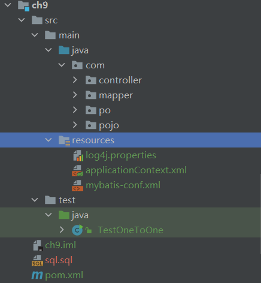
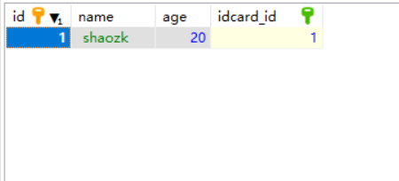
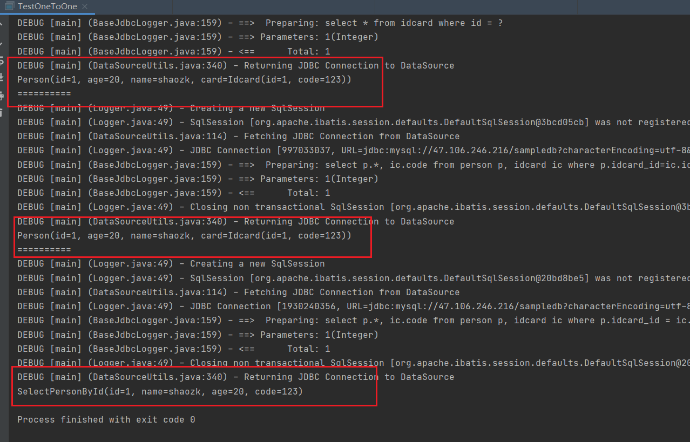
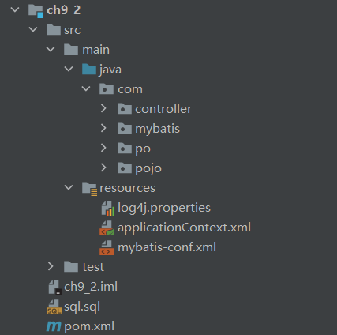
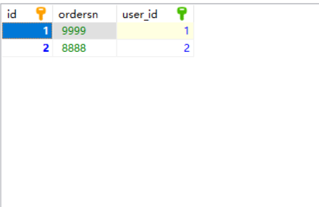
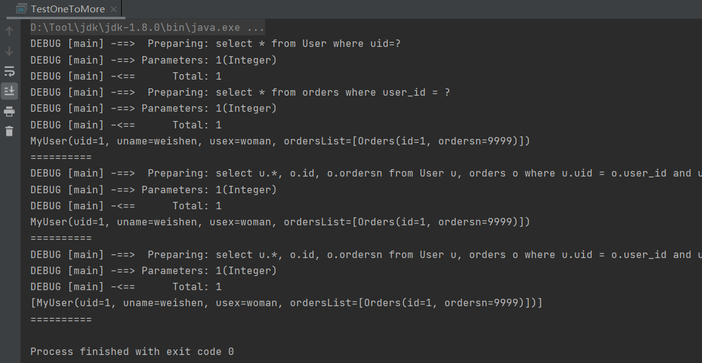
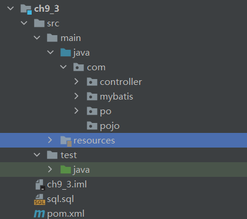
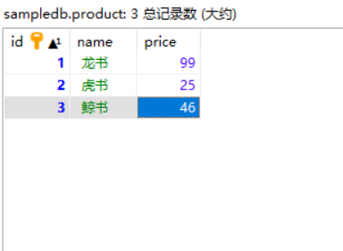
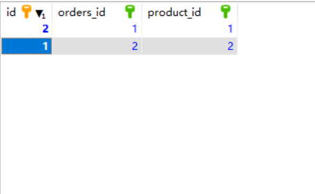
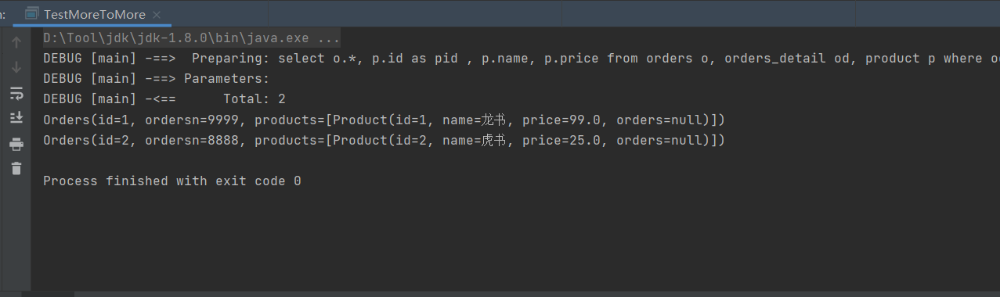

# 实验09 Mybatis编程实践（补充）

## 1.一对一级联查询
目录结构


数据库
```sql

CREATE TABLE idcard (
	id INT(10) NOT NULL AUTO_INCREMENT,
	code VARCHAR(18) COLLATE UTF8_UNICODE_CI DEFAULT NULL,
	PRIMARY KEY (id)
);s

CREATE TABLE person (
	id INT(10) NOT NULL,person
	name VARCHAR(20) COLLATE UTF8_UNICODE_CI DEFAULT NULL,
	age INT(11) DEFAULT NULL,
	idcard_id INT(10) DEFAULT NULL,
	PRIMARY KEY(id),
	KEY idcard_id (idcard_id),
	CONSTRAINT idcard_id FOREIGN KEY (idcard_id) REFERENCES idcard (id)
);

```

person表


idcard表


持久化类IdCard
```java
/*
 * Date: 2021/4/30
 * Author: <https://www.github.com/shaozk>
 */

package com.po;

import lombok.Getter;
import lombok.Setter;
import lombok.ToString;

/**
 * 数据库中idcard表的持久化类
 * @author shaozk
 */
@Setter
@Getter
@ToString
public class Idcard {
    private Integer id;
    private String code;
}

```

持久化类Person
```java
/*
 * Date: 2021/4/30
 * Author: <https://www.github.com/shaozk>
 */

package com.po;

import com.po.Idcard;
import lombok.Getter;
import lombok.Setter;
import lombok.ToString;

/**
 * 数据库中person表的持久化类
 * @author shaozk
 */
@Getter
@Setter
@ToString
public class Person {
    private Integer id;
    private Integer age;
    private String name;
    private Idcard card;
}

```

mybatis核心配置文件mybatis-conf.xml
```xml
<?xml version="1.0" encoding="UTF-8" ?>
<!DOCTYPE configuration
        PUBLIC "-//mybatis.org//DTD Config 3.0//EN"
        "http://mybatis.org/dtd/mybatis-3-config.dtd">

<configuration>
    <settings>
<!--        打开延迟加载的开关-->
        <setting name="lazyLoadingEnabled" value="true"/>
<!--        将积极加载改为按需加载-->
        <setting name="aggressiveLazyLoading" value="false"/>
    </settings>
</configuration>

```

映射文件IdCardMapper.xml
```xml
<?xml version="1.0" encoding="UTF-8" ?>
<!DOCTYPE mapper
        PUBLIC "-//mybatis.org//DTD Config 3.0//EN"
        "http://mybatis.org/dtd/mybatis-3-mapper.dtd">

<mapper namespace="com.mapper.IdCardMapper">
    <select id="selectCodeById" parameterType="Integer" resultType="com.po.Idcard">
        select * from idcard where id = #{id}
    </select>
</mapper>

```

对应接口IdCardMapper
```java
/*
 * Date: 2021/4/30
 * Author: <https://www.github.com/shaozk>
 */

package com.mapper;

import com.po.Idcard;
import org.apache.ibatis.annotations.Mapper;

/**
 *
 * @author shaozk
 */
@Mapper
public interface IdCardMapper {
    public Idcard selectCodeById(Integer i);
}

```


映射文件PersonMapper.xml
```xml
<?xml version="1.0" encoding="UTF-8" ?>
<!DOCTYPE mapper
        PUBLIC "-//mybatis.org//DTD Config 3.0//EN"
        "http://mybatis.org/dtd/mybatis-3-mapper.dtd">

<mapper namespace="com.mapper.PersonMapper">
<!--    一对一根据id查询个人信息：级联查询的第一种方法（嵌套查询，执行两个sql语句）-->
    <resultMap id="cardAndPerson1" type="com.po.Person">
        <id property="id" column="id"/>
        <result property="name" column="name"/>
        <result property="age" column="age"/>
<!--        一对一联级查询-->
        <association property="card" column="idcard_id" javaType="com.po.Idcard"
        select="com.mapper.IdCardMapper.selectCodeById"/>
    </resultMap>
    <select id="selectPersonById1" parameterType="Integer" resultMap="cardAndPerson1">
        select * from person where id = #{id}
    </select>

<!--    一对一根据id查询个人信息：级联查询的第二种方法（嵌套结果，执行个SQL语句）-->
    <resultMap id="cardAndPerson2" type="com.po.Person">
        <id property="id" column="id"/>
        <result property="name" column="name"/>
        <result property="age" column="age"/>
        <!--        一对一联级查询-->
        <association property="card" javaType="com.po.Idcard">
            <id property="id" column="idcard_id"/>
            <result property="code" column="code"/>
        </association>
    </resultMap>
<!--    一对一根据id查询个人-->
    <select id="selectPersonById2" parameterType="Integer" resultMap="cardAndPerson2">
        select p.*, ic.code
        from person p, idcard ic
        where p.idcard_id=ic.id and p.id=#{id}
    </select>
<!--    一对一根据id查询个人信息：连接查询（使用POJO存储结果）-->
    <select id="selectPersonById3" parameterType="Integer" resultType="com.pojo.SelectPersonById">
        select p.*, ic.code
        from person p, idcard ic
        where p.idcard_id = ic.id and p.id=#{id}
    </select>
</mapper>

```

对应接口PersonMapper
```java
/*
 * Date: 2021/4/30
 * Author: <https://www.github.com/shaozk>
 */

package com.mapper;

import com.po.Person;
import com.pojo.SelectPersonById;
import org.apache.ibatis.annotations.Mapper;

/**
 *
 * @author shaozk
 */
@Mapper
public interface PersonMapper {
    public Person selectPersonById1(Integer id);
    public Person selectPersonById2(Integer id);
    public SelectPersonById selectPersonById3(Integer id);

}


```

POJO类SelectPersonById
```java
/*
 * Date: 2021/4/30
 * Author: <https://www.github.com/shaozk>
 */

package com.pojo;

import lombok.Getter;
import lombok.Setter;
import lombok.ToString;

/**
 * TODO
 *
 * @author shaozk
 */
@Setter
@Getter
@ToString
public class SelectPersonById {
    private Integer id;
    private String name;
    private Integer age;
    private String code;

}

```

controller层OneToOneController
```java
/*
 * Date: 2021/4/30
 * Author: <https://www.github.com/shaozk>
 */

package com.controller;

import com.mapper.PersonMapper;
import com.po.Person;
import com.pojo.SelectPersonById;
import org.springframework.beans.factory.annotation.Autowired;
import org.springframework.stereotype.Controller;

/**
 * TODO
 *
 * @author shaozk
 */
@Controller("oneToOneController")
public class OneToOneController {
    @Autowired
    private PersonMapper personMapper;

    public void test() {
        Person p1 = personMapper.selectPersonById1(1);
        System.out.println(p1);
        System.out.println("==========");

        Person p2 = personMapper.selectPersonById2(1);
        System.out.println(p2);
        System.out.println("==========");

        SelectPersonById p3 = personMapper.selectPersonById3(1);
        System.out.println(p3);
    }
}

```

测试类TestOneToOne
```java
/*
 * Date: 2021/4/30
 * Author: <https://www.github.com/shaozk>
 */

import com.controller.OneToOneController;
import org.springframework.context.ApplicationContext;
import org.springframework.context.support.ClassPathXmlApplicationContext;

/**
 * @author shaozk
 */
public class TestOneToOne {
    public static void main(String[] args) {
        ApplicationContext applicationContext = new ClassPathXmlApplicationContext("applicationContext.xml");
        OneToOneController oto = (OneToOneController) applicationContext.getBean("oneToOneController");
        oto.test();
    }
}

```

其他文件pom.xml
```xml
<?xml version="1.0" encoding="UTF-8"?>
<project xmlns="http://maven.apache.org/POM/4.0.0"
         xmlns:xsi="http://www.w3.org/2001/XMLSchema-instance"
         xsi:schemaLocation="http://maven.apache.org/POM/4.0.0 http://maven.apache.org/xsd/maven-4.0.0.xsd">
    <modelVersion>4.0.0</modelVersion>

    <groupId>org.example</groupId>
    <artifactId>ch9</artifactId>
    <version>1.0-SNAPSHOT</version>

    <properties>
        <maven.compiler.source>8</maven.compiler.source>
        <maven.compiler.target>8</maven.compiler.target>
    </properties>

    <build>
        <!--   **.xml写在src找不到问题解决方案     -->
        <resources>
            <resource>
                <!-- directory：指定资源文件的位置 -->
                <directory>src/main/java</directory>
                <includes>
                    <!-- “**” 表示任意级目录    “*”表示任意任意文件 -->
                    <!-- mvn resources:resources　：对资源做出处理，先于compile阶段  -->
                    <include>**/*.properties</include>
                    <include>**/*.xml</include>
                </includes>
                <!--  filtering：开启过滤，用指定的参数替换directory下的文件中的参数(eg. ${name}) -->
                <filtering>false</filtering>
            </resource>
            <resource>
                <directory>src/main/resources</directory>
            </resource>
        </resources>

    </build>

    <dependencies>
        <dependency>
            <groupId>org.projectlombok</groupId>
            <artifactId>lombok</artifactId>
            <version>1.18.20</version>
            <scope>provided</scope>
        </dependency>
        <dependency>
            <groupId>junit</groupId>
            <artifactId>junit</artifactId>
            <version>4.12</version>
            <scope>test</scope>
        </dependency>

        <dependency>
            <groupId>org.springframework</groupId>
            <artifactId>spring-core</artifactId>
            <version>5.0.2.RELEASE</version>
        </dependency>

        <dependency>
            <groupId>org.springframework</groupId>
            <artifactId>spring-beans</artifactId>
            <version>5.0.2.RELEASE</version>
        </dependency>

        <dependency>
            <groupId>org.springframework</groupId>
            <artifactId>spring-context</artifactId>
            <version>5.0.2.RELEASE</version>
        </dependency>

        <dependency>
            <groupId>org.springframework</groupId>
            <artifactId>spring-context-support</artifactId>
            <version>5.0.2.RELEASE</version>
        </dependency>

        <dependency>
            <groupId>org.springframework</groupId>
            <artifactId>spring-expression</artifactId>
            <version>5.0.2.RELEASE</version>
        </dependency>

        <!-- https://mvnrepository.com/artifact/commons-logging/commons-logging -->
        <dependency>
            <groupId>commons-logging</groupId>
            <artifactId>commons-logging</artifactId>
            <version>1.2</version>
        </dependency>
        <dependency>
            <groupId>org.springframework</groupId>
            <artifactId>spring-test</artifactId>
            <version>5.0.2.RELEASE</version>
            <scope>compile</scope>
        </dependency>
        <dependency>
            <groupId>org.springframework</groupId>
            <artifactId>spring-jdbc</artifactId>
            <version>5.0.2.RELEASE</version>
        </dependency>
        <dependency>
            <groupId>org.springframework</groupId>
            <artifactId>spring-tx</artifactId>
            <version>5.0.2.RELEASE</version>
        </dependency>
        <dependency>
            <groupId>org.springframework</groupId>
            <artifactId>spring-aop</artifactId>
            <version>5.0.2.RELEASE</version>
        </dependency>
        <dependency>
            <groupId>mysql</groupId>
            <artifactId>mysql-connector-java</artifactId>
            <version>5.1.46</version>
        </dependency>
        <dependency>
            <groupId>org.aspectj</groupId>
            <artifactId>aspectjweaver</artifactId>
            <version>1.8.13</version>
        </dependency>

        <dependency>
            <groupId>org.springframework</groupId>
            <artifactId>spring-aspects</artifactId>
            <version>5.0.2.RELEASE</version>
        </dependency>
        <dependency>
            <groupId>org.mybatis</groupId>
            <artifactId>mybatis</artifactId>
            <version>3.4.5</version>
        </dependency>
        <dependency>
            <groupId>org.apache.ant</groupId>
            <artifactId>ant</artifactId>
            <version>1.9.9</version>
        </dependency>
        <dependency>
            <groupId>org.apache.ant</groupId>
            <artifactId>ant-launcher</artifactId>
            <version>1.9.9</version>
        </dependency>
        <dependency>
            <groupId>org.ow2.asm</groupId>
            <artifactId>asm</artifactId>
            <version>5.0.4</version>
        </dependency>
        <dependency>
            <groupId>org.slf4j</groupId>
            <artifactId>slf4j-api</artifactId>
            <version>1.7.25</version>
        </dependency>
        <dependency>
            <groupId>org.slf4j</groupId>
            <artifactId>slf4j-log4j12</artifactId>
            <version>1.7.25</version>
        </dependency>
        <!-- https://mvnrepository.com/artifact/org.mybatis/mybatis-spring -->
        <dependency>
            <groupId>org.mybatis</groupId>
            <artifactId>mybatis-spring</artifactId>
            <version>2.0.5</version>
        </dependency>

        <dependency>
            <groupId>org.apache.commons</groupId>
            <artifactId>commons-dbcp2</artifactId>
            <version>2.8.0</version>
        </dependency>

        <dependency>
            <groupId>aopalliance</groupId>
            <artifactId>aopalliance</artifactId>
            <version>1.0</version>
        </dependency>


    </dependencies>

</project>
```

spring配置文件applicationContext.xml
```xml
<?xml version="1.0" encoding="UTF-8"?>
<beans xmlns="http://www.springframework.org/schema/beans"
       xmlns:xsi="http://www.w3.org/2001/XMLSchema-instance"
       xmlns:context="http://www.springframework.org/schema/context"
       xmlns:tx="http://www.springframework.org/schema/tx"
       xmlns:mvc="http://www.springframework.org/schema/mvc"
       xsi:schemaLocation="http://www.springframework.org/schema/beans
        http://www.springframework.org/schema/beans/spring-beans.xsd
        http://www.springframework.org/schema/context
        http://www.springframework.org/schema/context/spring-context.xsd
        http://www.springframework.org/schema/tx
        http://www.springframework.org/schema/tx/spring-tx.xsd
        http://www.springframework.org/schema/mvc
        http://www.springframework.org/schema/mvc/spring-mvc.xsd">
    <!--    扫描，使注解生效-->
    <context:component-scan base-package="com.mapper"/>
    <context:component-scan base-package="com.controller"/>
    <!--    配置数据源-->
    <bean id="dataSourceSpring" class="org.apache.commons.dbcp2.BasicDataSource">
        <!--                Mysql数据库驱动程序-->
        <property name="driverClassName" value="com.mysql.jdbc.Driver"/>
        <!--                连接数据库的URL-->
        <property name="url" value="jdbc:mysql://47.106.246.216/sampledb?characterEncoding=utf-8&amp;useSSL=false"/>
        <property name="username" value="root"/>
        <property name="password" value="123456"/>
        <!--        最大连接数-->
        <property name="maxTotal" value="30"/>
        <!--        最大空闲连接数-->
        <property name="maxIdle" value="10"/>
        <!--        初始化连接数-->
        <property name="initialSize" value="5"/>
    </bean>

    <!--    添加事务支持-->
    <bean id="txManager"
          class="org.springframework.jdbc.datasource.DataSourceTransactionManager">
        <property name="dataSource" ref="dataSourceSpring"/>
    </bean>
    <!--    开启事务注解-->
    <tx:annotation-driven transaction-manager="txManager"/>


    <!--    配置Mybatis工厂，同时指定数据源，并与Mybatis完美整合-->
    <bean id="sqlSessionFactory" class="org.mybatis.spring.SqlSessionFactoryBean">
        <property name="dataSource" ref="dataSourceSpring"/>
        <!--        configLocation的属性值为MyBatis的核心配置文件-->
        <property name="configLocation" value="classpath:mybatis-conf.xml"/>
        <!--注册Mapper.xm映射器-->
        <property name="mapperLocations" value="classpath:com/mapper/*.xml"/>
    </bean>

    <!--    Mapper代理开发，使用Spring自动扫描MyBatis的接口并装配-->
    <!--    Spring自动将指定包中所有被@Mapper注解标注的接口自动装配为Mybatis的映射接口-->
    <bean class="org.mybatis.spring.mapper.MapperScannerConfigurer">
        <!--    mybatis-spring组件的扫描器，-->
        <property name="basePackage" value="com.mapper"/>
        <property name="sqlSessionFactoryBeanName" value="sqlSessionFactory"/>
        <!--注册Mapper.xm映射器-->
    </bean>
</beans>
```

日志文件
```properties
log4j.rootLogger=ERROR, stdout
log4j.logger.com.mybatis=DEBUG
log4j.appender.stdout=org.apache.log4j.ConsoleAppender
log4j.appender.stdout.layout=org.apache.log4j.PatternLayout
log4j.appender.stdout.layout.ConversionPattern=%5p [%t] -%m%n

```
tips:接下来的实验中这些文件只需做小的修改，因此不再贴出

实验结果截图：



## 2.一对多级联查询

目录结构


创建数据库
```sql

CREATE TABLE orders (
	id INT(10) NOT NULL AUTO_INCREMENT,
	ordersn VARCHAR(20) COLLATE UTF8_UNICODE_CI DEFAULT NULL,
	user_id INT(10) DEFAULT NULL,
	PRIMARY KEY (id),
	KEY user_id (user_id),
	CONSTRAINT user_id FOREIGN KEY (user_id) REFERENCES User (uid)
);
```

orders表


持久化类Orders
```java
/*
 * Date: 2021/5/1
 * Author: <https://www.github.com/shaozk>
 */

package com.po;

import lombok.Getter;
import lombok.Setter;
import lombok.ToString;

/**
 * orders表的持久化类
 * @author shaozk
 */
@Setter
@Getter
@ToString
public class Orders {
    private Integer id;
    private String ordersn;
}

```

持久化类MyUser
```java
/*
 * Date: 2021/5/1
 * Author: <https://www.github.com/shaozk>
 */

package com.po;

import lombok.Getter;
import lombok.Setter;
import lombok.ToString;
import java.util.List;

/**
 *
 * @author shaozk
 */
@Getter
@Setter
@ToString
public class MyUser {
    private Integer uid;
    private String uname;
    private String usex;
    private List<Orders> ordersList;

}

```

POJO
```java
/*
 * Date: 2021/5/1
 * Author: <https://www.github.com/shaozk>
 */

package com.pojo;

import lombok.Getter;
import lombok.Setter;
import lombok.ToString;

/**
 * TODO
 *
 * @author shaozk
 */
@Setter
@Getter
@ToString
public class SelectUserOrderById {
    private Integer uid;
    private String uname;
    private String usex;
    private Integer id;
    private String order;
}

```

映射文件OrderMapper.xml
```xml
<?xml version="1.0" encoding="UTF-8" ?>
<!DOCTYPE mapper
        PUBLIC "-//mybatis.org//DTD Config 3.0//EN"
        "http://mybatis.org/dtd/mybatis-3-mapper.dtd">

<mapper namespace="com.mybatis.OrdersMapper">

    <!--    根据用户uid查询订单信息-->
    <select id="selectOrdersById" parameterType="Integer" resultType="com.po.Orders">
        select * from orders where user_id = #{id}
    </select>

</mapper>

```


映射文件UserMapper.xml
```xml
<?xml version="1.0" encoding="UTF-8" ?>
<!DOCTYPE mapper
        PUBLIC "-//mybatis.org//DTD Config 3.0//EN"
        "http://mybatis.org/dtd/mybatis-3-mapper.dtd">

<mapper namespace="com.mybatis.UserMapper">

    <!--        根据uid查询一个用户的信息-->
    <select id="selectUserById" parameterType="Integer"
            resultType="com.po.MyUser">
        select * from User where uid = #{uid}
    </select>
    <!--    查询所有用户信息-->
    <select id="selectAllUser" resultType="com.po.MyUser">
        select * from User
    </select>
    <!--    添加一个用户#{uname}为 com.mybatis.com.po.MyUser的属性值-->
    <insert id="addUser" parameterType="com.po.MyUser">
        insert into User (uname, usex) values (#{uname}, #{usex})
    </insert>
    <!--    修改一个用户-->
    <update id="updateUser" parameterType="com.po.MyUser">
        update User set uname=#{uname},usex = #{usex} where uid = #{uid}
    </update>
    <!--    删除一个用户-->
    <delete id="deleteUser" parameterType="Integer">
        delete from User where uid = #{uid}
    </delete>

    <resultMap type="com.po.MyUser" id="userAndOrders1">
        <id property="uid" column="uid"/>
        <result property="uname" column="uname"/>
        <result property="usex" column="usex"/>
        <!--        一对多级联查询，ofType表示集合中的元素类型，将uid传递给selectOrdersById-->
        <collection property="ordersList" ofType="com.po.Orders" column="uid"
                    select="com.mybatis.OrdersMapper.selectOrdersById"/>
    </resultMap>

    <select id="selectUserOrdersById1" parameterType="Integer" resultMap="userAndOrders1">
        select * from User where uid=#{uid}
    </select>

    <!--    一对多 根据uid查询用户及其相关联的订单信息，级联查询的第二种方法（嵌套结果）-->
    <resultMap id="userAndOrders2" type="com.po.MyUser">
        <id property="uid" column="uid"/>
        <result property="uname" column="uname"/>
        <result property="usex" column="usex"/>
        <!--    一对多级联查询，ofType表示集合中的元素类型-->
        <collection property="ordersList" ofType="com.po.Orders">
            <id property = "id" column="id"/>
            <result property="ordersn" column="ordersn"/>
        </collection>
    </resultMap>
    <select id="selectUserOrdersById2" resultMap="userAndOrders2" parameterType="Integer">
        select u.*, o.id, o.ordersn from User u, orders o where u.uid = o.user_id and u.uid = #{id}
    </select>
    <!--    一一对多 根据uid查询用户及其关联的订单信息：连接查询（使用pojo存储结果）-->
    <select id="selectUserOrdersById3" parameterType="Integer" resultMap="userAndOrders2">
        select u.*, o.id, o.ordersn from User u, orders o where u.uid = o.user_id and u.uid = #{id}
    </select>

</mapper>

```

数据操作接口
OrdersMapper
```java
/*
 * Date: 2021/5/1
 * Author: <https://www.github.com/shaozk>
 */

package com.mybatis;

import com.po.Orders;
import com.po.MyUser;
import com.pojo.SelectUserOrderById;
import org.apache.ibatis.annotations.Mapper;
import org.springframework.stereotype.Repository;

import java.util.List;

/**
 * @author shaozk
 * @Description: TODO
 */
@Repository
@Mapper
public interface OrdersMapper {
    public List<Orders> selectOrdersById(Integer uid);
}

```

UserMapper
```java
/*
 * Date: 2021/5/1
 * Author: <https://www.github.com/shaozk>
 */

package com.mybatis;

import com.po.MyUser;
import com.po.Orders;
import com.pojo.SelectUserOrderById;
import org.apache.ibatis.annotations.Mapper;
import org.springframework.stereotype.Repository;

import java.util.List;

/**
 * @author shaozk
 * @Description: TODO
 */
@Repository
@Mapper
public interface UserMapper {

    public MyUser selectUserById(Integer uid);
    public List<MyUser> selectAllUser();
    public int addUser(MyUser user);
    public int updateUser(MyUser user);
    public int deleteUser(Integer uid);
    public MyUser selectUserOrdersById1(Integer uid);
    public MyUser selectUserOrdersById2(Integer uid);
    public List<SelectUserOrderById> selectUserOrdersById3(Integer uid);
}

```

controller层OneToMoreController
```java
/*
 * Date: 2021/5/1
 * Author: <https://www.github.com/shaozk>
 */

package com.controller;

import com.mybatis.OrdersMapper;
import com.mybatis.UserMapper;
import com.po.MyUser;
import com.pojo.SelectUserOrderById;
import org.springframework.beans.factory.annotation.Autowired;
import org.springframework.stereotype.Controller;

import java.util.List;

/**
 * TODO
 *
 * @author shaozk
 */
@Controller("oneToMoreController")
public class OneToMoreController {
    @Autowired
    private UserMapper userMapper;

    public void test() {
        // 查询一个用户及订单信息
        MyUser auser1 = userMapper.selectUserOrdersById1(1);
        System.out.println(auser1);
        System.out.println("==========");

        MyUser auser2 = userMapper.selectUserOrdersById2(1);
        System.out.println(auser2);
        System.out.println("==========");

        List<SelectUserOrderById> auser3 = userMapper.selectUserOrdersById3(1);
        System.out.println(auser3);
        System.out.println("==========");


    }
}

```

测试类TestOneToMore
```java
/*
 * Date: 2021/5/1
 * Author: <https://www.github.com/shaozk>
 */

import com.controller.OneToMoreController;
import org.springframework.context.ApplicationContext;
import org.springframework.context.support.ClassPathXmlApplicationContext;

/**
 * TODO
 *
 * @author shaozk
 */
public class TestOneToMore {
    public static void main(String[] args) {

        ApplicationContext applicationContext = new ClassPathXmlApplicationContext("applicationContext.xml");
        OneToMoreController oneToMoreController = (OneToMoreController)applicationContext.getBean("oneToMoreController");
        oneToMoreController.test();
    }
}

```

实验截图：



## 3.多对多级联查询
目录结构


创建数据库
```sql

## 表 product
CREATE TABLE product (
	id INT(10) NOT NULL,
	name VARCHAR(50) COLLATE UTF8_UNICODE_CI DEFAULT NULL,
	price DOUBLE DEFAULT NULL,
	PRIMARY KEY (id)
);s

## 表 orders_detail
CREATE TABLE orders_detail (
	id INT(10) NOT NULL AUTO_INCREMENT,
	orders_id INT(10) DEFAULT NULL,
	product_id INT(10) DEFAULT NULL,
	PRIMARY KEY (id),
	KEY orders_id (orders_id),
	KEY product_id (product_id),
	CONSTRAINT orders_id FOREIGN KEY (orders_id) REFERENCES orders (id),
	CONSTRAINT product_id FOREIGN KEY (product_id) REFERENCES product (id)
);


```

product表


orders_detail表


持久化类Product
```java
/*
 * Date: 2021/5/1
 * Author: <https://www.github.com/shaozk>
 */

package com.po;

import lombok.Getter;
import lombok.Setter;
import lombok.ToString;

import java.util.List;

/**
 *
 * @author shaozk
 */
@Getter
@Setter
@ToString
public class Product {
    private Integer id;
    private String name;
    private Double price;
    // 多对多中的一个一对多
    private List<Orders> orders;

}

```

Orders
```java
/*
 * Date: 2021/5/1
 * Author: <https://www.github.com/shaozk>
 */

package com.po;

import lombok.Getter;
import lombok.Setter;
import lombok.ToString;

import java.util.List;

/**
 * orders表的持久化类
 * @author shaozk
 */
@Setter
@Getter
@ToString
public class Orders {
    private Integer id;
    private String ordersn;
    // 多对多中另一个一对多
    private List<Product> products;

}

```
POJO:
无需创建pojo

映射文件OrdersMapper.xml
```xml
<?xml version="1.0" encoding="UTF-8" ?>
<!DOCTYPE mapper
        PUBLIC "-//mybatis.org//DTD Config 3.0//EN"
        "http://mybatis.org/dtd/mybatis-3-mapper.dtd">

<mapper namespace="com.mybatis.OrdersMapper">

    <!--    根据用户uid查询订单信息-->
    <select id="selectOrdersById" parameterType="Integer" resultType="com.po.Orders">
        select * from orders where user_id = #{id}
    </select>

<!--    多对多级联 查询所有订单以及每个订单对应的商品信息（嵌套结果）-->
    <resultMap id="allOrdersAndProducts" type="com.po.Orders">
        <id property="id" column="id"/>
        <result property="ordersn" column="ordersn"/>
<!--        多对多级联-->
        <collection property="products" ofType="com.po.Product">
            <id property="id" column="pid"/>
            <result property="name" column="name"/>
            <result property="price" column="price"/>
        </collection>
    </resultMap>

    <select id="selectAllOrdersAndProducts" resultMap="allOrdersAndProducts">
        select o.*, p.id as pid , p.name, p.price
        from orders o, orders_detail od, product p
        where od.orders_id = o.id
        and od.product_id = p.id
    </select>

</mapper>

```

对应接口类OrdersMapper
```java
/*
 * Date: 2021/5/1
 * Author: <https://www.github.com/shaozk>
 */

package com.mybatis;

import com.po.Orders;
import org.apache.ibatis.annotations.Mapper;
import org.springframework.stereotype.Repository;

import java.util.List;

/**
 * @author shaozk
 * @Description: TODO
 */
@Repository
@Mapper
public interface OrdersMapper {
    public List<Orders> selectOrdersById(Integer uid);
    public List<Orders> selectAllOrdersAndProducts();
}

```

controller层MoreToMoreController
```java
/*
 * Date: 2021/5/1
 * Author: <https://www.github.com/shaozk>
 */

package com.controller;

import com.mybatis.OrdersMapper;
import com.po.Orders;
import org.springframework.beans.factory.annotation.Autowired;
import org.springframework.stereotype.Controller;

import java.util.List;

/**
 *
 * @author shaozk
 */
@Controller
public class MoreToMoreController {
    @Autowired
    private OrdersMapper ordersMapper;

    public void test() {
        List<Orders> os = ordersMapper.selectAllOrdersAndProducts();
        for(Orders orders : os) {
            System.out.println(orders);
        }
    }
}

```

测试类TestMoreToMore
```java
/*
 * Date: 2021/5/1
 * Author: <https://www.github.com/shaozk>
 */

import com.controller.MoreToMoreController;
import org.springframework.context.ApplicationContext;
import org.springframework.context.support.ClassPathXmlApplicationContext;

/**
 * 
 * @author shaozk
 */
public class TestMoreToMore {
    public static void main(String[] args) {
        ApplicationContext applicationContext = new ClassPathXmlApplicationContext("applicationContext.xml");
        MoreToMoreController moreToMoreController = (MoreToMoreController) applicationContext.getBean("moreToMoreController");
        moreToMoreController.test();
    }
}

```

实验截图：

