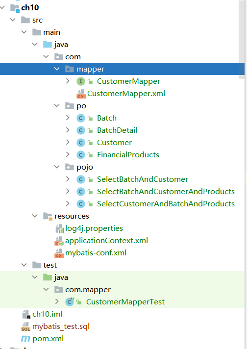
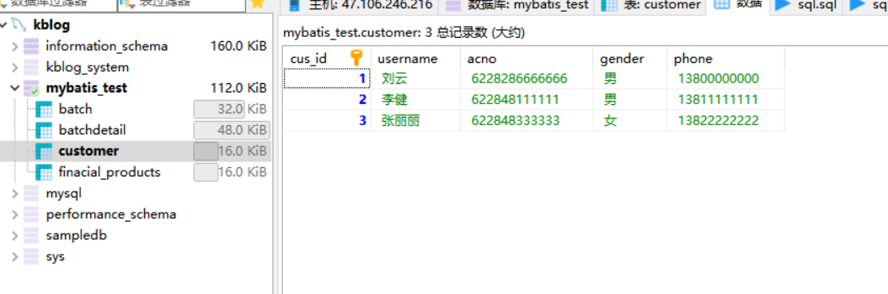
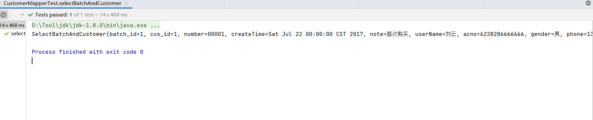
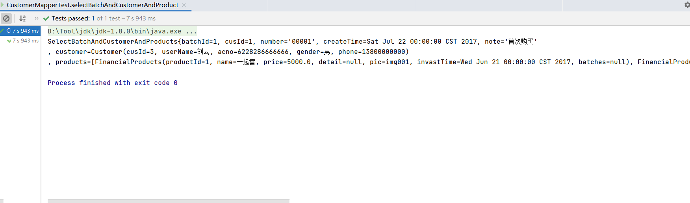
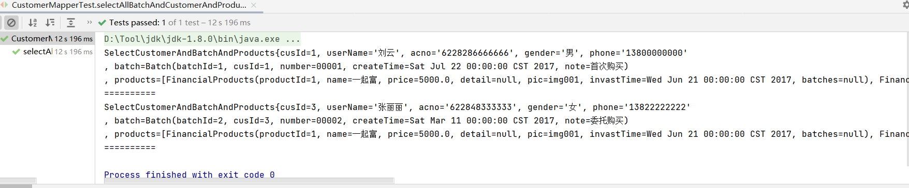

# Mybatis关联映射实践
## 实验内容：

模拟用户批量购买理财产品的业务。用户（customer）一个批次（batch）可以购买多款理财产品（product）。
此业务逻辑涉及4张表:用户表、批次表、批次明细表、理财产品表。

（1）查询一个购买批次的信息以及创建该批次的用户；

（2）在（1）的基础上增加对该批次从属的理财产品信息的查询；

（3）查询所有用户以及用户对应的批次订单中所有理财产品的详细信息。

### 目录结构


### 数据库


### 实体类
Batch.java
```java
/*
 * Date: 2021/5/7
 * Author: <https://www.github.com/shaozk>
 */

package com.po;

import lombok.Getter;
import lombok.Setter;
import lombok.ToString;

import java.util.Date;
import java.util.List;

/**
 * 批次
 * @author shaozk
 */
@Setter
@Getter
@ToString
public class Batch {
    private Integer batchId;
    private Integer cusId;
    private String number;
    private Date createTime;
    private String note;
}

```

BatchDetail.java
```java
/*
 * Date: 2021/5/7
 * Author: <https://www.github.com/shaozk>
 */

package com.po;

import lombok.Getter;
import lombok.Setter;
import lombok.ToString;

import java.util.List;

/**
 * 批次明细
 * @author shaozk
 */
@Setter
@Getter
@ToString
public class BatchDetail {
    private Integer id;
    private Integer productId;
    private Integer batchId;
    private Integer productNum;
}

```

Customer.java
```java
/*
 * Date: 2021/5/7
 * Author: <https://www.github.com/shaozk>
 */

package com.po;

import lombok.Getter;
import lombok.Setter;
import lombok.ToString;

/**
 * 用户
 * @author shaozk
 */
@Setter
@Getter
@ToString
public class Customer {
    private Integer cusId;
    private String userName;
    private String acno;
    private String gender;
    private String phone;
}

```

FinancialProducts.java
```java
/*
 * Date: 2021/5/7
 * Author: <https://www.github.com/shaozk>
 */

package com.po;

import lombok.Getter;
import lombok.Setter;
import lombok.ToString;

import java.util.Date;
import java.util.List;

/**
 * 理财产品
 * @author shaozk
 */
@Getter
@Setter
@ToString
public class FinancialProducts {
    private Integer productId;
    private String name;
    private Float price;
    private String detail;
    private String pic;
    private Date invastTime;

    private List<Batch> batches;


}

```

### POJO
SelectBatchAndCustomer.java
```java
/*
 * Date: 2021/5/7
 * Author: <https://www.github.com/shaozk>
 */

package com.pojo;

import lombok.Getter;
import lombok.Setter;
import lombok.ToString;

import java.util.Date;

/**
 *
 * @author shaozk
 */
@Getter
@Setter
@ToString
public class SelectBatchAndCustomer {
    // 注意pojo里不要写驼峰名
    private Integer batch_id;
    private Integer cus_id;
    private String number;
    private Date createTime;
    private String note;
    private String userName;
    private String acno;
    private String gender;
    private String phone;
}

```

SelectBatchAndCustomerAndProducts
```java
/*
 * Date: 2021/5/7
 * Author: <https://www.github.com/shaozk>
 */

package com.pojo;

import com.po.Customer;
import com.po.FinancialProducts;
import lombok.Data;

import java.util.Date;
import java.util.List;

/**
 *
 * @author shaozk
 */
@Data
public class SelectBatchAndCustomerAndProducts {
    private Integer batchId;
    private Integer cusId;
    private String number;
    private Date createTime;
    private String note;

    // 用户信息
    private Customer customer;
    // 理财产品信息
    private List<FinancialProducts> products;

    @Override
    public String toString() {
        return "SelectBatchAndCustomerAndProducts{" +
                "batchId=" + batchId +
                ", cusId=" + cusId +
                ", number='" + number + '\'' +
                ", createTime=" + createTime +
                ", note='" + note + '\'' +
                "\n" +      // 方便查看结果
                ", customer=" + customer +
                "\n" +
                ", products=" + products +
                '}';
    }
}

```

SelectCustomerAndBatchAndProducts
```java
/*
 * Date: 2021/5/7
 * Author: <https://www.github.com/shaozk>
 */

package com.pojo;

import com.po.Batch;
import com.po.Customer;
import com.po.FinancialProducts;
import lombok.Data;
import lombok.ToString;

import java.util.List;

/**
 * @author shaozk
 */
@Data
public class SelectCustomerAndBatchAndProducts {
    private Integer cusId;
    private String userName;
    private String acno;
    private String gender;
    private String phone;

    // 用户信息
    private Batch batch;
    // 理财产品信息
    private List<FinancialProducts> products;

    @Override
    public String toString() {
        return "SelectCustomerAndBatchAndProducts{" +
                "cusId=" + cusId +
                ", userName='" + userName + '\'' +
                ", acno='" + acno + '\'' +
                ", gender='" + gender + '\'' +
                ", phone='" + phone + '\'' +
                "\n" +      // 方便查看结果
                ", batch=" + batch +
                "\n" +
                ", products=" + products +
                '}';
    }
}

```
###Mapper文件和对应接口
CustomerMapper.xml
```xml
<?xml version="1.0" encoding="UTF-8" ?>
<!DOCTYPE mapper
        PUBLIC "-//mybatis.org//DTD Config 3.0//EN"
        "http://mybatis.org/dtd/mybatis-3-mapper.dtd">

<mapper namespace="com.mapper.CustomerMapper">

<!--    1）查询一个购买批次的信息以及创建该批次的用户-->
    <select id="selectBatchAndCustomer" parameterType="Integer" resultType="com.pojo.SelectBatchAndCustomer">
        select batch.*, customer.*
        from batch, customer
        where batch.cus_id = customer.cus_id and batch.batch_id = #{id}
    </select>

    <!--    2）在（1）的基础上增加对该批次从属的理财产品信息的查询-->
    <resultMap id="batchAndCustomerAndProducts" type="com.pojo.SelectBatchAndCustomerAndProducts">
        <id property="batchId" column="batch_id"/>
        <result property="cusId" column="cus_id"/>
        <result property="createTime" column="createtime"/>
        <result property="number" column="number"/>
        <result property="note" column="note"/>
<!--        一对一-->
        <association property="customer" javaType="com.po.Customer">
            <id property="cusId" column="product_id"/>
            <result property="userName" column="username"/>
            <result property="gender" column="gender"/>
            <result property="phone" column="phone"/>
            <result property="acno" column="acno"/>
        </association>
<!--        多对多-->
        <collection property="products" ofType="com.po.FinancialProducts">
            <id property="productId" column="product_id"/>
            <result property="name" column="name"/>
            <result property="price" column="price"/>
            <result property="pic" column="pic"/>
            <result property="detail" column="detial"/>
            <result property="invastTime" column="invasttime"/>
        </collection>
    </resultMap>

    <select id="selectBatchAndCustomerAndProduct" parameterType="Integer" resultMap="batchAndCustomerAndProducts">
        select batch.*, customer.*, fp.*
        from batch, batchdetail bd, finacial_products fp, customer
        where batch.cus_id = customer.cus_id
          and batch.batch_id = bd.batch_id
          and bd.product_id = fp.product_id
          and batch.batch_id = #{id}
    </select>

<!--    （3）查询所有用户以及用户对应的批次订单中所有理财产品的详细信息。-->
    <resultMap id="customerAndBatchAndProducts" type="com.pojo.SelectCustomerAndBatchAndProducts">
        <id property="cusId" column="cus_id"/>
        <result property="userName" column="username"/>
        <result property="gender" column="gender"/>
        <result property="phone" column="phone"/>
        <result property="acno" column="acno"/>
        <!--        一对一-->
        <association property="batch" javaType="com.po.Batch">
            <id property="batchId" column="batch_id"/>
            <result property="cusId" column="cus_id"/>
            <result property="createTime" column="createtime"/>
            <result property="number" column="number"/>
            <result property="note" column="note"/>
        </association>
        <!--        多对多-->
        <collection property="products" ofType="com.po.FinancialProducts">
            <id property="productId" column="product_id"/>
            <result property="name" column="name"/>
            <result property="price" column="price"/>
            <result property="pic" column="pic"/>
            <result property="detail" column="detial"/>
            <result property="invastTime" column="invasttime"/>
        </collection>
    </resultMap>

    <select id="selectAllBatchAndCustomerAndProduct" resultMap="customerAndBatchAndProducts">
        select batch.*, customer.*, fp.*
        from batch, batchdetail bd, finacial_products fp, customer
        where batch.cus_id = customer.cus_id
          and batch.batch_id = bd.batch_id
          and bd.product_id = fp.product_id
    </select>
    
</mapper>

```

CustomerMapper.java
```java
/*
 * Date: 2021/5/7
 * Author: <https://www.github.com/shaozk>
 */

package com.mapper;

import com.po.Batch;
import com.po.Customer;
import com.pojo.SelectBatchAndCustomer;
import com.pojo.SelectBatchAndCustomerAndProducts;
import com.pojo.SelectCustomerAndBatchAndProducts;
import org.apache.ibatis.annotations.Mapper;
import org.springframework.stereotype.Repository;

import java.util.List;

/**
 * @author shaozk
 */
@Mapper
@Repository
public interface CustomerMapper {
    public SelectBatchAndCustomer selectBatchAndCustomer(Integer id);
    public List<SelectBatchAndCustomerAndProducts> selectBatchAndCustomerAndProduct(Integer id);
    public List<SelectCustomerAndBatchAndProducts> selectAllBatchAndCustomerAndProduct();
}

```

### 测试类
```java
package com.mapper;

import com.po.Batch;
import com.pojo.SelectBatchAndCustomer;
import com.pojo.SelectBatchAndCustomerAndProducts;
import com.pojo.SelectCustomerAndBatchAndProducts;
import org.junit.Test;
import org.junit.runner.RunWith;
import org.springframework.beans.factory.annotation.Autowired;
import org.springframework.test.context.ContextConfiguration;
import org.springframework.test.context.junit4.SpringJUnit4ClassRunner;

import java.util.ArrayList;
import java.util.List;

import static org.junit.Assert.*;

@RunWith(SpringJUnit4ClassRunner.class)
@ContextConfiguration(locations = {"classpath:applicationContext.xml"})
public class CustomerMapperTest {
    @Autowired
    private CustomerMapper customerMapper;

    @Test
    public void selectBatchAndCustomer() {
        SelectBatchAndCustomer sbac = customerMapper.selectBatchAndCustomer(1);
        System.out.println(sbac);
    }

    @Test
    public void selectBatchAndCustomerAndProduct() {
        List<SelectBatchAndCustomerAndProducts> bList = customerMapper.selectBatchAndCustomerAndProduct(1);
        for(SelectBatchAndCustomerAndProducts b : bList) {
            System.out.println(b);
        }
    }

    @Test
    public void selectAllBatchAndCustomerAndProduct() {
        List<SelectCustomerAndBatchAndProducts> bList = customerMapper.selectAllBatchAndCustomerAndProduct();
        for(SelectCustomerAndBatchAndProducts b : bList) {
            System.out.println(b);
            System.out.println("==========");
        }
    }
}
```

tips:一些琐碎的文件没贴出来，如spring配置文件，mybatis配置文件，日志文件，pom文件。

###实验结果


