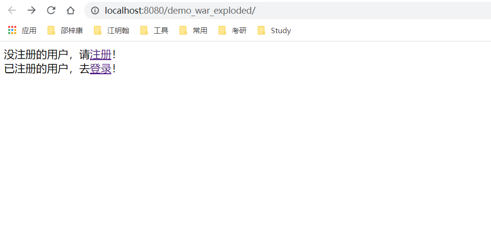
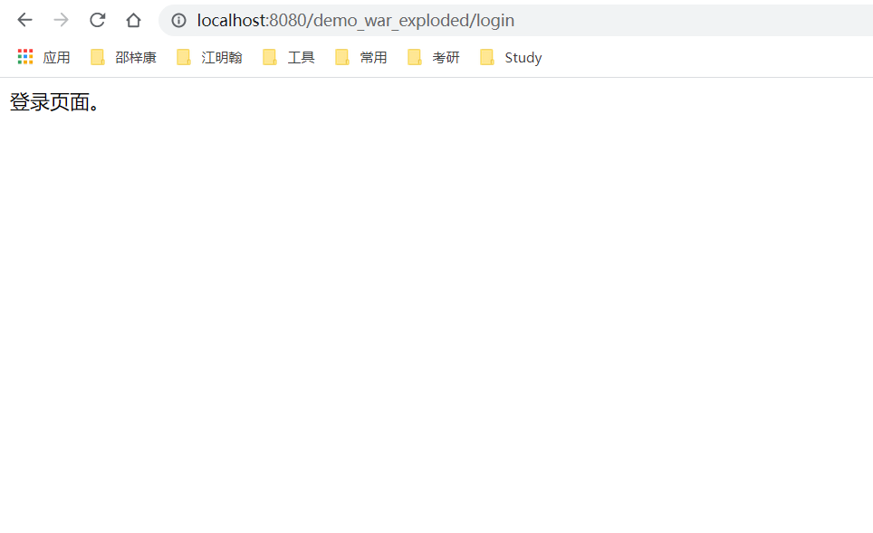
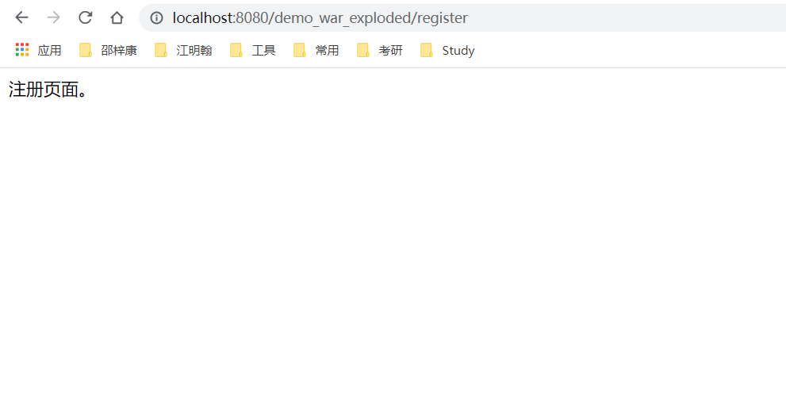

# 实验11-SpringMVC编程实验(1)

## 1.第一个Spring MVC应用(第9章)
### 目录结构


### web.xml
```xml
<?xml version="1.0" encoding="UTF-8"?>
<web-app xmlns:xsi="http://www.w3.org/2001/XMLSchema-instance"
         xmlns="http://xmlns.jcp.org/xml/ns/javaee"
         xsi:schemaLocation="http://xmlns.jcp.org/xml/ns/javaee http://xmlns.jcp.org/xml/ns/javaee/web-app_3_1.xsd"
         id="WebApp_ID" version="3.1">
  <!--部署DispatcherServlet-->
  <servlet>
    <servlet-name>springmvc</servlet-name>
    <servlet-class>org.springframework.web.servlet.DispatcherServlet</servlet-class>
    <!-- 表示容器在启动时立即加载servlet -->
    <load-on-startup>1</load-on-startup>
  </servlet>
  <servlet-mapping>
    <servlet-name>springmvc</servlet-name>
    <!-- 处理所有URL-->
    <url-pattern>/</url-pattern>
  </servlet-mapping>
</web-app>

```

### springmvc-servlet.xml
```xml
<?xml version="1.0" encoding="UTF-8"?>
<beans xmlns="http://www.springframework.org/schema/beans"
       xmlns:xsi="http://www.w3.org/2001/XMLSchema-instance"
       xsi:schemaLocation="
    	   http://www.springframework.org/schema/beans
    	   http://www.springframework.org/schema/beans/spring-beans.xsd">
    <!--LoginController控制器类，映射到“/login”  -->
    <bean name="/login" class="controller.LoginController"/>
    <!--RegisterController控制器类，映射到“/register”  -->
    <bean name="/register" class="controller.RegisterController"/>
    <bean class="org.springframework.web.servlet.view.InternalResourceViewResolver"
          id="internalResourceViewResolver">
        <!-- 前缀 -->
        <property name="prefix" value="/WEB-INF/jsp/" />
        <!-- 后缀 -->
        <property name="suffix" value=".jsp" />
    </bean>

</beans>
```

### index.jsp
```jsp
<%@ page language="java" contentType="text/html; charset=UTF-8"
         pageEncoding="UTF-8"%>
<!DOCTYPE html PUBLIC "-//W3C//DTD HTML 4.01 Transitional//EN" "http://www.w3.org/TR/html4/loose.dtd">
<html>
<head>
    <meta http-equiv="Content-Type" content="text/html; charset=UTF-8">
    <title>Insert title here</title>
</head>
<body>
没注册的用户，请<a href="${pageContext.request.contextPath }/register">注册</a>！<br>
已注册的用户，去<a href="${pageContext.request.contextPath }/login">登录</a>！
</body>
</html>
```

### login.jsp
```jsp
<%--
  Created by IntelliJ IDEA.
  User: Administrator
  Date: 2021/5/14
  Time: 20:13
  To change this template use File | Settings | File Templates.
--%>
<%@ page contentType="text/html;charset=UTF-8" language="java" %>
<html>
<head>
    <meta http-equiv="Content-Type" content="text/html; charset=UTF-8">
    <title>Insert title here</title>
</head>
<body>
    登录页面。
</body>
</html>
```

### register.jsp
```jsp
<%--
  Created by IntelliJ IDEA.
  User: Administrator
  Date: 2021/5/14
  Time: 20:13
  To change this template use File | Settings | File Templates.
--%>
<%@ page contentType="text/html;charset=UTF-8" language="java" %>
<html>
<head>
    <meta http-equiv="Content-Type" content="text/html; charset=UTF-8">
    <title>Insert title here</title>
</head>
<body>
    注册页面。
</body>
</html>

```
### RegisterController.java
```java
/*
 * Date: 2021/5/14
 * Author: <https://www.github.com/shaozk>
 */

package controller;

import org.springframework.web.servlet.ModelAndView;
import org.springframework.web.servlet.mvc.Controller;

import javax.servlet.http.HttpServletRequest;
import javax.servlet.http.HttpServletResponse;

/**
 * @author shaozk
 */
public class RegisterController implements Controller {
    @Override
    public ModelAndView handleRequest(HttpServletRequest arg0, HttpServletResponse arg1) throws Exception {
        //return new ModelAndView("/WEB-INF/jsp/register.jsp");
        return new ModelAndView("register");
    }
}

```

### LoginController.java
```java
/*
 * Date: 2021/5/14
 * Author: <https://www.github.com/shaozk>
 */

package controller;

import org.springframework.web.servlet.ModelAndView;
import org.springframework.web.servlet.mvc.Controller;

import javax.servlet.http.HttpServletRequest;
import javax.servlet.http.HttpServletResponse;

/**
 * @author shaozk
 */
public class LoginController implements Controller {
    @Override
    public ModelAndView handleRequest(HttpServletRequest arg0, HttpServletResponse arg1) throws Exception {
        //return new ModelAndView("/WEB-INF/jsp/login.jsp");
        return new ModelAndView("login");
    }
}

```

### 实验截图
1.首页

2.登录界面


3.注册界面



## 2.Spring MVC的Controller（第10章）

### 目录结构

### web.xml
```xml
<?xml version="1.0" encoding="UTF-8"?>
<web-app xmlns:xsi="http://www.w3.org/2001/XMLSchema-instance"
         xmlns="http://xmlns.jcp.org/xml/ns/javaee"
         xsi:schemaLocation="http://xmlns.jcp.org/xml/ns/javaee http://xmlns.jcp.org/xml/ns/javaee/web-app_3_1.xsd"
         id="WebApp_ID" version="3.1">
  <!--部署DispatcherServlet-->
  <servlet>
    <servlet-name>springmvc</servlet-name>
    <servlet-class>org.springframework.web.servlet.DispatcherServlet</servlet-class>
    <!-- 表示容器在启动时立即加载servlet -->
    <load-on-startup>1</load-on-startup>
  </servlet>
  <servlet-mapping>
    <servlet-name>springmvc</servlet-name>
    <!-- 处理所有URL-->
    <url-pattern>/</url-pattern>
  </servlet-mapping>
</web-app>

```

### springmvc-servlet.xml
```xml
<?xml version="1.0" encoding="UTF-8"?>
<beans xmlns="http://www.springframework.org/schema/beans"
       xmlns:xsi="http://www.w3.org/2001/XMLSchema-instance"
       xmlns:context="http://www.springframework.org/schema/context"
       xmlns:mvc="http://www.springframework.org/schema/mvc"
       xsi:schemaLocation="
    	http://www.springframework.org/schema/beans
    	http://www.springframework.org/schema/beans/spring-beans.xsd
        http://www.springframework.org/schema/context
        http://www.springframework.org/schema/context/spring-context.xsd
        http://www.springframework.org/schema/mvc
        http://www.springframework.org/schema/mvc/spring-mvc.xsd">
    <!-- 使用扫描机制，扫描控制器类 -->
    <context:component-scan base-package="controller"/>
    <context:component-scan base-package="service"/>
    <mvc:annotation-driven />
    <!-- annotation-driven用于简化开发的配置，
    注解DefaultAnnotationHandlerMapping和AnnotationMethodHandlerAdapter -->
    <!-- 使用resources过滤掉不需要dispatcher servlet的资源。
    使用resources时，必须使用annotation-driven，不然resources元素会阻止任意控制器被调用。
    如果不使用resources，则annotation-driven可以没有。 -->
    <!-- 允许css目录下所有文件可见 -->
    <mvc:resources location="/css/" mapping="/css/**"/>
    <!-- 允许html目录下所有文件可见 -->
    <mvc:resources location="/html/" mapping="/html/**"/>
    <!--允许images目录下所有文件可见 -->
    <mvc:resources location="/images/" mapping="/images/**"/>
    <!-- 配置视图解析器 -->
    <bean class="org.springframework.web.servlet.view.InternalResourceViewResolver"
          id="internalResourceViewResolver">
        <!-- 前缀 -->
        <property name="prefix" value="/WEB-INF/jsp/" />
        <!-- 后缀 -->
        <property name="suffix" value=".jsp" />
    </bean>
</beans>

```

### index.jsp
```jsp
<%@ page language="java" contentType="text/html; charset=UTF-8" pageEncoding="UTF-8"%>
<!DOCTYPE html PUBLIC "-//W3C//DTD HTML 4.01 Transitional//EN" "http://www.w3.org/TR/html4/loose.dtd">
<html>
<head>
    <meta http-equiv="Content-Type" content="text/html; charset=UTF-8">
    <title>My JSP 'index.jsp' starting page</title>
</head>
<body>
没注册的用户，请<a href="${pageContext.request.contextPath }/index/register">注册</a>！<br>
已注册的用户，去<a href="${pageContext.request.contextPath }/index/login">登录</a>！
</body>
</html>

```

### login.jsp
```jsp
<%--
  Created by IntelliJ IDEA.
  User: Administrator
  Date: 2021/5/14
  Time: 20:43
  To change this template use File | Settings | File Templates.
--%>
<%@ page language="java" contentType="text/html; charset=UTF-8" pageEncoding="UTF-8"%>
<!DOCTYPE html PUBLIC "-//W3C//DTD HTML 4.01 Transitional//EN" "http://www.w3.org/TR/html4/loose.dtd">
<html>
<head>
    <meta http-equiv="Content-Type" content="text/html; charset=UTF-8">
    <title>后台登录</title>
    <style type="text/css">
        table{
            text-align: center;
        }
        .textSize{
            width: 120px;
            height: 25px;
        }
        * {
            margin: 0px;
            padding: 0px;
        }
        body {
            font-family: Arial, Helvetica, sans-serif;
            font-size: 12px;
            margin: 10px 10px auto;
            background-image: url(${pageContext.request.contextPath }/images/bb.jpg);
        }
    </style>
    <script type="text/javascript">
        //确定按钮
        function gogo(){
            document.forms[0].submit();
        }
        //取消按钮
        function cancel(){
            document.forms[0].action = "";
        }
    </script>
</head>
<body>
<form action="${pageContext.request.contextPath }/user/login" method="post">
    <table>
        <tr>
            <td colspan="2"></td>
        </tr>
        <tr>
            <td>姓名：</td>
            <td><input type="text" name="uname" class="textSize"></td>
        </tr>
        <tr>
            <td>密码：</td>
            <td><input type="password" name="upass" class="textSize"></td>
        </tr>
        <tr>
            <td colspan="2">
                <input type="image" src="${pageContext.request.contextPath }/images/ok.gif" onclick="gogo()" >
                <input type="image" src="${pageContext.request.contextPath }/images/cancel.gif" onclick="cancel()" >
            </td>
        </tr>
    </table>
    ${messageError }
</form>
</body>
</html>


```

### main.jsp
```jsp
<%--
  Created by IntelliJ IDEA.
  User: Administrator
  Date: 2021/5/14
  Time: 20:44
  To change this template use File | Settings | File Templates.
--%>
<%@ page language="java" contentType="text/html; charset=UTF-8" pageEncoding="UTF-8"%>
<!DOCTYPE html PUBLIC "-//W3C//DTD HTML 4.01 Transitional//EN" "http://www.w3.org/TR/html4/loose.dtd">
<html>
<head>
    <meta http-equiv="Content-Type" content="text/html; charset=UTF-8">
    <title>主页面</title>
</head>
<body>
欢迎${sessionScope.u.uname }访问该系统。
</body>
</html>

```

### register.jsp
```jsp
<%--
  Created by IntelliJ IDEA.
  User: Administrator
  Date: 2021/5/14
  Time: 20:44
  To change this template use File | Settings | File Templates.
--%>
<%@ page language="java" contentType="text/html; charset=UTF-8" pageEncoding="UTF-8"%>
<!DOCTYPE html PUBLIC "-//W3C//DTD HTML 4.01 Transitional//EN" "http://www.w3.org/TR/html4/loose.dtd">
<html>
<head>
    <meta http-equiv="Content-Type" content="text/html; charset=UTF-8">
    <style type="text/css">
        .textSize{
            width: 100pt;
            height: 15pt
        }
    </style>
    <title>注册画面</title>
    <script type="text/javascript">
        //注册时检查输入项
        function allIsNull(){
            var name=document.registForm.uname.value;
            var pwd=document.registForm.upass.value;
            var repwd=document.registForm.reupass.value;
            if(name==""){
                alert("请输入姓名！");
                document.registForm.uname.focus();
                return false;
            }
            if(pwd==""){
                alert("请输入密码！");
                document.registForm.upass.focus();
                return false;
            }
            if(repwd==""){
                alert("请输入确认密码！");
                document.registForm.reupass.focus();
                return false;
            }
            if(pwd!=repwd){
                alert("2次密码不一致，请重新输入！");
                document.registForm.upass.value="";
                document.registForm.reupass.value="";
                document.registForm.upass.focus();
                return false;
            }
            document.registForm.submit();
            return true;
        }
    </script>
</head>
<body>
<form action="${pageContext.request.contextPath }/user/register" method="post" name="registForm">
    <table
            border=1
            bgcolor="lightblue"
            align="center">
        <tr>
            <td>姓名：</td>
            <td>
                <input class="textSize" type="text" name="uname" value="${user.uname }"/>
            </td>
        </tr>

        <tr>
            <td>密码：</td>
            <td><input class="textSize" type="password" maxlength="20" name="upass"/></td>
        </tr>

        <tr>
            <td>确认密码：</td>
            <td><input class="textSize" type="password" maxlength="20" name="reupass"/></td>
        </tr>

        <tr>
            <td colspan="2" align="center"><input type="button" value="注册" onclick="allIsNull()"/></td>
        </tr>
    </table>
</form>
</body>
</html>
```

### IndexController.java
```java
/*
 * Date: 2021/5/14
 * Author: <https://www.github.com/shaozk>
 */

package controller;

import org.springframework.stereotype.Controller;
import org.springframework.web.bind.annotation.RequestMapping;

/**
 * @author shaozk
 */
@Controller
@RequestMapping("/index")
public class IndexController {
    @RequestMapping("/login")
    public String login() {
        return "login";//跳转到“/WEB-INF/jsp/login.jsp”
    }
    @RequestMapping("/register")
    public String register() {
        return "register";
    }
}


```

### UserController.java
```java
/*
 * Date: 2021/5/14
 * Author: <https://www.github.com/shaozk>
 */

package controller;

import org.apache.commons.logging.Log;
import org.apache.commons.logging.LogFactory;
import org.springframework.beans.factory.annotation.Autowired;
import org.springframework.stereotype.Controller;
import org.springframework.ui.Model;
import org.springframework.web.bind.annotation.ModelAttribute;
import org.springframework.web.bind.annotation.RequestMapping;
import pojo.UserForm;
import service.UserService;

import javax.servlet.http.HttpSession;

/**
 * @author shaozk
 */
@Controller
@RequestMapping("/user")
public class UserController {
    //得到一个用来记录日志的对象，这样打印信息的时候能够标记打印的是那个类的信息
    private static final Log logger = LogFactory.getLog(UserController.class);
    //将服务依赖注入到属性userService
    @Autowired
    public UserService userService;
    /**
     * 处理登录
     */
    @RequestMapping("/login")
    public String login(UserForm user, HttpSession session, Model model) {
        if(userService.login(user)){
            session.setAttribute("u", user);
            logger.info("成功");
            return "main";//登录成功，跳转到main.jsp
        }else{
            logger.info("失败");
            model.addAttribute("messageError", "用户名或密码错误");
            return "login";
        }
    }
    /**
     *处理注册
     */
    @RequestMapping("/register")
    public String register(@ModelAttribute("user") UserForm user) {
        if(userService.register(user)){
            logger.info("成功");
            return "login";//注册成功，跳转到login.jsp
        }else{
            logger.info("失败");
            //使用@ModelAttribute("user")与model.addAttribute("user", user)功能相同
            //在register.jsp页面上可以使用EL表达式${user.uname}取出ModelAttribute的uname值
            return "register";//返回register.jsp
        }
    }
}

```

### UserForm.java
```java
/*
 * Date: 2021/5/14
 * Author: <https://www.github.com/shaozk>
 */

package pojo;

import lombok.Data;

/**
 * @author shaozk
 */
@Data
public class UserForm {
    private String uname;
    private String upass;
    private String reupass;
}

```

### UserService.java
```java
/*
 * Date: 2021/5/14
 * Author: <https://www.github.com/shaozk>
 */

package service;

import pojo.UserForm;

/**
 * @author shaozk
 */
public interface UserService {
    boolean login(UserForm user);
    boolean register(UserForm user);
}

```

### UserServiceImpl.java
```java
/*
 * Date: 2021/5/14
 * Author: <https://www.github.com/shaozk>
 */

package service;

import org.springframework.stereotype.Service;
import pojo.UserForm;

/**
 * TODO
 *
 * @author shaozk
 */
@Service
public class UserServiceImpl implements UserService{
    @Override
    public boolean login(UserForm user) {
        if("shaozk".equals(user.getUname())
                && "123456".equals(user.getUpass()))
            return true;
        return false;
    }
    @Override
    public boolean register(UserForm user) {
        if("shaozk".equals(user.getUname())
                && "123456".equals(user.getUpass()))
            return true;
        return false;
    }
}

```

### 实验结果：
1.首页

2.登录界面


3.登录成功界面


4.注册界面


