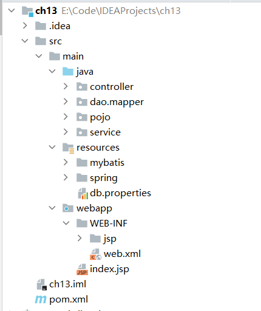
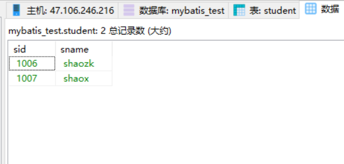
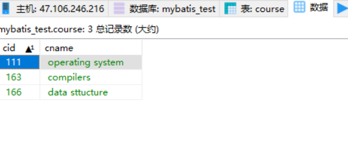
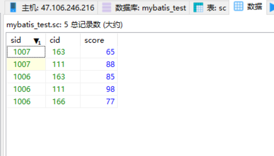
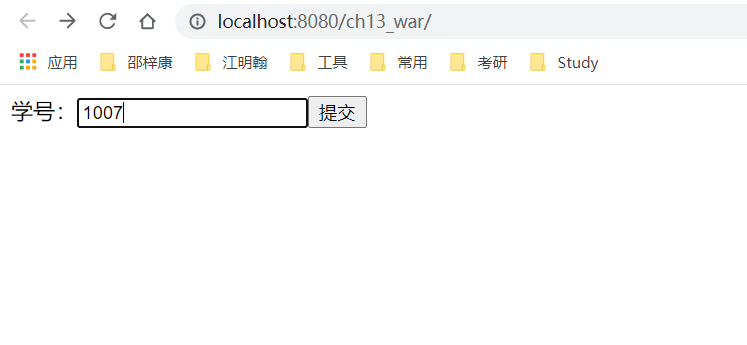
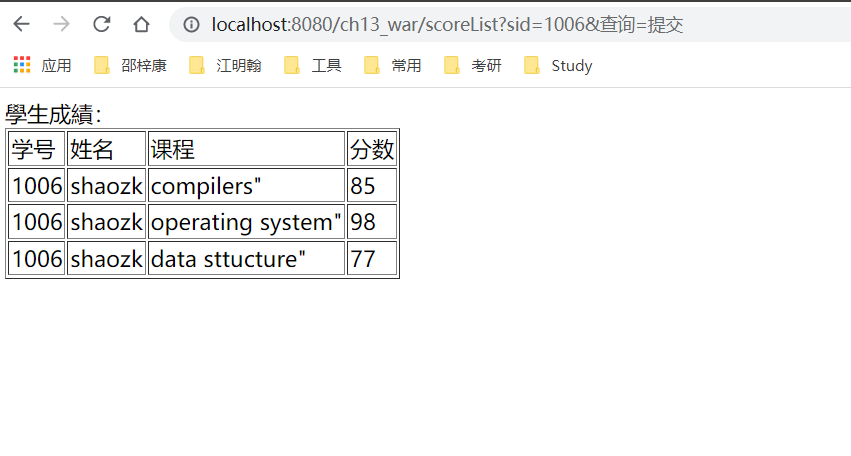
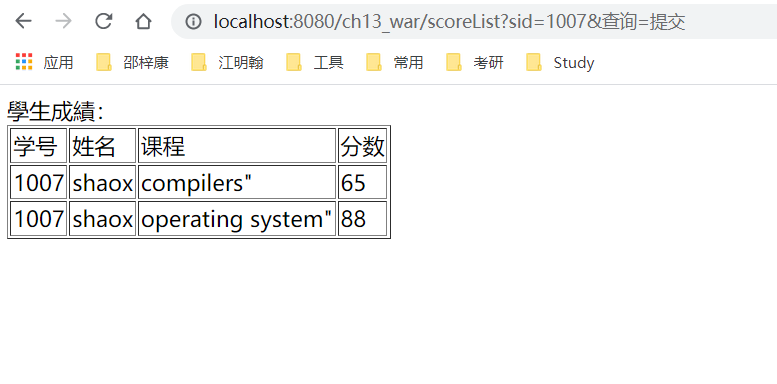

# 实验12-SringMVC编程实验（补充）

## 项目结构


## 创建数据库
sql
```sql
USE `mybatis_test`;

## 学生表
DROP TABLE if EXISTS student;
CREATE TABLE student (
	sid VARCHAR(4),
	sname VARCHAR(10)
);

## 插入数据
INSERT INTO student VALUES(1006, "shaozk");
INSERT INTO student VALUES(1007, "shaox");

## 课程表
DROP TABLE if exists course;
CREATE TABLE course (
	cid VARCHAR(3),
	cname VARCHAR(20)
);

## 插入数据
INSERT INTO course VALUES(163, "compilers");
INSERT INTO course VALUES(111, "operating system");
INSERT INTO course VALUES(166, "data sttucture");


## 成绩表
DROP TABLE if exists sc;
CREATE TABLE sc (
	sid VARCHAR(4),
	cid VARCHAR(3),
	score INT(3)
);

## 插入数据
INSERT INTO sc VALUES(1006, 163, 85);
INSERT INTO sc VALUES(1006, 111, 98);
INSERT INTO sc VALUES(1006, 166, 77);
INSERT INTO sc VALUES(1007, 163, 65);
INSERT INTO sc VALUES(1007, 111, 88);
```

student表


course表


sc表


## 核心配置文件
web.xml
```xml
<?xml version="1.0" encoding="UTF-8"?>
<web-app xmlns="http://xmlns.jcp.org/xml/ns/javaee"
         xmlns:xsi="http://www.w3.org/2001/XMLSchema-instance"
         xsi:schemaLocation="http://xmlns.jcp.org/xml/ns/javaee http://xmlns.jcp.org/xml/ns/javaee/web-app_4_0.xsd"
         version="4.0">
  <servlet>
    <servlet-name>dispatcherServlet</servlet-name>
    <servlet-class>org.springframework.web.servlet.DispatcherServlet</servlet-class>
    <init-param>
      <param-name>contextConfigLocation</param-name>
      <param-value>classpath*:spring/springmvc.xml</param-value>
    </init-param>
    <load-on-startup>1</load-on-startup>

  </servlet>
  <servlet-mapping>
    <servlet-name>dispatcherServlet</servlet-name>
    <url-pattern>/</url-pattern>
  </servlet-mapping>

  <!--配置spring容器监听器-->
  <context-param>
    <param-name>contextConfigLocation</param-name>
    <param-value>classpath*:spring/applicationContext.xml</param-value>
  </context-param>
  <listener>
    <listener-class>org.springframework.web.context.ContextLoaderListener</listener-class>
  </listener>
</web-app>
```

springmvc.xml
```xml
<?xml version="1.0" encoding="UTF-8"?>
<beans xmlns="http://www.springframework.org/schema/beans"
       xmlns:xsi="http://www.w3.org/2001/XMLSchema-instance" xmlns:mvc="http://www.springframework.org/schema/mvc"
       xmlns:context="http://www.springframework.org/schema/context"
       xsi:schemaLocation="http://www.springframework.org/schema/beans http://www.springframework.org/schema/beans/spring-beans.xsd http://www.springframework.org/schema/mvc http://www.springframework.org/schema/mvc/spring-mvc.xsd http://www.springframework.org/schema/context http://www.springframework.org/schema/context/spring-context.xsd">

    <!--    扫描控制器类-->
    <context:component-scan base-package="controller"/>
    <!-- 1.注解驱动 -->
    <mvc:annotation-driven/>
    <!-- 2.静态资源过滤 -->
    <mvc:default-servlet-handler/>

    <!-- 配置视图解析器 -->
    <bean class="org.springframework.web.servlet.view.InternalResourceViewResolver"
          id="internalResourceViewResolver">
        <!-- 前缀 -->
        <property name="prefix" value="/WEB-INF/jsp/" />
        <!-- 后缀 -->
        <property name="suffix" value=".jsp" />
    </bean>
</beans>
```

applicationContext.xml
```xml
<?xml version="1.0" encoding="UTF-8"?>
<beans xmlns="http://www.springframework.org/schema/beans"
       xmlns:xsi="http://www.w3.org/2001/XMLSchema-instance"
       xmlns:context="http://www.springframework.org/schema/context"
       xsi:schemaLocation="http://www.springframework.org/schema/beans http://www.springframework.org/schema/beans/spring-beans.xsd http://www.springframework.org/schema/context http://www.springframework.org/schema/context/spring-context.xsd">

<!--配置service层-->
    <context:component-scan base-package="service"/>

    <!-- 加载配置文件 -->
    <context:property-placeholder location="classpath:db.properties" />

    <!-- 数据库连接池 -->
    <bean id="dataSource" class="org.apache.commons.dbcp2.BasicDataSource"
          destroy-method="close">
        <property name="driverClassName" value="${jdbc.driver}" />
        <property name="url" value="${jdbc.url}" />
        <property name="username" value="${jdbc.username}" />
        <property name="password" value="${jdbc.password}" />
        <property name="maxIdle" value="5" />
    </bean>


    <!-- SqlsessionFactory -->
    <bean id="sqlSessionFactory" class="org.mybatis.spring.SqlSessionFactoryBean">
        <!-- 数据源 -->
        <property name="dataSource" ref="dataSource"/>
        <!-- mybatis配置文件 -->
        <property name="configLocation" value="classpath:/mybatis/mybatis-config.xml"/>
<!--        mapper配置文件-->
        <property name="mapperLocations" value="classpath:/dao/mapper/*.xml"/>
     </bean>


    <!--
    MapperScannerConfigurer：mapper的扫描器，将包下边的mapper接口自动创建代理对象，
    自动创建到spring容器中，bean的id是mapper的类名（首字母小写）
     -->
    <bean class="org.mybatis.spring.mapper.MapperScannerConfigurer">
        <!-- 配置扫描包的路径
        如果要扫描多个包，中间使用半角逗号分隔
        要求mapper.xml和mapper.java同名且在同一个目录
         -->
        <property name="basePackage" value="dao.mapper"/>
        <!-- 使用sqlSessionFactoryBeanName -->
        <property name="sqlSessionFactoryBeanName" value="sqlSessionFactory"/>
    </bean>

</beans>
```

db.properties
```properties
jdbc.driver=com.mysql.jdbc.Driver
jdbc.url=jdbc:mysql://47.106.246.216/mybatis_test?characterEncoding=utf-8&amp;useSSL=false
jdbc.username=root
jdbc.password=123456

```

## pojo
StudentCourseAndScore.java
```java
/*
 * Date: 2021/5/24
 * Author: <https://www.github.com/shaozk>
 */

package pojo;


import lombok.Data;

/**
 * 同时含有课程和分数信息的pojo
 * @author shaozk
 */
@Data
public class StudentCourseAndScore {
    private String sid;
    private String sname;
    private String course;
    private String score;
}

```

## dao(mapper)层
StudentMapper.java
```java
/*
 * Date: 2021/5/24
 * Author: <https://www.github.com/shaozk>
 */

package dao.mapper;

import org.apache.ibatis.annotations.Mapper;
import org.springframework.stereotype.Repository;
import pojo.StudentCourseAndScore;

import java.util.List;

/**
 * @author shaozk
 */
@Mapper
@Repository
public interface StudentMapper {
    /**
     * 通过学生id查询成绩
     * @param sid
     */
    public List<StudentCourseAndScore> listAllScoreById(String sid);
}

```

StudentMapper.xml
```xml
<?xml version="1.0" encoding="UTF-8" ?>
<!DOCTYPE mapper
        PUBLIC "-//mybatis.org//DTD Config 3.0//EN"
        "http://mybatis.org/dtd/mybatis-3-mapper.dtd">

<mapper namespace="dao.mapper.StudentMapper">

    <resultMap id="courseAndScore" type="pojo.StudentCourseAndScore">
        <id property="sid" column="sid"/>
        <result property="sname" column="sname"/>
        <result property="course" column="cname"/>
        <result property="score" column="score"/>
    </resultMap>

    <!--    通过学生id查询成绩信息-->
    <select id="listAllScoreById" resultMap="courseAndScore">
        select student.*, course.cname, sc.score
        from student
        left join sc on student.sid = sc.sid
        left join course on sc.cid = course.cid
        where student.sid = #{sid}
    </select>
</mapper>

```

## service层
StudentService.java
```java
/*
 * Date: 2021/5/24
 * Author: <https://www.github.com/shaozk>
 */

package service;

import pojo.StudentCourseAndScore;

import java.util.List;

/**
 * @author shaozk
 */
public interface StudentService {
    List<StudentCourseAndScore> listAllCourseAndScore(String sid);
}

```

StudentServiceImpl.java
```java
/*
 * Date: 2021/5/24
 * Author: <https://www.github.com/shaozk>
 */

package service;

import dao.mapper.StudentMapper;
import org.springframework.beans.factory.annotation.Autowired;
import org.springframework.stereotype.Service;
import pojo.StudentCourseAndScore;

import java.util.ArrayList;
import java.util.List;

/**
 * @author shaozk
 */
@Service
public class StudentServiceImpl implements StudentService{

    @Autowired
    private StudentMapper studentMapper;

    @Override
    public List<StudentCourseAndScore> listAllCourseAndScore(String sid) {
//        測試
//        List<StudentCourseAndScore> list = new ArrayList<>();
//        StudentCourseAndScore scas = new StudentCourseAndScore();
//        scas.setCourse("compiler");
//        scas.setSname("shaozk");
//        scas.setSid("1006");
//        scas.setScore(100);
//        list.add(scas);
        return studentMapper.listAllScoreById(sid);
    }
}

```

## controller层
StudentController.java
```java
/*
 * Date: 2021/5/24
 * Author: <https://www.github.com/shaozk>
 */

package controller;

import com.sun.corba.se.impl.ior.OldJIDLObjectKeyTemplate;
import org.springframework.beans.factory.annotation.Autowired;
import org.springframework.stereotype.Controller;
import org.springframework.web.bind.annotation.RequestBody;
import org.springframework.web.bind.annotation.RequestMapping;
import org.springframework.web.bind.annotation.RequestMethod;
import org.springframework.web.bind.annotation.RequestParam;
import org.springframework.web.servlet.ModelAndView;
import pojo.StudentCourseAndScore;
import service.StudentService;

import java.util.List;

/**
 * @author shaozk
 */
@Controller
public class StudentController {

    @Autowired
    private StudentService studentService;

    /**
     * 获取学生成绩通过sid
     * @param sid
     * @return
     */
    @RequestMapping(value = "scoreList", method = RequestMethod.GET)
    public ModelAndView scoreList(@RequestParam(name = "sid", required = true) String sid) {
        ModelAndView modelAndView = new ModelAndView();
        List<StudentCourseAndScore> scoreList = studentService.listAllCourseAndScore(sid);
        modelAndView.addObject("scoreList", scoreList);
        modelAndView.setViewName("scoreList");
        return modelAndView;
    }

    /**
     * 一个测试方法
     * @return
     */
    @RequestMapping("/test")
    public ModelAndView test() {
        ModelAndView view = new ModelAndView();
        String str = new String("hello");
        view.addObject("str", str);
        view.setViewName("test");
        return view;
    }
}

```


## 前端页面
index.jsp
```html
<%@ page language="java" contentType="text/html; charset=UTF-8" pageEncoding="UTF-8"%>
<!DOCTYPE html PUBLIC "-//W3C//DTD HTML 4.01 Transitional//EN" "http://www.w3.org/TR/html4/loose.dtd">
<html>
<body>
<form action="${pageContext.request.contextPath }/scoreList" method="get">
    学号：<input type="text" name="sid"/><input type="submit" name="查询"/>
</form>
</body>
</html>

```

scoreList.jsp
```html
<%@ page contentType="text/html;charset=UTF-8" language="java" %>
<%@ taglib uri="http://java.sun.com/jsp/jstl/core" prefix="c" %>
<html>
<head>
    <title>scoreList</title>
</head>
<body>
學生成績：
<table border="1">
    <tr>
        <td>学号</td>
        <td>姓名</td>
        <td>课程</td>
        <td>分数</td>
    </tr>
<c:forEach items="${scoreList }" var="item">
    <tr>
        <td>${item.sid }</td>
        <td>${item.sname }</td>
        <td>${item.course}"</td>
        <td>${item.score }</td>
    </tr>
</c:forEach>
</table>
</body>
</html>


```
## 实验截图

查询学生成绩界面


学生1006成绩


学生1007成绩

