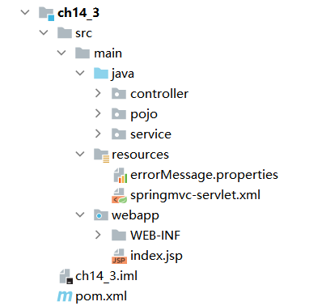

# 实验13 Spring MVC编程实践（2）

## 1.Formatter转换器
### 目录结构


### 实体类
GoodModelb.java
```java
/*
 * Date: 2021/5/28
 * Author: <https://www.github.com/shaozk>
 */

package pojo;

import java.util.Date;

/**
 * @author shaozk
 */
public class GoodsModelb {
    private String goodsname;
    private double goodsprice;
    private int goodsnumber;
    private Date goodsdate;

    public String getGoodsname() {
        return goodsname;
    }

    public void setGoodsname(String goodsname) {
        this.goodsname = goodsname;
    }

    public double getGoodsprice() {
        return goodsprice;
    }

    public void setGoodsprice(double goodsprice) {
        this.goodsprice = goodsprice;
    }

    public int getGoodsnumber() {
        return goodsnumber;
    }

    public void setGoodsnumber(int goodsnumber) {
        this.goodsnumber = goodsnumber;
    }

    public Date getGoodsdate() {
        return goodsdate;
    }

    public void setGoodsdate(Date goodsdate) {
        this.goodsdate = goodsdate;
    }
}

```

### 控制器类
FormatterController.java
```java
/*
 * Date: 2021/5/28
 * Author: <https://www.github.com/shaozk>
 */

package controller;

import org.springframework.stereotype.Controller;
import org.springframework.ui.Model;
import org.springframework.web.bind.annotation.RequestMapping;
import pojo.GoodsModelb;

/**
 * @author shaozk
 */
@Controller
@RequestMapping("/my")
public class FormatterController {
    @RequestMapping("/formatter")
    public String myConverter(GoodsModelb gm, Model model){
        model.addAttribute("goods",gm);
        return "showGoodsb";
    }
}

```

### 自定义格式转换器类
MyFormatter.java
```java
/*
 * Date: 2021/5/28
 * Author: <https://www.github.com/shaozk>
 */

package formatter;

import org.springframework.format.Formatter;

import java.text.ParseException;
import java.text.SimpleDateFormat;
import java.util.Date;
import java.util.Locale;

/**
 * @author shaozk
 */
public class MyFormatter implements Formatter<Date> {

    SimpleDateFormat dateFormat = new SimpleDateFormat("yyyy-MM-dd");


    @Override
    public Date parse(String text, Locale locale) throws ParseException {
        return dateFormat.parse(text);
    }

    @Override
    public String print(Date object, Locale locale) {
        return dateFormat.format(locale);
    }
}

```

### springmvc配置文件
springmvc-servlet.xml
```xml
<?xml version="1.0" encoding="UTF-8"?>
<beans xmlns="http://www.springframework.org/schema/beans"
       xmlns:xsi="http://www.w3.org/2001/XMLSchema-instance"
       xmlns:context="http://www.springframework.org/schema/context"
       xmlns:mvc="http://www.springframework.org/schema/mvc"
       xsi:schemaLocation="
    	http://www.springframework.org/schema/beans
    	http://www.springframework.org/schema/beans/spring-beans.xsd
        http://www.springframework.org/schema/context
        http://www.springframework.org/schema/context/spring-context.xsd
        http://www.springframework.org/schema/mvc
        http://www.springframework.org/schema/mvc/spring-mvc.xsd">
    <!-- 使用扫描机制，扫描controller包 -->
    <context:component-scan base-package="controller"/>

    <!-- 1.注解驱动 -->
    <mvc:annotation-driven/>
    <!-- 2.静态资源过滤 -->
    <mvc:default-servlet-handler/>

    <!-- 注册MyFormatter-->
    <bean id="conversionService" class="org.springframework.format.support.FormattingConversionServiceFactoryBean">
        <property name="formatters">
            <set>
                <bean class="formatter.MyFormatter"/>
            </set>
        </property>
    </bean>
    <mvc:annotation-driven conversion-service="conversionService"/>
    <!-- 配置视图解析器 -->
    <bean class="org.springframework.web.servlet.view.InternalResourceViewResolver"
          id="internalResourceViewResolver">
        <!-- 前缀 -->
        <property name="prefix" value="/WEB-INF/jsp/" />
        <!-- 后缀 -->
        <property name="suffix" value=".jsp" />
    </bean>
</beans>
```

### 视图文件
inputb.jsp
```html
<%@ page language="java" contentType="text/html; charset=UTF-8" pageEncoding="UTF-8"%>
<!DOCTYPE html PUBLIC "-//W3C//DTD HTML 4.01 Transitional//EN" "http://www.w3.org/TR/html4/loose.dtd">
<html>
<head>
    <meta http-equiv="Content-Type" content="text/html; charset=UTF-8">
    <title>Insert title here</title>
</head>
<body>
<form action="${pageContext.request.contextPath }/my/formatter" method="post">
    商品名称：<input type="text" name="goodsname"/><br>
    商品价格：<input type="text" name="goodsprice"/><br>
    商品数量：<input type="text" name="goodsnumber"/><br>
    商品日期：<input type="text" name="goodsdate"/>（yyyy-MM-dd）<br>
    <input type="submit" value="提交"/>
</form>
</body>
</html>
```


showGoodsb.jsp
```html
<%@ page language="java" contentType="text/html; charset=UTF-8" pageEncoding="UTF-8"%>
<!DOCTYPE html PUBLIC "-//W3C//DTD HTML 4.01 Transitional//EN" "http://www.w3.org/TR/html4/loose.dtd">
<html>
<head>
    <meta http-equiv="Content-Type" content="text/html; charset=UTF-8">
    <title>Insert title here</title>
</head>
<body>
您创建的商品信息如下：<br>
<!-- 使用EL表达式取出Action类的属性goods的值 -->
商品名称为：${goods.goodsname }<br>
商品价格为：${goods.goodsprice }<br>
商品数量为：${goods.goodsnumber }<br>
商品日期为：${goods.goodsdate }
</body>
</html>
```

### 结果截图


## 2.数据绑定的应用
### 目录结构
 

### 相关配置文件
web.xml
```xml
<?xml version="1.0" encoding="UTF-8"?>
<web-app xmlns:xsi="http://www.w3.org/2001/XMLSchema-instance"
         xmlns="http://xmlns.jcp.org/xml/ns/javaee"
         xsi:schemaLocation="http://xmlns.jcp.org/xml/ns/javaee http://xmlns.jcp.org/xml/ns/javaee/web-app_3_1.xsd"
         id="WebApp_ID" version="3.1">
  <!--配置DispatcherServlet -->
  <servlet>
    <servlet-name>springmvc</servlet-name>
    <servlet-class>org.springframework.web.servlet.DispatcherServlet</servlet-class>
    <init-param>
      <param-name>contextConfigLocation</param-name>
      <param-value>classpath*:spring/springmvc-servlet.xml</param-value>
    </init-param>
    <load-on-startup>1</load-on-startup>
  </servlet>
  <servlet-mapping>
    <servlet-name>springmvc</servlet-name>
    <url-pattern>/</url-pattern>
  </servlet-mapping>
  <!-- 避免中文乱码 -->
  <filter>
    <filter-name>characterEncodingFilter</filter-name>
    <filter-class>org.springframework.web.filter.CharacterEncodingFilter</filter-class>
    <init-param>
      <param-name>encoding</param-name>
      <param-value>UTF-8</param-value>
    </init-param>
    <init-param>
      <param-name>forceEncoding</param-name>
      <param-value>true</param-value>
    </init-param>
  </filter>
  <filter-mapping>
    <filter-name>characterEncodingFilter</filter-name>
    <url-pattern>/*</url-pattern>
  </filter-mapping>
</web-app>

```

springmvc-servlet.xml同前面实验一样，不在赘述

### POJO
User.java
```java
/*
 * Date: 2021/5/28
 * Author: <https://www.github.com/shaozk>
 */

package pojo;

import lombok.Data;

/**
 * @author shaozk
 */
public class User {
    private String userName;
    private String[] hobby;
    private String[] friends;
    private String carrer;
    private String houseRegister;
    private String remark;

    public String getUserName() {
        return userName;
    }

    public void setUserName(String userName) {
        this.userName = userName;
    }

    public String[] getHobby() {
        return hobby;
    }

    public void setHobby(String[] hobby) {
        this.hobby = hobby;
    }

    public String[] getFriends() {
        return friends;
    }

    public void setFriends(String[] friends) {
        this.friends = friends;
    }

    public String getCarrer() {
        return carrer;
    }

    public void setCarrer(String carrer) {
        this.carrer = carrer;
    }

    public String getHouseRegister() {
        return houseRegister;
    }

    public void setHouseRegister(String houseRegister) {
        this.houseRegister = houseRegister;
    }

    public String getRemark() {
        return remark;
    }

    public void setRemark(String remark) {
        this.remark = remark;
    }
}

```

### Service层
UserService.java
```java
/*
 * Date: 2021/5/28
 * Author: <https://www.github.com/shaozk>
 */

package service;

import pojo.User;

import java.util.ArrayList;

/**
 * @author shaozk
 */
public interface UserService {
    boolean addUser(User u);
    ArrayList<User> getUsers();
}

```

UserServiceImpl.java
```java
/*
 * Date: 2021/5/28
 * Author: <https://www.github.com/shaozk>
 */

package service;

import org.springframework.stereotype.Service;
import pojo.User;

import java.util.ArrayList;

/**
 * @author shaozk
 */
@Service
public class UserServiceImpl implements UserService{
    //使用静态集合变量users模拟数据库
    private static ArrayList<User> users = new ArrayList<User>();
    @Override
    public boolean addUser(User u) {
        if(!"IT民工".equals(u.getCarrer())){//不允许添加IT民工
            users.add(u);
            return true;
        }
        return false;
    }

    @Override
    public ArrayList<User> getUsers() {
        return users;
    }
}
```

### Controller层
UserController.java
```java
/*
 * Date: 2021/5/28
 * Author: <https://www.github.com/shaozk>
 */

package controller;

import org.apache.commons.logging.Log;
import org.apache.commons.logging.LogFactory;
import org.springframework.beans.factory.annotation.Autowired;
import org.springframework.stereotype.Controller;
import org.springframework.ui.Model;
import org.springframework.web.bind.annotation.ModelAttribute;
import org.springframework.web.bind.annotation.RequestMapping;
import pojo.User;
import service.UserService;

import java.util.HashMap;
import java.util.List;

/**
 * @author shaozk
 */
@Controller
@RequestMapping("/user")
public class UserController {
    // 得到一个用来记录日志的对象，这样打印信息的时候能够标记打印的是那个类的信息
    private static final Log logger = LogFactory.getLog(UserController.class);
    @Autowired
    private UserService userService;


    @RequestMapping(value = "/input")
    public String inputUser(Model model) {
        HashMap<String, String> hobbys = new HashMap<String, String>();
        hobbys.put("篮球", "篮球");
        hobbys.put("乒乓球", "乒乓球");
        hobbys.put("电玩", "电玩");
        hobbys.put("游泳", "游泳");
        // 如果model中没有user属性，userAdd.jsp会抛出异常，因为表单标签无法找到
        // modelAttribute属性指定的form backing object
        model.addAttribute("user", new User());
        model.addAttribute("hobbys", hobbys);
        model.addAttribute("carrers", new String[] { "教师", "学生", "coding搬运工", "IT民工", "其它" });
        model.addAttribute("houseRegisters", new String[] { "北京", "上海", "广州", "深圳", "其它" });
        return "userAdd";
    }
    @RequestMapping(value = "/save")
    public String addUser(@ModelAttribute User user, Model model) {
        if (userService.addUser(user)) {
            logger.info("成功");
            return "redirect:/user/list";
        } else {
            logger.info("失败");
            HashMap<String, String> hobbys = new HashMap<String, String>();
            hobbys.put("篮球", "篮球");
            hobbys.put("乒乓球", "乒乓球");
            hobbys.put("电玩", "电玩");
            hobbys.put("游泳", "游泳");
            // 这里不需要model.addAttribute("user", new
            // User())，因为@ModelAttribute指定form backing object
            model.addAttribute("hobbys", hobbys);
            model.addAttribute("carrers", new String[] { "教师", "学生", "coding搬运工", "IT民工", "其它" });
            model.addAttribute("houseRegisters", new String[] { "北京", "上海", "广州", "深圳", "其它" });
            return "userAdd";
        }
    }
    @RequestMapping(value = "/list")
    public String listUsers(Model model) {
        List<User> users = userService.getUsers();
        model.addAttribute("users", users);
        return "userList";
    }
}

```

### View层
userAdd.jsp
```html
<%@ page language="java" contentType="text/html; charset=UTF-8" pageEncoding="UTF-8"%>
<%@ taglib prefix="form" uri="http://www.springframework.org/tags/form" %>
<!DOCTYPE html PUBLIC "-//W3C//DTD HTML 4.01 Transitional//EN" "http://www.w3.org/TR/html4/loose.dtd">
<html>
<head>
    <meta http-equiv="Content-Type" content="text/html; charset=UTF-8">
    <title>Insert title here</title>
</head>
<body>
<form:form modelAttribute="user"  method="post" action=" ${pageContext.request.contextPath }/user/save">
    <fieldset>
        <legend>添加一个用户</legend>
        <p>
            <label>用户名:</label>
            <form:input path="userName"/>
        </p>
        <p>
            <label>爱好:</label>
            <form:checkboxes items="${hobbys}"  path="hobby" />
        </p>
        <p>
            <label>朋友:</label>
            <form:checkbox path="friends" value="张三"/>张三
            <form:checkbox path="friends" value="李四"/>李四
            <form:checkbox path="friends" value="王五"/>王五
            <form:checkbox path="friends" value="赵六"/>赵六
        </p>
        <p>
            <label>职业:</label>
            <form:select path="carrer">
                <option/>请选择职业
                <form:options items="${carrers }"/>
            </form:select>
        </p>
        <p>
            <label>户籍:</label>
            <form:select path="houseRegister">
                <option/>请选择户籍
                <form:options items="${houseRegisters }"/>
            </form:select>
        </p>
        <p>
            <label>个人描述:</label>
            <form:textarea path="remark" rows="5"/>
        </p>
        <p id="buttons">
            <input id="reset" type="reset">
            <input id="submit" type="submit" value="添加">
        </p>
    </fieldset>
</form:form>
</body>
</html>

```

userList.jsp
```html
<%@ page language="java" contentType="text/html; charset=UTF-8" pageEncoding="UTF-8"%>
<%@ taglib uri="http://java.sun.com/jsp/jstl/core" prefix="c" %>
<!DOCTYPE html PUBLIC "-//W3C//DTD HTML 4.01 Transitional//EN" "http://www.w3.org/TR/html4/loose.dtd">
<html>
<head>
    <meta http-equiv="Content-Type" content="text/html; charset=UTF-8">
    <title>Insert title here</title>
</head>
<body>
<h1>用户列表</h1>
<a href="<c:url value="${pageContext.request.contextPath }/user/input"/>">继续添加</a>
<table>
    <tr>
        <th>用户名</th>
        <th>兴趣爱好</th>
        <th>朋友</th>
        <th>职业</th>
        <th>户籍</th>
        <th>个人描述</th>
    </tr>
    <!-- JSTL标签，请参考本书的相关内容 -->
    <c:forEach items="${users}" var="user">
        <tr>
            <td>${user.userName }</td>
            <td>
                <c:forEach items="${user.hobby }" var="hobby">
                    ${hobby }&nbsp;
                </c:forEach>
            </td>
            <td>
                <c:forEach items="${user.friends }" var="friend">
                    ${friend }&nbsp;
                </c:forEach>
            </td>
            <td>${user.carrer }</td>
            <td>${user.houseRegister }</td>
            <td>${user.remark }</td>
        </tr>
    </c:forEach>
</table>
</body>
</html>

```

### 效果截图


## 3.JSON数据交互
### 目录结构图


### 配置文件
web.xml
```xml
<?xml version="1.0" encoding="UTF-8"?>
<web-app xmlns:xsi="http://www.w3.org/2001/XMLSchema-instance" xmlns="http://xmlns.jcp.org/xml/ns/javaee" xsi:schemaLocation="http://xmlns.jcp.org/xml/ns/javaee http://xmlns.jcp.org/xml/ns/javaee/web-app_3_1.xsd" id="WebApp_ID" version="3.1">
  <servlet>
    <servlet-name>springmvc</servlet-name>
    <servlet-class>org.springframework.web.servlet.DispatcherServlet</servlet-class>
    <init-param>
      <param-name>contextConfigLocation</param-name>
      <param-value>classpath*:springmvc-servlet.xml</param-value>
    </init-param>
    <load-on-startup>1</load-on-startup>
  </servlet>
  <servlet-mapping>
    <servlet-name>springmvc</servlet-name>
    <url-pattern>/</url-pattern>
  </servlet-mapping>
</web-app>
```

### POJO类
Person.java
```java
/*
 * Date: 2021/5/28
 * Author: <https://www.github.com/shaozk>
 */

package pojo;

/**
 * @author shaozk
 */
public class Person {
    private String pname;
    private String password;
    private Integer page;
    public String getPname() {
        return pname;
    }
    public void setPname(String pname) {
        this.pname = pname;
    }
    public String getPassword() {
        return password;
    }
    public void setPassword(String password) {
        this.password = password;
    }
    public Integer getPage() {
        return page;
    }
    public void setPage(Integer page) {
        this.page = page;
    }
}

```

### Controller器类
TestController.java
```java
/*
 * Date: 2021/5/28
 * Author: <https://www.github.com/shaozk>
 */

package controller;

import org.springframework.stereotype.Controller;
import org.springframework.web.bind.annotation.RequestBody;
import org.springframework.web.bind.annotation.RequestMapping;
import org.springframework.web.bind.annotation.ResponseBody;
import pojo.Person;

/**
 * @author shaozk
 */
@Controller
public class TestController {
    /**
     * 接收页面请求的JSON数据，并返回JSON格式结果
     */
    @RequestMapping("/testJson")
    @ResponseBody
    public Person testJson(@RequestBody Person user) {
        //打印接收的JSON格式数据
        System.out.println("pname=" + user.getPname() +
                ", password=" + user.getPassword() + ",page=" + user.getPage());
        //返回JSON格式的响应
        return user;
    }
}
```

### View层
index.jsp
```html
<%@ page language="java" contentType="text/html; charset=UTF-8"
         pageEncoding="UTF-8"%>
<!DOCTYPE html PUBLIC "-//W3C//DTD HTML 4.01 Transitional//EN" "http://www.w3.org/TR/html4/loose.dtd">
<html>
<head>
    <meta http-equiv="Content-Type" content="text/html; charset=UTF-8">
    <title>Insert title here</title>
    <script type="text/javascript" src="${pageContext.request.contextPath }/js/jquery-3.2.1.min.js"></script>
    <script type="text/javascript">
        function testJson() {
            //获取输入的值pname为id
            var pname = $("#pname").val();
            var password = $("#password").val();
            var page = $("#page").val();
            $.ajax({
                //请求路径
                url : "${pageContext.request.contextPath }/testJson",
                //请求类型
                type : "post",
                //data表示发送的数据
                data : JSON.stringify({pname:pname,password:password,page:page}),
                //定义发送请求的数据格式为JSON字符串
                contentType : "application/json;charset=utf-8",
                //定义回调响应的数据格式为JSON字符串，该属性可以省略
                dataType : "json",
                //成功响应的结果
                success : function(data){
                    if(data != null){
                        alert("输入的用户名:" + data.pname + "，密码：" + data.password + "，年龄：" +  data.page);
                    }
                }

            });
        }
    </script>
</head>
<body>
<form action="">
    用户名：<input type="text" name="pname" id="pname"/><br>
    密码：<input type="password" name="password" id="password"/><br>
    年龄：<input type="text" name="page" id="page"/><br>
    <input type="button" value="测试" onclick="testJson()"/>
</form>
</body>
</html>
```

### 结果截图


## 4.Spring验证器
### 目录结构


### POJO类
```java
/*
 * Date: 2021/5/28
 * Author: <https://www.github.com/shaozk>
 */

package pojo;

import org.springframework.format.annotation.DateTimeFormat;

import java.util.Date;

/**
 * @author shaozk
 */
public class Goods {
    private String gname;
    private String gdescription;
    private double gprice;
    @DateTimeFormat(pattern="yyyy-MM-dd")
    private Date gdate;
    public String getGname() {
        return gname;
    }
    public void setGname(String gname) {
        this.gname = gname;
    }
    public String getGdescription() {
        return gdescription;
    }
    public void setGdescription(String gdescription) {
        this.gdescription = gdescription;
    }
    public double getGprice() {
        return gprice;
    }
    public void setGprice(double gprice) {
        this.gprice = gprice;
    }
    public Date getGdate() {
        return gdate;
    }
    public void setGdate(Date gdate) {
        this.gdate = gdate;
    }
}

```


### 验证器类
GoodsValidator.java
```java
/*
 * Date: 2021/5/28
 * Author: <https://www.github.com/shaozk>
 */

package validator;

import org.springframework.stereotype.Component;
import org.springframework.validation.Errors;
import org.springframework.validation.ValidationUtils;
import org.springframework.validation.Validator;
import pojo.Goods;

import java.util.Date;

/**
 * @author shaozk
 */
@Component
public class GoodsValidator implements Validator {
    @Override
    public boolean supports(Class<?> klass) {
        // 要验证的Model，返回值为false则不验证。
        return Goods.class.isAssignableFrom(klass);
    }
    @Override
    public void validate(Object object, Errors errors) {
        Goods goods = (Goods)object;//object要验证的对象
        //goods.gname.required是错误消息属性文件中的编码
        ValidationUtils.rejectIfEmpty(errors, "gname", "goods.gname.required");
        ValidationUtils.rejectIfEmpty(errors, "gdescription", "goods.gdescription.required");
        if(goods.getGprice() > 100 || goods.getGprice() < 0){
            errors.rejectValue("gprice", "gprice.invalid");
        }
        Date goodsDate = goods.getGdate();
        //在系统时间之后
        if(goodsDate != null && goodsDate.after(new Date())){
            errors.rejectValue("gdate", "gdate.invalid");
        }
    }
}

```

### Service层
GoodsService.java
```java
/*
 * Date: 2021/5/28
 * Author: <https://www.github.com/shaozk>
 */

package service;

import pojo.Goods;

import java.util.ArrayList;

/**
 * @author shaozk
 */
public interface GoodsService {
    boolean save(Goods g);
    ArrayList<Goods> getGoods();
}

```

GoodsServiceImpl.java
```java
/*
 * Date: 2021/5/28
 * Author: <https://www.github.com/shaozk>
 */

package service;

import org.springframework.stereotype.Service;
import pojo.Goods;

import java.util.ArrayList;

/**
 * @author shaozk
 */
@Service
public class GoodsServiceImpl implements GoodsService{
    private static ArrayList<Goods> goods = new ArrayList<Goods>();
    @Override
    public boolean save(Goods g) {
        goods.add(g);
        return true;
    }
    @Override
    public ArrayList<Goods> getGoods() {
        return goods;
    }
}

```

### Controller层
GoodsController.java
```java
/*
 * Date: 2021/5/28
 * Author: <https://www.github.com/shaozk>
 */

package controller;

import org.apache.commons.logging.Log;
import org.apache.commons.logging.LogFactory;
import org.springframework.beans.factory.annotation.Autowired;
import org.springframework.stereotype.Controller;
import org.springframework.ui.Model;
import org.springframework.validation.BindingResult;
import org.springframework.web.bind.annotation.ModelAttribute;
import org.springframework.web.bind.annotation.RequestMapping;
import pojo.Goods;
import service.GoodsService;
import validator.GoodsValidator;

import javax.annotation.Resource;

/**
 * @author shaozk
 */
@Controller
@RequestMapping("/goods")
public class GoodsController {
    // 得到一个用来记录日志的对象，这样打印信息的时候能够标记打印的是那个类的信息
    private static final Log logger = LogFactory.getLog(GoodsController.class);
    @Autowired
    private GoodsService goodsService;
    //注解验证器相当于 GoodsValidator validator = new  GoodsValidator();
    @Resource
    private GoodsValidator goodsValidator;

    @RequestMapping("/input")
    public String input(Model model){
        // 如果model中没有goods属性，addGoods.jsp会抛出异常，因为表单标签无法找到modelAttribute属性指定的form
        // backing object
        model.addAttribute("goods", new Goods());
        return "addGoods";
    }
    @RequestMapping("/save")
    public String save(@ModelAttribute Goods goods, BindingResult result, Model model){
        this.goodsValidator.validate(goods, result);//添加验证
        if (result.hasErrors()) {
            return "addGoods";
        }
        goodsService.save(goods);
        logger.info("添加成功");
        model.addAttribute("goodsList", goodsService.getGoods());
        return "goodsList";
    }

}

```

### View层
addGoods.jsp
```html
<%@ page language="java" contentType="text/html; charset=UTF-8" pageEncoding="UTF-8"%>
<%@ taglib prefix="form" uri="http://www.springframework.org/tags/form" %>
<!DOCTYPE html PUBLIC "-//W3C//DTD HTML 4.01 Transitional//EN" "http://www.w3.org/TR/html4/loose.dtd">
<html>
<head>
    <meta http-equiv="Content-Type" content="text/html; charset=UTF-8">
    <title>Insert title here</title>
</head>
<body>
<form:form modelAttribute="goods" action="${pageContext.request.contextPath }/goods/save" method="post">
    <fieldset>
        <legend>添加一件商品</legend>
        <p>
            <label>商品名:</label>
            <form:input path="gname"/>
        </p>
        <p>
            <label>商品详情:</label>
            <form:input path="gdescription"/>
        </p>
        <p>
            <label>商品价格:</label>
            <form:input path="gprice"/>
        </p>
        <p>
            <label>创建日期:</label>
            <form:input path="gdate"/>(yyyy-MM-dd)
        </p>
        <p id="buttons">
            <input id="reset" type="reset">
            <input id="submit" type="submit" value="添加">
        </p>
    </fieldset>
    <!-- 取出所有验证错误 -->
    <form:errors path="*"/>
</form:form>
</body>
</html>

```

goodsList.jsp
```html
<%@ page language="java" contentType="text/html; charset=UTF-8" pageEncoding="UTF-8"%>
<%@ taglib uri="http://java.sun.com/jsp/jstl/core" prefix="c" %>
<!DOCTYPE html PUBLIC "-//W3C//DTD HTML 4.01 Transitional//EN" "http://www.w3.org/TR/html4/loose.dtd">
<html>
<head>
    <meta http-equiv="Content-Type" content="text/html; charset=UTF-8">
    <title>Insert title here</title>
</head>
<body>
<table>
    <tr>
        <td>商品名</td>
        <td>商品详情</td>
        <td>商品价格</td>
        <td>创建日期</td>
    </tr>
    <c:forEach items="${goodsList }" var="goods">
        <tr>
            <td>${goods.gname }</td>
            <td>${goods.gdescription }</td>
            <td>${goods.gprice }</td>
            <td>${goods.gdate }</td>
        </tr>
    </c:forEach>
</table>
</body>
</html>
```


### 配置文件
web.xml
```xml
<?xml version="1.0" encoding="UTF-8"?>
<web-app xmlns:xsi="http://www.w3.org/2001/XMLSchema-instance" xmlns="http://xmlns.jcp.org/xml/ns/javaee" xsi:schemaLocation="http://xmlns.jcp.org/xml/ns/javaee http://xmlns.jcp.org/xml/ns/javaee/web-app_3_1.xsd" id="WebApp_ID" version="3.1">
  <servlet>
    <servlet-name>springmvc</servlet-name>
    <servlet-class>org.springframework.web.servlet.DispatcherServlet</servlet-class>
    <init-param>
      <param-name>contextConfigLocation</param-name>
      <param-value>classpath*:springmvc-servlet.xml</param-value>
    </init-param>
    <load-on-startup>1</load-on-startup>
  </servlet>
  <servlet-mapping>
    <servlet-name>springmvc</servlet-name>
    <url-pattern>/</url-pattern>
  </servlet-mapping>
  <!-- 避免中文乱码 -->
  <filter>
    <filter-name>characterEncodingFilter</filter-name>
    <filter-class>org.springframework.web.filter.CharacterEncodingFilter</filter-class>
    <init-param>
      <param-name>encoding</param-name>
      <param-value>UTF-8</param-value>
    </init-param>
    <init-param>
      <param-name>forceEncoding</param-name>
      <param-value>true</param-value>
    </init-param>
  </filter>
  <filter-mapping>
    <filter-name>characterEncodingFilter</filter-name>
    <url-pattern>/*</url-pattern>
  </filter-mapping>
</web-app>
```

springmvc-servlet.xml
```xml
<?xml version="1.0" encoding="UTF-8"?>
<beans xmlns="http://www.springframework.org/schema/beans"
       xmlns:xsi="http://www.w3.org/2001/XMLSchema-instance"
       xmlns:context="http://www.springframework.org/schema/context"
       xmlns:mvc="http://www.springframework.org/schema/mvc"
       xsi:schemaLocation="
    	http://www.springframework.org/schema/beans
    	http://www.springframework.org/schema/beans/spring-beans.xsd
        http://www.springframework.org/schema/context
        http://www.springframework.org/schema/context/spring-context.xsd
        http://www.springframework.org/schema/mvc
        http://www.springframework.org/schema/mvc/spring-mvc.xsd">
    <!-- 使用扫描机制，扫描包 -->
    <context:component-scan base-package="controller"/>
    <context:component-scan base-package="service"/>
    <context:component-scan base-package="validator"/>
    <!-- 注册格式化转换器，因为用到日期转换-->
    <bean id="conversionService" class="org.springframework.format.support.FormattingConversionServiceFactoryBean">
    </bean>
    <mvc:annotation-driven conversion-service="conversionService"/>
    <!-- 配置消息属性文件 -->
    <bean id="messageSource" class="org.springframework.context.support.ReloadableResourceBundleMessageSource">
        <property name="basename" value="classpath*:errorMessages"/>
    </bean>
    <!-- 配置视图解析器 -->
    <bean class="org.springframework.web.servlet.view.InternalResourceViewResolver"
          id="internalResourceViewResolver">
        <!-- 前缀 -->
        <property name="prefix" value="/WEB-INF/jsp/" />
        <!-- 后缀 -->
        <property name="suffix" value=".jsp" />
    </bean>
</beans>
```

errorMessages.properties
```properties
goods.gname.required=\u8BF7\u8F93\u5165\u5546\u54C1\u540D\u79F0\u3002
goods.gdescription.required=\u8BF7\u8F93\u5165\u5546\u54C1\u8BE6\u60C5\u3002
gprice.invalid=\u4EF7\u683C\u57280-100\u4E4B\u95F4\u3002
gdate.invalid=\u521B\u5EFA\u65E5\u671F\u4E0D\u80FD\u5728\u7CFB\u7EDF\u65E5\u671F\u4E4B\u540E\u3002
```

### 结果截图


## 5.JSR 303验证


### 
springmvc-servlet.xml
```xml
<?xml version="1.0" encoding="UTF-8"?>
<beans xmlns="http://www.springframework.org/schema/beans"
       xmlns:xsi="http://www.w3.org/2001/XMLSchema-instance"
       xmlns:p="http://www.springframework.org/schema/p"
       xmlns:context="http://www.springframework.org/schema/context"
       xmlns:mvc="http://www.springframework.org/schema/mvc"
       xsi:schemaLocation="
    	http://www.springframework.org/schema/beans
    	http://www.springframework.org/schema/beans/spring-beans.xsd
        http://www.springframework.org/schema/context
        http://www.springframework.org/schema/context/spring-context.xsd
        http://www.springframework.org/schema/mvc
        http://www.springframework.org/schema/mvc/spring-mvc.xsd">
    <!-- 使用扫描机制，扫描包 -->
    <context:component-scan base-package="controller"/>
    <context:component-scan base-package="service"/>
    <!-- 配置消息属性文件 -->
    <bean id="messageSource"
          class="org.springframework.context.support.ReloadableResourceBundleMessageSource">
        <!-- 资源文件名-->
        <property name="basenames">
            <list>
                <value>errorMessages</value>
            </list>
        </property>
        <!-- 资源文件编码格式 -->
        <property name="fileEncodings" value="utf-8" />
        <!-- 对资源文件内容缓存时间，单位秒 -->
        <property name="cacheSeconds" value="120" />
    </bean>
    <!-- 注册校验器 -->
    <bean id="validator"
          class="org.springframework.validation.beanvalidation.LocalValidatorFactoryBean">
        <!-- hibernate校验器-->
        <property name="providerClass" value="org.hibernate.validator.HibernateValidator" />
        <!-- 指定校验使用的资源文件，在文件中配置校验错误信息，如果不指定则默认使用classpath下的ValidationMessages.properties -->
        <property name="validationMessageSource" ref="messageSource" />
    </bean>
    <!-- 开启spring的Valid功能 -->
    <mvc:annotation-driven conversion-service="conversionService" validator="validator"/>
    <!-- 注册格式化转换器 -->
    <bean id="conversionService" class="org.springframework.format.support.FormattingConversionServiceFactoryBean">
        <property name="formatters">
            <set>
                <!-- 注册自定义格式化转换器 -->
            </set>
        </property>
    </bean>
    <!-- 配置视图解析器 -->
    <bean class="org.springframework.web.servlet.view.InternalResourceViewResolver"
          id="internalResourceViewResolver">
        <!-- 前缀 -->
        <property name="prefix" value="/WEB-INF/jsp/" />
        <!-- 后缀 -->
        <property name="suffix" value=".jsp" />
    </bean>
</beans>
```

### POJO类
Goods.java
```java
/*
 * Date: 2021/5/28
 * Author: <https://www.github.com/shaozk>
 */

package pojo;

import org.hibernate.validator.constraints.NotBlank;
import org.hibernate.validator.constraints.Range;
import org.springframework.format.annotation.DateTimeFormat;

import javax.validation.constraints.Past;
import java.util.Date;

/**
 * @author shaozk
 */
public class Goods {
    //goods.gname.required错误消息key（国际化后，对应的就是国际化的信息）
    @NotBlank(message="{goods.gname.required}")
    private String gname;
    @NotBlank(message="{goods.gdescription.required}")
    private String gdescription;
    @Range(min=0,max=100,message="{gprice.invalid}")
    private double gprice;
    //日期格式化（需要在配置文件配置FormattingConversionServiceFactoryBean）
    @DateTimeFormat(pattern="yyyy-MM-dd")
    @Past(message="{gdate.invalid}")
    private Date gdate;
    public String getGname() {
        return gname;
    }
    public void setGname(String gname) {
        this.gname = gname;
    }
    public String getGdescription() {
        return gdescription;
    }
    public void setGdescription(String gdescription) {
        this.gdescription = gdescription;
    }
    public double getGprice() {
        return gprice;
    }
    public void setGprice(double gprice) {
        this.gprice = gprice;
    }
    public Date getGdate() {
        return gdate;
    }
    public void setGdate(Date gdate) {
        this.gdate = gdate;
    }
}

```

### Service层
GoodsService.java
```java
/*
 * Date: 2021/5/28
 * Author: <https://www.github.com/shaozk>
 */

package service;

import pojo.Goods;

import java.util.ArrayList;

/**
 * @author shaozk
 */
public interface GoodsService {
    boolean save(Goods g);
    ArrayList<Goods> getGoods();
}

```

GoodsServiceImpl.java
```java
/*
 * Date: 2021/5/28
 * Author: <https://www.github.com/shaozk>
 */

package service;

import org.springframework.stereotype.Service;
import pojo.Goods;

import java.util.ArrayList;

/**
 * @author shaozk
 */
@Service
public class GoodsServiceImpl implements GoodsService {
    private static ArrayList<Goods> goods = new ArrayList<Goods>();
    @Override
    public boolean save(Goods g) {
        goods.add(g);
        return true;
    }
    @Override
    public ArrayList<Goods> getGoods() {
        return goods;
    }
}

```

### Controller层
GoodsController.java
```java
/*
 * Date: 2021/5/28
 * Author: <https://www.github.com/shaozk>
 */

package controller;

import org.apache.commons.logging.Log;
import org.apache.commons.logging.LogFactory;
import org.springframework.beans.factory.annotation.Autowired;
import org.springframework.stereotype.Controller;
import org.springframework.ui.Model;
import org.springframework.validation.BindingResult;
import org.springframework.web.bind.annotation.ModelAttribute;
import org.springframework.web.bind.annotation.RequestMapping;
import pojo.Goods;
import service.GoodsService;

import javax.validation.Valid;

/**
 * @author shaozk
 */
@Controller
@RequestMapping("/goods")
public class GoodsController {
    // 得到一个用来记录日志的对象，这样打印信息的时候能够标记打印的是那个类的信息
    private static final Log logger = LogFactory.getLog(GoodsController.class);
    @Autowired
    private GoodsService goodsService;
    @RequestMapping("/input")
    public String input(Model model){
        // 如果model中没有goods属性，addGoods.jsp会抛出异常，因为表单标签无法找到modelAttribute属性指定的form
        // backing object
        model.addAttribute("goods", new Goods());
        return "addGoods";
    }
    @RequestMapping("/save")
    public String save(@Valid @ModelAttribute Goods goods, BindingResult result, Model model){
        if(result.hasErrors()){
            return "addGoods";
        }
        goodsService.save(goods);
        logger.info("添加成功");
        model.addAttribute("goodsList", goodsService.getGoods());
        return "goodsList";
    }

}

```


### View层
addGoods.jsp
```html
<%@ page language="java" contentType="text/html; charset=UTF-8" pageEncoding="UTF-8"%>
<%@ taglib prefix="form" uri="http://www.springframework.org/tags/form" %>
<!DOCTYPE html PUBLIC "-//W3C//DTD HTML 4.01 Transitional//EN" "http://www.w3.org/TR/html4/loose.dtd">
<html>
<head>
    <meta http-equiv="Content-Type" content="text/html; charset=UTF-8">
    <title>Insert title here</title>
</head>
<body>
<form:form modelAttribute="goods" action="${pageContext.request.contextPath }/goods/save" method="post">
    <fieldset>
        <legend>添加一件商品</legend>
        <p>
            <label>商品名:</label>
            <form:input path="gname"/>
        </p>
        <p>
            <label>商品详情:</label>
            <form:input path="gdescription"/>
        </p>
        <p>
            <label>商品价格:</label>
            <form:input path="gprice"/>
        </p>
        <p>
            <label>创建日期:</label>
            <form:input path="gdate"/>(yyyy-MM-dd)
        </p>
        <p id="buttons">
            <input id="reset" type="reset">
            <input id="submit" type="submit" value="添加">
        </p>
    </fieldset>
    <!-- 取出所有验证错误 -->
    <form:errors path="*"/>
</form:form>
</body>
</html>
```

goodsList.jsp
```html
<%@ page language="java" contentType="text/html; charset=UTF-8" pageEncoding="UTF-8"%>
<%@ taglib uri="http://java.sun.com/jsp/jstl/core" prefix="c" %>
<!DOCTYPE html PUBLIC "-//W3C//DTD HTML 4.01 Transitional//EN" "http://www.w3.org/TR/html4/loose.dtd">
<html>
<head>
    <meta http-equiv="Content-Type" content="text/html; charset=UTF-8">
    <title>Insert title here</title>
</head>
<body>
<table>
    <tr>
        <td>商品名</td>
        <td>商品详情</td>
        <td>商品价格</td>
        <td>创建日期</td>
    </tr>
    <c:forEach items="${goodsList }" var="goods">
        <tr>
            <td>${goods.gname }</td>
            <td>${goods.gdescription }</td>
            <td>${goods.gprice }</td>
            <td>${goods.gdate }</td>
        </tr>
    </c:forEach>
</table>
</body>
</html>
```


### 结果截图
