# Springmvc 编程（3）

## 1.拦截器
### 1）多个拦截器的执行流程
#### 目录结构
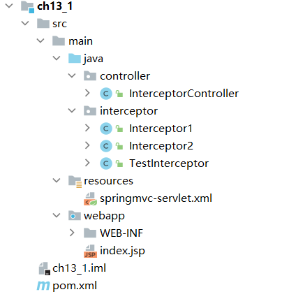

#### 拦截器类
TestInterceptor.java
```java

package interceptor;

import org.springframework.web.servlet.HandlerInterceptor;
import org.springframework.web.servlet.ModelAndView;

import javax.servlet.http.HttpServletRequest;
import javax.servlet.http.HttpServletResponse;


public class TestInterceptor implements HandlerInterceptor {
    @Override
    public boolean preHandle(HttpServletRequest request, HttpServletResponse response, Object handler) throws Exception {
        System.out.println("preHandle...");
        return true;
    }

    @Override
    public void postHandle(HttpServletRequest request, HttpServletResponse response, Object handler, ModelAndView modelAndView) throws Exception {
        System.out.println("postHandler...");
    }

    @Override
    public void afterCompletion(HttpServletRequest request, HttpServletResponse response, Object handler, Exception ex) throws Exception {
        System.out.println("afterCompletion...");
    }
}

```

Interceptor1.java
```java

package interceptor;

import org.springframework.web.servlet.HandlerInterceptor;
import org.springframework.web.servlet.ModelAndView;

import javax.servlet.ServletOutputStream;
import javax.servlet.http.HttpServletRequest;
import javax.servlet.http.HttpServletResponse;

public class Interceptor1 implements HandlerInterceptor {
    @Override
    public boolean preHandle(HttpServletRequest request, HttpServletResponse response, Object handler) throws Exception {
        System.out.println("prehandle1...");
        return true;
    }

    @Override
    public void postHandle(HttpServletRequest request, HttpServletResponse response, Object handler, ModelAndView modelAndView) throws Exception {
        System.out.println("postHandle1...");
    }

    @Override
    public void afterCompletion(HttpServletRequest request, HttpServletResponse response, Object handler, Exception ex) throws Exception {
        System.out.println("afterHandle1...");

    }
}


```

Interceptor2.java
```java
package interceptor;

import org.springframework.web.servlet.HandlerInterceptor;
import org.springframework.web.servlet.ModelAndView;

import javax.servlet.http.HttpServletRequest;
import javax.servlet.http.HttpServletResponse;

public class Interceptor2 implements HandlerInterceptor {
    @Override
    public boolean preHandle(HttpServletRequest request, HttpServletResponse response, Object handler) throws Exception {
        System.out.println("preHandle2...");
        return true;
    }

    @Override
    public void postHandle(HttpServletRequest request, HttpServletResponse response, Object handler, ModelAndView modelAndView) throws Exception {
        System.out.println("postHandle2...");

    }

    @Override
    public void afterCompletion(HttpServletRequest request, HttpServletResponse response, Object handler, Exception ex) throws Exception {
        System.out.println("afterCompletion2...");

    }
}

```

#### Controller层
InterceptorController.java
```java
package controller;

import org.springframework.stereotype.Controller;
import org.springframework.web.bind.annotation.RequestMapping;

@Controller
public class InterceptorController {
    @RequestMapping("/test")
    public String gotoTest() {
        System.out.println("do test....");
        return "test";
    }
}

```

#### 配置文件
springmvc-servlet.xml
```xml
<?xml version="1.0" encoding="UTF-8"?>
<beans xmlns="http://www.springframework.org/schema/beans"
       xmlns:xsi="http://www.w3.org/2001/XMLSchema-instance"
       xmlns:context="http://www.springframework.org/schema/context"
       xmlns:mvc="http://www.springframework.org/schema/mvc"
       xsi:schemaLocation="
    	http://www.springframework.org/schema/beans
    	http://www.springframework.org/schema/beans/spring-beans.xsd
        http://www.springframework.org/schema/context
        http://www.springframework.org/schema/context/spring-context.xsd
        http://www.springframework.org/schema/mvc
        http://www.springframework.org/schema/mvc/spring-mvc.xsd">
    <!-- 使用扫描机制，扫描控制器类 -->
    <context:component-scan base-package="controller"/>
    <!-- 配置视图解析器 -->
    <bean class="org.springframework.web.servlet.view.InternalResourceViewResolver"
          id="internalResourceViewResolver">
        <!-- 前缀 -->
        <property name="prefix" value="/WEB-INF/jsp/" />
        <!-- 后缀 -->
        <property name="suffix" value=".jsp" />
    </bean>
    <mvc:interceptors>
        <bean class="interceptor.TestInterceptor"/>
        <mvc:interceptor>
            <!-- 配置拦截器作用的路径 -->
            <mvc:mapping path="/**"/>
            <bean class="interceptor.Interceptor1"/>
        </mvc:interceptor>
        <mvc:interceptor>
            <!-- 配置拦截器作用的路径 -->
            <mvc:mapping path="/**"/>
            <bean class="interceptor.Interceptor2"/>
        </mvc:interceptor>
    </mvc:interceptors>
</beans>

```

#### View层
test.jsp
```html
<html>
<head>
    <title>test</title>
</head>
<body>
    视图
    <%System.out.println("视图渲染结果");%>
</body>
</html>

```


## 2.国际化
### 目录结构
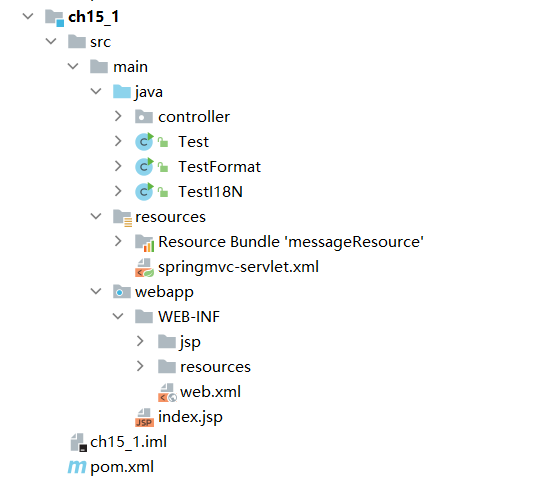

### 1）Java支持的语言和国家
Test.java
```java
import java.util.Locale;

public class Test {
    public static void main(String[] args) {
        // java支持的语言和国家
        Locale locales[] = Locale.getAvailableLocales();
        for (int i = 0; i < locales.length; i++) {
            System.out.println(locales[i].getDisplayCountry() + "="
            +locales[i].getCountry() + " "
            + locales[i].getDisplayLanguage() + "="
            + locales[i].getLanguage());
        }
    }
}


```

结果截图：
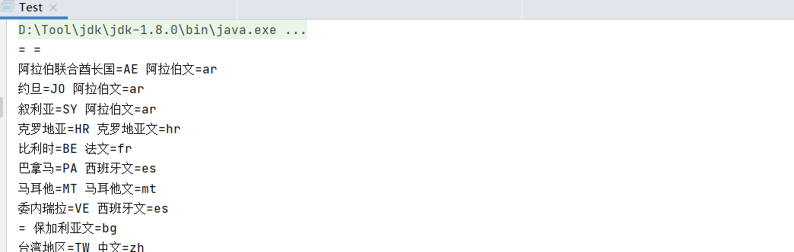


### 2）Java程序的国际化
Test18N.java
```java
import java.util.Locale;
import java.util.ResourceBundle;

public class TestI18N {
    public static void main(String[] args) {
        //取得系统默认的国家语言环境
        Locale lc = Locale.getDefault();
        //根据国家语言环境加载资源文件
        ResourceBundle rb = ResourceBundle.getBundle("messageResource", lc);
        //打印出从资源文件中取得的信息
        System.out.println(rb.getString("hello"));
    }
}

```

messageResource_en_US.properties
```properties
hello=I want to say hello to all world!
welcome={0}, study hard. Today is {1}.
```

messageResource_zh_CN.properties
```properties
hello=\u6211\u8981\u5411\u4E0D\u540C\u56FD\u5BB6\u7684\u4EBA\u6C11\u95EE\u597D\uFF1A\u60A8\u597D\uFF01
welcome={0}\uFF0C\u6B22\u8FCE\u5B66\u4E60Spring MVC\uFF0C\u4ECA\u5929\u662F\u661F\u671F{1}\u3002
```

结果截图：
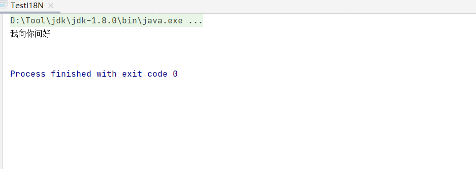


### 3) 带占位符的国际化信息
TestFormat.java
```java
import java.text.MessageFormat;
import java.util.Locale;
import java.util.ResourceBundle;

public class TestFormat {
    //带占位符的国际化信息
    public static void main(String[] args) {
        //取得系统默认的国家语言环境
        Locale lc = Locale.getDefault();
        //根据国家语言环境加载资源文件
        ResourceBundle rb = ResourceBundle.getBundle("messageResource", lc);
        //从资源文件中取得的信息
        String msg = rb.getString("welcome");
        //替换消息文本中的占位符，消息文本中的数字占位符将按照参数的顺序
        //(从第二个参数开始)而被替换，即“我”替换{0}，“5”替换{1}
        String msgFor = MessageFormat.format(msg, "我","5");
        System.out.println(msgFor);
    }
}

```

结果截图：
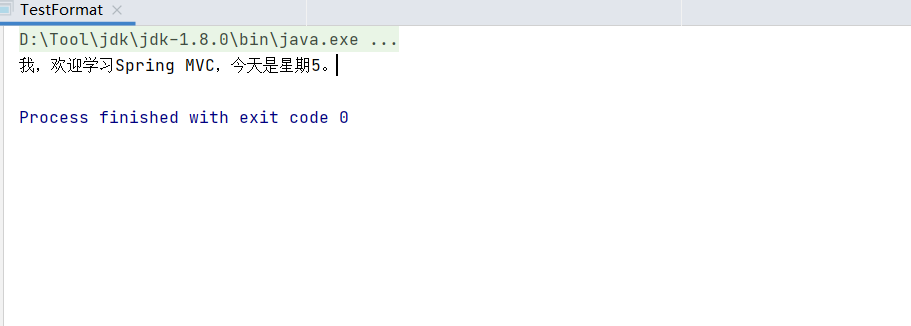


### 4）用户自定义切换语言
#### 国际化资源文件
message_en_US.properties
```properties
first = first
second = second
third = {0} third {1}
language.en = English
language.cn = Chinese

```

message_zh_CN.properties
```properties
first = \u7B2C\u4E00\u9875
second = \u7B2C\u4E8C\u9875
third = {0} \u7B2C\u4E09\u9875 {1}
language.cn = \u4E2D\u6587
language.en = \u82F1\u6587

```

#### View层
first.jsp
```html
<%@ page language="java" contentType="text/html; charset=UTF-8" pageEncoding="UTF-8"%>
<%@taglib prefix="spring" uri="http://www.springframework.org/tags" %>
<!DOCTYPE html PUBLIC "-//W3C//DTD HTML 4.01 Transitional//EN" "http://www.w3.org/TR/html4/loose.dtd">
<html>
<head>
    <meta http-equiv="Content-Type" content="text/html; charset=UTF-8">
    <title>Insert title here</title>
</head>
<body>
<a href="${pageContext.request.contextPath }/i18nTest?locale=zh_CN"><spring:message code="language.cn" /></a> --
<a href="${pageContext.request.contextPath }/i18nTest?locale=en_US"><spring:message code="language.en" /></a>
<br><br>
<spring:message code="first"/><br><br>
<a href="${pageContext.request.contextPath }/my/second"><spring:message code="second"/></a>
</body>
</html>
```

second.jsp
```html
<%@ page language="java" contentType="text/html; charset=UTF-8" pageEncoding="UTF-8"%>
<%@taglib prefix="spring" uri="http://www.springframework.org/tags" %>
<!DOCTYPE html PUBLIC "-//W3C//DTD HTML 4.01 Transitional//EN" "http://www.w3.org/TR/html4/loose.dtd">
<html>
<head>
    <meta http-equiv="Content-Type" content="text/html; charset=UTF-8">
    <title>Insert title here</title>
</head>
<body>
<spring:message code="second"/><br><br>
<a href="${pageContext.request.contextPath }/my/third"><spring:message code="third" arguments="888,999"  /></a>
</body>
</html>
```

third.jsp
```html
<%@ page language="java" contentType="text/html; charset=UTF-8" pageEncoding="UTF-8"%>
<%@taglib prefix="spring" uri="http://www.springframework.org/tags" %>
<!DOCTYPE html PUBLIC "-//W3C//DTD HTML 4.01 Transitional//EN" "http://www.w3.org/TR/html4/loose.dtd">
<html>
<head>
    <meta http-equiv="Content-Type" content="text/html; charset=UTF-8">
    <title>Insert title here</title>
</head>
<body>
<spring:message code="third" arguments="888,999" /><br><br>
<a href="${pageContext.request.contextPath }/my/first"><spring:message code="first"/></a>
</body>
</html>
```

#### 控制层
I18NTestController.java
```java
package controller;

import org.springframework.stereotype.Controller;
import org.springframework.web.bind.annotation.RequestMapping;

import java.util.Locale;

@Controller
public class I18NTestController {
    @RequestMapping("/i18nTest")
    public String first(Locale locale){
        return "first";
    }
}

```

MyController.java
```java
package controller;

import org.springframework.stereotype.Controller;
import org.springframework.web.bind.annotation.RequestMapping;

@Controller
@RequestMapping("/my")
public class MyController {
    @RequestMapping("/first")
    public String first(){
        return "first";
    }
    @RequestMapping("/second")
    public String second(){
        return "second";
    }
    @RequestMapping("/third")
    public String third(){
        return "third";
    }
}
```

#### 配置文件
springmvc-servlet.xml
```xml
<?xml version="1.0" encoding="UTF-8"?>
<beans xmlns="http://www.springframework.org/schema/beans"
       xmlns:xsi="http://www.w3.org/2001/XMLSchema-instance"
       xmlns:context="http://www.springframework.org/schema/context"
       xmlns:mvc="http://www.springframework.org/schema/mvc"
       xsi:schemaLocation="http://www.springframework.org/schema/beans http://www.springframework.org/schema/beans/spring-beans.xsd http://www.springframework.org/schema/context http://www.springframework.org/schema/context/spring-context.xsd http://www.springframework.org/schema/mvc http://www.springframework.org/schema/mvc/spring-mvc.xsd">

    <context:component-scan base-package="controller"/>

<!--    视图解析器-->
    <bean
        class="org.springframework.web.servlet.view.InternalResourceViewResolver"
        name="internalResourceViewResolver">
        <property name="prefix" value="/WEB-INF/jsp/"/>
        <property name="suffix" value=".jsp"/>
    </bean>

    <!-- 国际化操作拦截器 如果采用基于（Session/Cookie）则必需配置 -->
    <mvc:interceptors>
        <bean class="org.springframework.web.servlet.i18n.LocaleChangeInterceptor"/>
    </mvc:interceptors>
    <!-- 存储区域设置信息 -->
    <bean id="localeResolver"
          class="org.springframework.web.servlet.i18n.SessionLocaleResolver" >
        <property name="defaultLocale" value="zh_CN"/>
    </bean>
    <!-- 加载国际化资源文件 -->
    <bean id="messageSource" class="org.springframework.context.support.ReloadableResourceBundleMessageSource">
<!--         <property name="basename" value="classpath:messageResource" />-->
        <property name="basename" value="/WEB-INF/resources/message" />
    </bean>

</beans>
```

#### 实验截图
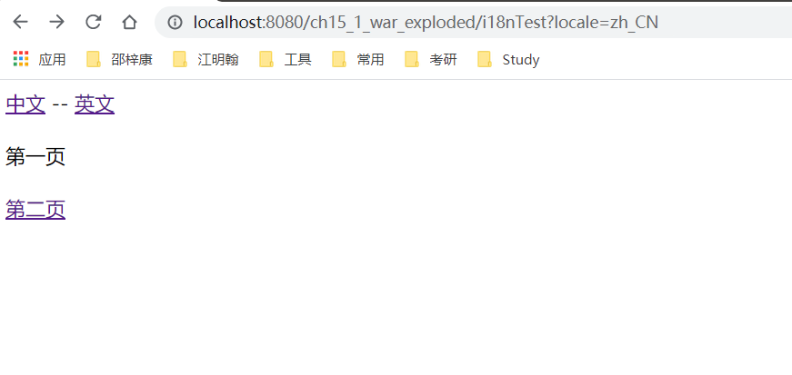
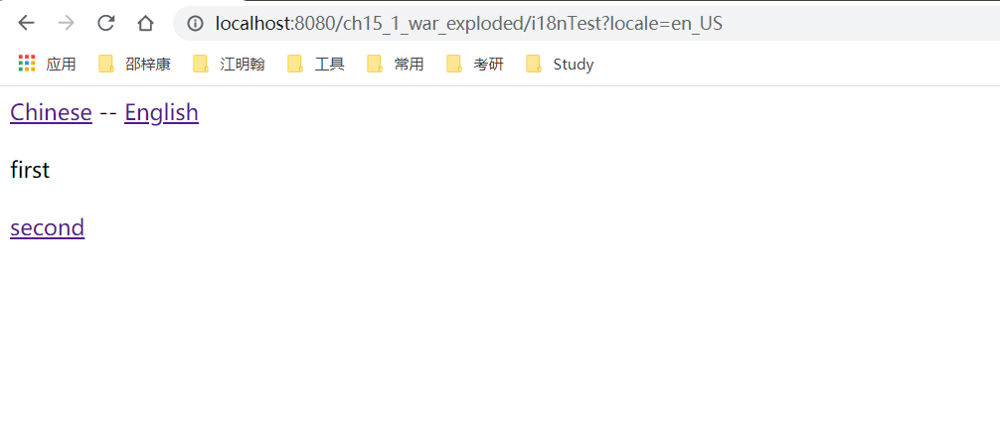

## 3.统一异常处理
### 目录结构
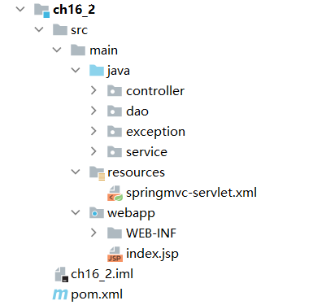

### 自定义异常类
MyException.java
```java
package exception;

public class MyException extends Exception {
    private static final long serialVersionUID = 1L;
    public MyException() {
        super();
    }
    public MyException(String message) {
        super(message);
    }
}
```

MyExceptionHandler.java
```java
package exception;

import org.springframework.web.servlet.HandlerExceptionResolver;
import org.springframework.web.servlet.ModelAndView;

import javax.servlet.http.HttpServletRequest;
import javax.servlet.http.HttpServletResponse;
import java.sql.SQLException;
import java.util.HashMap;
import java.util.Map;

public class MyExceptionHandler implements HandlerExceptionResolver {
    @Override
    public ModelAndView resolveException(HttpServletRequest arg0, HttpServletResponse arg1, Object arg2,
                                         Exception arg3) {
        Map<String, Object> model = new HashMap<String, Object>();
        model.put("ex", arg3);
        // 根据不同错误转向不同页面（统一处理），即异常与view的对应关系
        if(arg3 instanceof MyException) {
            return new ModelAndView("my-error", model);
        }else if(arg3 instanceof SQLException) {
            return new ModelAndView("sql-error", model);
        } else {
            return new ModelAndView("error", model);
        }
    }
}

```

### Dao层
TestExceptionDao.java
```java
package dao;

import exception.MyException;
import org.springframework.stereotype.Repository;

import java.sql.SQLException;

@Repository("testExceptionDao")
public class TestExceptionDao {
    public void daodb() throws Exception {
        throw new SQLException("Dao中数据库异常");
    }
    public void daomy() throws Exception {
        throw new MyException("Dao中自定义异常");
    }
    public void daono() throws Exception {
        throw new Exception("Dao中未知异常");
    }
}

```

### Service层
TestExceptionService.java
```java

package service;

public interface TestExceptionService {
    public void servicemy() throws Exception;
    public void servicedb() throws Exception;
    public void daomy() throws Exception;
    public void daodb() throws Exception;
    public void serviceno() throws Exception;
    public void daono() throws Exception;
}

```

TestExceptionServiceImpl.java
```java

package service;

import dao.TestExceptionDao;
import exception.MyException;
import org.springframework.beans.factory.annotation.Autowired;
import org.springframework.stereotype.Service;

import java.sql.SQLException;

@Service("testExceptionService")
public class TestExceptionServiceImpl implements TestExceptionService{
    @Autowired
    private TestExceptionDao testExceptionDao;
    @Override
    public void servicemy() throws Exception {
        throw new MyException("Service中自定义异常");
    }
    @Override
    public void servicedb() throws Exception {
        throw new SQLException("Service中数据库异常");
    }
    @Override
    public void serviceno() throws Exception {
        throw new Exception("Service中未知异常");
    }
    @Override
    public void daomy() throws Exception {
        testExceptionDao.daomy();
    }
    @Override
    public void daodb() throws Exception {
        testExceptionDao.daodb();
    }
    public void daono() throws Exception{
        testExceptionDao.daono();
    }
}
```

### Controller层
TestExceptionController.java
```java
package controller;

import exception.MyException;
import org.springframework.beans.factory.annotation.Autowired;
import org.springframework.stereotype.Controller;
import org.springframework.web.bind.annotation.RequestMapping;
import service.TestExceptionService;

import java.sql.SQLException;

@Controller
public class TestExceptionController {
    @Autowired
    private TestExceptionService testExceptionService;

    @RequestMapping("/db")
    public void db() throws Exception {
        throw new SQLException("控制器中数据库异常");
    }

    @RequestMapping("/my")
    public void my() throws Exception {
        throw new MyException("控制器中自定义异常");
    }

    @RequestMapping("/no")
    public void no() throws Exception {
        throw new Exception("控制器中未知异常");
    }

    @RequestMapping("/servicedb")
    public void servicedb() throws Exception {
        testExceptionService.servicedb();
    }

    @RequestMapping("/servicemy")
    public void servicemy() throws Exception {
        testExceptionService.servicemy();
    }

    @RequestMapping("/serviceno")
    public void serviceno() throws Exception {
        testExceptionService.serviceno();
    }

    @RequestMapping("/daodb")
    public void daodb() throws Exception {
        testExceptionService.daodb();
    }

    @RequestMapping("/daomy")
    public void daomy() throws Exception {
        testExceptionService.daomy();
    }

    @RequestMapping("/daono")
    public void daono() throws Exception {
        testExceptionService.daono();
    }
}
```

### View层
404.jsp
```html
<%@ page language="java" contentType="text/html; charset=UTF-8" pageEncoding="UTF-8" isErrorPage="true"%>
<!DOCTYPE html PUBLIC "-//W3C//DTD HTML 4.01 Transitional//EN" "http://www.w3.org/TR/html4/loose.dtd">
<html>
<head>
    <meta http-equiv="Content-Type" content="text/html; charset=UTF-8">
    <title>Insert title here</title>
</head>
<body>
资源已不在。
</body>
</html>

```

error.jsp
```html
<%@ page language="java" contentType="text/html; charset=UTF-8" pageEncoding="UTF-8" isErrorPage="true"%>
<!DOCTYPE html PUBLIC "-//W3C//DTD HTML 4.01 Transitional//EN" "http://www.w3.org/TR/html4/loose.dtd">
<html>
<head>
    <meta http-equiv="Content-Type" content="text/html; charset=UTF-8">
    <title>Insert title here</title>
</head>
<body>
<H1>未知错误：</H1><%=exception%>
<H2>错误内容：</H2>
<%
    exception.printStackTrace(response.getWriter());
%>
</body>
</html>

```

my-error.jsp
```html
<%@ page language="java" contentType="text/html; charset=UTF-8" pageEncoding="UTF-8" isErrorPage="true"%>
<!DOCTYPE html PUBLIC "-//W3C//DTD HTML 4.01 Transitional//EN" "http://www.w3.org/TR/html4/loose.dtd">
<html>
<head>
    <meta http-equiv="Content-Type" content="text/html; charset=UTF-8">
    <title>Insert title here</title>
</head>
<body>
<H1>自定义异常错误：</H1><%=exception%>
<H2>错误内容：</H2>
<%
    exception.printStackTrace(response.getWriter());
%>
</body>
</html>

```

sql-error.jsp
```html
<%@ page language="java" contentType="text/html; charset=UTF-8" pageEncoding="UTF-8" isErrorPage="true"%>
<!DOCTYPE html PUBLIC "-//W3C//DTD HTML 4.01 Transitional//EN" "http://www.w3.org/TR/html4/loose.dtd">
<html>
<head>
    <meta http-equiv="Content-Type" content="text/html; charset=UTF-8">
    <title>Insert title here</title>
</head>
<body>
<H1>数据库异常错误：</H1><%=exception%>
<H2>错误内容：</H2>
<%
exception.printStackTrace(response.getWriter());
%>
</body>
</html>
```

### 配置文件
web.xml
```xml
<?xml version="1.0" encoding="UTF-8"?>
<web-app xmlns:xsi="http://www.w3.org/2001/XMLSchema-instance"
         xmlns="http://xmlns.jcp.org/xml/ns/javaee"
         xsi:schemaLocation="http://xmlns.jcp.org/xml/ns/javaee http://xmlns.jcp.org/xml/ns/javaee/web-app_3_1.xsd"
         id="WebApp_ID" version="3.1">
  <!-- 资源不存在，页面配置 -->
    <error-page>
      <error-code>404</error-code>
      <location>/WEB-INF/jsp/404.jsp</location>
    </error-page>
  <!--配置DispatcherServlet -->
  <servlet>
    <servlet-name>springmvc</servlet-name>
    <servlet-class>org.springframework.web.servlet.DispatcherServlet</servlet-class>
    <init-param>
      <param-name>contextConfigLocation</param-name>
      <param-value>classpath*:springmvc-servlet.xml</param-value>
    </init-param>
    <load-on-startup>1</load-on-startup>
  </servlet>
  <servlet-mapping>
    <servlet-name>springmvc</servlet-name>
    <url-pattern>/</url-pattern>
  </servlet-mapping>
</web-app>
```

springmvc-servlet.xml
```html
<?xml version="1.0" encoding="UTF-8"?>
<beans xmlns="http://www.springframework.org/schema/beans"
       xmlns:xsi="http://www.w3.org/2001/XMLSchema-instance"
       xmlns:context="http://www.springframework.org/schema/context"
       xsi:schemaLocation="
    	http://www.springframework.org/schema/beans
    	http://www.springframework.org/schema/beans/spring-beans.xsd
        http://www.springframework.org/schema/context
        http://www.springframework.org/schema/context/spring-context.xsd">
    <!-- 使用扫描机制，扫描包 -->
    <context:component-scan base-package="controller" />
    <context:component-scan base-package="service" />
    <context:component-scan base-package="dao" />
    <!-- 配置视图解析器 -->
    <bean
            class="org.springframework.web.servlet.view.InternalResourceViewResolver"
            id="internalResourceViewResolver">
        <!-- 前缀 -->
        <property name="prefix" value="/WEB-INF/jsp/" />
        <!-- 后缀 -->
        <property name="suffix" value=".jsp" />
    </bean>
    <!-- 托管MyExceptionHandler -->
    <bean class="exception.MyExceptionHandler"/>
</beans>

```

### 实验截图：

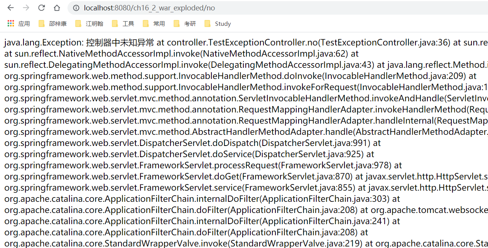
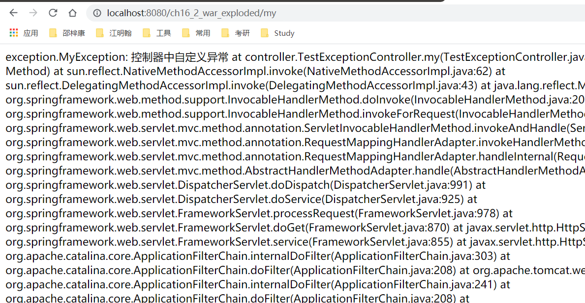
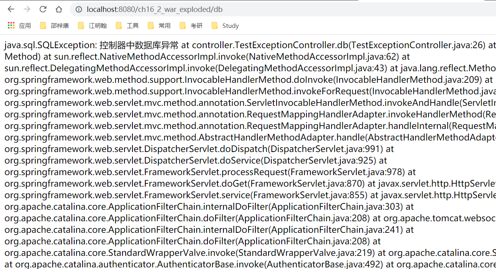


## 4.文件的上传和下载
### 目录结构

### 文件选择页面
单文件上传 oneFile.jsp
```html
<%@ page language="java" contentType="text/html; charset=UTF-8" pageEncoding="UTF-8"%>
<!DOCTYPE html PUBLIC "-//W3C//DTD HTML 4.01 Transitional//EN" "http://www.w3.org/TR/html4/loose.dtd">
<html>
<head>
    <meta http-equiv="Content-Type" content="text/html; charset=UTF-8">
    <title>Insert title here</title>
</head>
<body>
<form action="${pageContext.request.contextPath }/onefile" method="post" enctype="multipart/form-data">
    选择文件:<input type="file" name="myfile">  <br>
    文件描述:<input type="text" name="description"> <br>
    <input type="submit" value="提交">
</form>
</body>
</html>
```

显示单文件showOne.jsp
```html
<%@ page language="java" contentType="text/html; charset=UTF-8" pageEncoding="UTF-8"%>
<!DOCTYPE html PUBLIC "-//W3C//DTD HTML 4.01 Transitional//EN" "http://www.w3.org/TR/html4/loose.dtd">
<html>
<head>
    <meta http-equiv="Content-Type" content="text/html; charset=UTF-8">
    <title>Insert title here</title>
</head>
<body>
${fileDomain.description }<br>
<!-- fileDomain.getMyfile().getOriginalFilename() -->
${fileDomain.myfile.originalFilename }
</body>
</html>
```

多文件上传 multiFiles.jsp
```html
<%@ page language="java" contentType="text/html; charset=UTF-8" pageEncoding="UTF-8"%>
<!DOCTYPE html PUBLIC "-//W3C//DTD HTML 4.01 Transitional//EN" "http://www.w3.org/TR/html4/loose.dtd">
<html>
<head>
    <meta http-equiv="Content-Type" content="text/html; charset=UTF-8">
    <title>Insert title here</title>
</head>
<body>
<form action="${pageContext.request.contextPath }/multifile" method="post" enctype="multipart/form-data">
    选择文件1:<input type="file" name="myfile">  <br>
    文件描述1:<input type="text" name="description"> <br>
    选择文件2:<input type="file" name="myfile">  <br>
    文件描述2:<input type="text" name="description"> <br>
    选择文件3:<input type="file" name="myfile">  <br>
    文件描述3:<input type="text" name="description"> <br>
    <input type="submit" value="提交">
</form>
</body>
</html>
```

显示多文件showMulti.jsp
```html
<%@ page language="java" contentType="text/html; charset=UTF-8" pageEncoding="UTF-8"%>
<%@ taglib uri="http://java.sun.com/jsp/jstl/core" prefix="c" %>
<!DOCTYPE html PUBLIC "-//W3C//DTD HTML 4.01 Transitional//EN" "http://www.w3.org/TR/html4/loose.dtd">
<html>
<head>
    <meta http-equiv="Content-Type" content="text/html; charset=UTF-8">
    <title>Insert title here</title>
</head>
<body>
<table>
    <tr>
        <td>详情</td><td>文件名</td>
    </tr>
    <!-- 同时取两个数组的元素 -->
    <c:forEach items="${multiFileDomain.description}" var="description" varStatus="loop">
        <tr>

            <td>${description}</td>
            <td>${multiFileDomain.myfile[loop.count-1].originalFilename}</td>
        </tr>
    </c:forEach>
    <!-- fileDomain.getMyfile().getOriginalFilename() -->
</table>
</body>
</html>
```

下载文件 showDownFiles.jsp
```html
<%@ page language="java" contentType="text/html; charset=UTF-8" pageEncoding="UTF-8"%>
<%@ taglib uri="http://java.sun.com/jsp/jstl/core" prefix="c" %>
<!DOCTYPE html PUBLIC "-//W3C//DTD HTML 4.01 Transitional//EN" "http://www.w3.org/TR/html4/loose.dtd">
<html>
<head>
    <meta http-equiv="Content-Type" content="text/html; charset=UTF-8">
    <title>Insert title here</title>
</head>
<body>
<table>
    <tr>
        <td>被下载的文件名</td>
    </tr>
    <!-- 遍历model中的files -->
    <c:forEach items="${files}" var="filename">
        <tr>
            <td><a href="${pageContext.request.contextPath }/down?filename=${filename}">${filename}</a></td>
        </tr>
    </c:forEach>
</table>
</body>
</html>
```

### POJO类
FileDomain.java
```java
package pojo;

import org.springframework.web.multipart.MultipartFile;

public class FileDomain {
    private String description;
    private MultipartFile myfile;
    public String getDescription() {
        return description;
    }
    public void setDescription(String description) {
        this.description = description;
    }
    public MultipartFile getMyfile() {
        return myfile;
    }
    public void setMyfile(MultipartFile myfile) {
        this.myfile = myfile;
    }
}

```

MultiFileDomain.java
```java
/*
 * Date: 2021/6/6
 * Author: <https://www.github.com/shaozk>
 */

package pojo;

import org.springframework.web.multipart.MultipartFile;

import java.util.List;

/**
 * @author shaozk
 */
public class MultiFileDomain {
    private List<String> description;
    private List<MultipartFile> myfile;
    public List<String> getDescription() {
        return description;
    }
    public void setDescription(List<String> description) {
        this.description = description;
    }
    public List<MultipartFile> getMyfile() {
        return myfile;
    }
    public void setMyfile(List<MultipartFile> myfile) {
        this.myfile = myfile;
    }
}

```

#### 控制层
FileUploadController.java
```java
package controller;

import org.apache.commons.logging.Log;
import org.apache.commons.logging.LogFactory;
import org.springframework.stereotype.Controller;
import org.springframework.web.bind.annotation.ModelAttribute;
import org.springframework.web.bind.annotation.RequestMapping;
import org.springframework.web.multipart.MultipartFile;
import pojo.FileDomain;
import pojo.MultiFileDomain;

import javax.servlet.http.HttpServletRequest;
import java.io.File;
import java.util.List;

@Controller
public class FileUploadController {
    // 得到一个用来记录日志的对象，这样打印信息的时候能够标记打印的是那个类的信息
    private static final Log logger = LogFactory.getLog(FileUploadController.class);
    /**
     * 单文件上传
     */
    @RequestMapping("/onefile")
    public String oneFileUpload(@ModelAttribute FileDomain fileDomain, HttpServletRequest request){
		/*上传文件的保存位置"/uploadfiles"，该位置是指
		workspace\.metadata\.plugins\org.eclipse.wst.server.core\tmp0\wtpwebapps，
		发布后使用*/
        String realpath = request.getServletContext().getRealPath("uploadfiles");
        String fileName = fileDomain.getMyfile().getOriginalFilename();
        File targetFile = new File(realpath, fileName);
        if(!targetFile.exists()){
            targetFile.mkdirs();
        }
        //上传
        try {
            fileDomain.getMyfile().transferTo(targetFile);
            logger.info("成功");
        } catch (Exception e) {
            e.printStackTrace();
        }
        /*
      		@ModelAttribute FileDomain fileDomain这就话有这样一个功能：
      		model.addAttribute("fileDomain",fileDomain)所以此处不需要
         */
        return "showOne";
    }
    /**
     * 多文件上传
     */
    @RequestMapping("/multifile")
    public String multiFileUpload(@ModelAttribute MultiFileDomain multiFileDomain, HttpServletRequest request){
        String realpath = request.getServletContext().getRealPath("uploadfiles");
        //String realpath = "D:/spring mvc workspace/ch7/WebContent/uploadfiles";
        File targetDir = new File(realpath);
        if(!targetDir.exists()){
            targetDir.mkdirs();
        }
        List<MultipartFile> files = multiFileDomain.getMyfile();
        for (int i = 0; i < files.size(); i++) {
            MultipartFile file = files.get(i);
            String fileName = file.getOriginalFilename();
            File targetFile = new File(realpath,fileName);
            //上传
            try {
                file.transferTo(targetFile);
            } catch (Exception e) {
                e.printStackTrace();
            }
        }
        logger.info("成功");
        return "showMulti";
    }
}

```

FileDownController.java
```java
package controller;

import org.apache.commons.logging.Log;
import org.apache.commons.logging.LogFactory;
import org.springframework.stereotype.Controller;
import org.springframework.ui.Model;
import org.springframework.web.bind.annotation.RequestMapping;
import org.springframework.web.bind.annotation.RequestParam;

import javax.servlet.ServletOutputStream;
import javax.servlet.http.HttpServletRequest;
import javax.servlet.http.HttpServletResponse;
import java.io.File;
import java.io.FileInputStream;
import java.io.UnsupportedEncodingException;
import java.util.ArrayList;

@Controller
public class FileDownController {
    // 得到一个用来记录日志的对象，这样打印信息的时候能够标记打印的是那个类的信息
    private static final Log logger = LogFactory.getLog(FileDownController.class);
    /**
     * 显示要下载的文件
     */
    @RequestMapping("showDownFiles")
    public String show(HttpServletRequest request, Model model){
        //从workspace\.metadata\.plugins\org.eclipse.wst.server.core\tmp0\wtpwebapps\ch7\下载
        String realpath = request.getServletContext().getRealPath("uploadfiles");
        File dir = new File(realpath);
        File files[] = dir.listFiles();
        //获取该目录下的所有文件名
        ArrayList<String> fileName = new ArrayList<String>();
        for (int i = 0; i < files.length; i++) {
            fileName.add(files[i].getName());
        }
        model.addAttribute("files", fileName);
        return "showDownFiles";
    }
    /**
     * 执行下载
     */
    @RequestMapping("down")
    public String down(@RequestParam String filename, HttpServletRequest request, HttpServletResponse response){
        String aFilePath = null; //要下载的文件路径
        FileInputStream in = null; //输入流
        ServletOutputStream out = null; //输出流
        try {
            //从workspace\.metadata\.plugins\org.eclipse.wst.server.core\tmp0\wtpwebapps下载
            aFilePath = request.getServletContext().getRealPath("uploadfiles");
            //设置下载文件使用的报头
            response.setHeader("Content-Type", "application/x-msdownload" );
            response.setHeader("Content-Disposition", "attachment; filename="
                    + toUTF8String(filename));
            // 读入文件
            in = new FileInputStream(aFilePath + "\\"+ filename);
            //得到响应对象的输出流，用于向客户端输出二进制数据
            out = response.getOutputStream();
            out.flush();
            int aRead = 0;
            byte b[] = new byte[1024];
            while ((aRead = in.read(b)) != -1 & in != null) {
                out.write(b,0,aRead);
            }
            out.flush();
            in.close();
            out.close();
        } catch (Throwable e) {
            e.printStackTrace();
        }
        logger.info("下载成功");
        return null;
    }
    /**
     * 下载保存时中文文件名字符编码转换方法
     */
    public  String toUTF8String(String str){
        StringBuffer sb = new StringBuffer();
        int len = str.length();
        for(int i = 0; i < len; i++){
            //取出字符中的每个字符
            char c = str.charAt(i);
            //Unicode码值在0-255之间，不作处理
            if(c >= 0 && c <= 255){
                sb.append(c);
            }else{//转换UTF-8编码
                byte b[];
                try {
                    b = Character.toString(c).getBytes("UTF-8");
                } catch (UnsupportedEncodingException e) {
                    e.printStackTrace();
                    b = null;
                }
                //转换为%HH的字符串形式
                for(int j = 0; j < b.length; j ++){
                    int k = b[j];
                    if(k < 0){
                        k &= 255;
                    }
                    sb.append("%" + Integer.toHexString(k).toUpperCase());
                }
            }
        }
        return sb.toString();
    }
}


```

### 配置文件
springmvc-servlet.xml
```xml
<?xml version="1.0" encoding="UTF-8"?>
<beans xmlns="http://www.springframework.org/schema/beans"
       xmlns:xsi="http://www.w3.org/2001/XMLSchema-instance"
       xmlns:p="http://www.springframework.org/schema/p"
       xmlns:context="http://www.springframework.org/schema/context"
       xsi:schemaLocation="
    	http://www.springframework.org/schema/beans
    	http://www.springframework.org/schema/beans/spring-beans.xsd
        http://www.springframework.org/schema/context
        http://www.springframework.org/schema/context/spring-context.xsd">
    <!-- 使用扫描机制，扫描包 -->
    <context:component-scan base-package="controller" />
    <!-- 配置视图解析器 -->
    <bean
            class="org.springframework.web.servlet.view.InternalResourceViewResolver"
            id="internalResourceViewResolver">
        <!-- 前缀 -->
        <property name="prefix" value="/WEB-INF/jsp/" />
        <!-- 后缀 -->
        <property name="suffix" value=".jsp" />
    </bean>
    <!-- 配置MultipartResolver 用于文件上传 使用spring的CommosMultipartResolver -->
    <bean id="multipartResolver" class="org.springframework.web.multipart.commons.CommonsMultipartResolver"
          p:defaultEncoding="UTF-8"
          p:maxUploadSize="5400000">
        <!--D:\spring mvc workspace\.metadata\.plugins\org.eclipse.wst.server.core\tmp0\wtpwebapps\fileUpload  -->
    </bean>
    <!-- defaultEncoding="UTF-8" 是请求的编码格式，默认为iso-8859-1
        maxUploadSize="5400000" 是允许上传文件的最大值，单位为字节
        uploadTempDir="fileUpload/temp" 为上传文件的临时路径 -->
</beans>

```

### 实验截图
单文件上传
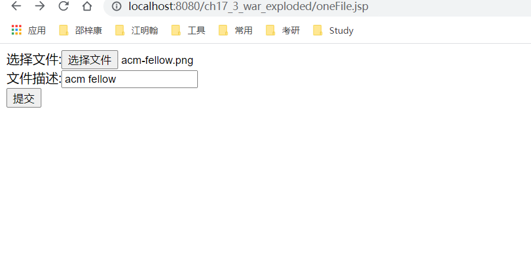
单文件上传成功
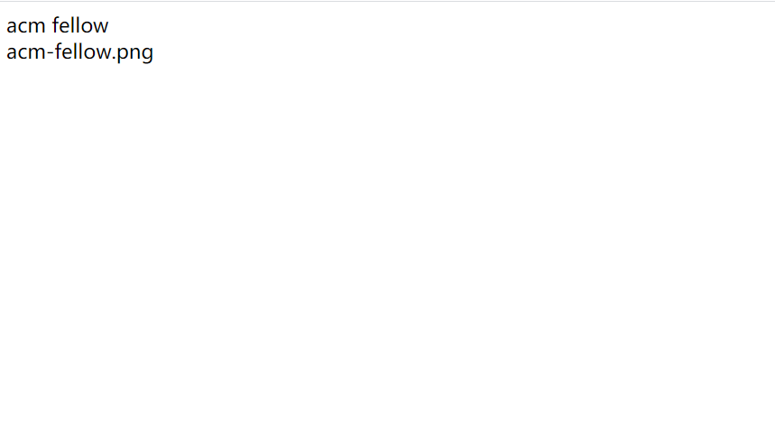
多文件上传
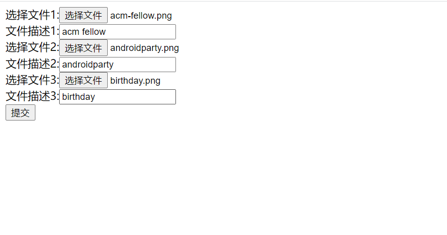
多文件上传成功
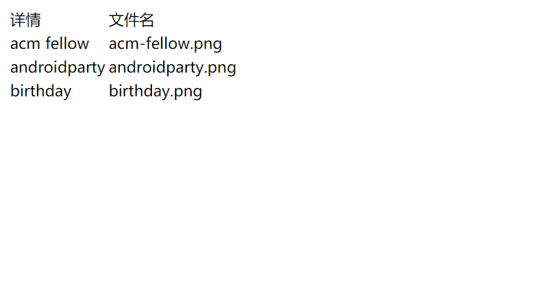
文件下载
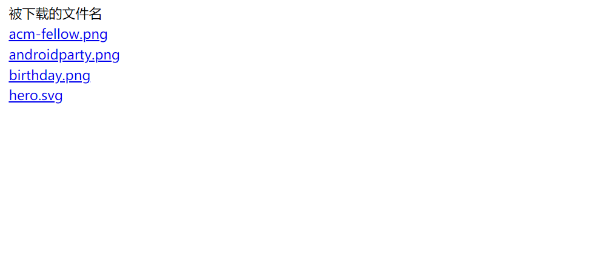
